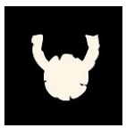

- I don't think we need to invent new rules.
- Indeed, theism is not clear on the subject. It believes it can contain Chaos, but that didn't work. It is likely that the explosion of the Six is partly responsible through **DIVINE EXPLOSION**. Hence the mess in the mythic ages and the Great Compromise. The Gods are the main source of Chaos.
- Mysticism isn't concerned either; it's not its subject. It even tends to make entropic sources (the Six) disappear through **TRANSFORMATIONS**. If everyone were mystical, the very notion of Chaos would not exist.
- Animism brings the least amount of Chaos. It manipulates **NATURE**, it does not innovate. The scope is bounded. New developments are exceedingly rare. If everyone were animist, Chaos would not exist.
- Logic does not carry Chaos within itself, but can produce results that seem chaotic through the magnitude of certain outcomes: it therefore brings novelty on a grand scale through **EFFECTS**.
- The cultists of **Chaos** are essentially theists (or even animists), but no additional rules are needed in my opinion. The Chaotic Gods appeared because there were breaches, but they respect the usual rules as Gods (Great Compromise, etc.)

> Chaos must remain a particular philosophical vision: a perspective on change and novelty, and on what is against nature and what perverts it.
