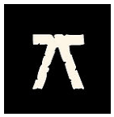
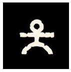

> When destiny hesitates, we gather everything that makes our strength, in flesh as in the invisible, and we look to which side fate will tip against what stands in opposition to us.

Principle: facing adversity, we bet everything that could, in this situation, serve us. The adversary or obstacle does the same. And then we proceed to a draw to resolve it.

A resolution is made to determine a narrative turning point. It exists only to serve the narrative. Therefore, we do not make a resolution at every turn. We can even choose to resolve an opposition once and not do it a second time if it brings nothing to the narrative dynamics.

The underlying idea of the game mechanic is to offer the necessary and sufficient framework to experience a Gloranthian immersion.

The system was invented so that players always keep in mind that the world can be understood through very different worldviews and so that there is coherence between the game mechanics and the characters' worldview.

When destiny is uncertain and we sense the emergence of a potential narrative turning point, we proceed in three steps:

- Each party determines what is important at that moment. By immersing themselves in the world, the situation, the focus they wish, they determine the elements to put on the scale: the **bets**
- The **resolution** of the bets is then done with different rules following each camp's vision of the world, depending on whether one is [animist](../animism), [theist](../theism), [mystic](../mysticism) or [logician](../mysticism/index.md). Each camp thus obtains a certain number of successes.
- The **interpretation of the result** is based on the situation, the focus established, and the objectives and strategies of the various parties.

## Determining Bets

The engine is first based on common sense and knowledge of the world of Glorantha. Each obstacle contains its share of difficulties to overcome. You use your assets to hope to surpass the obstacle.

The potentially determining bets are therefore listed.

When there is opposition, it can be useful to define the objectives of each camp and determine the bets of each camp based on the objectives of one and the other.

A wants this: A+ the bets that can lead to it, A- the bets that can thwart A's objective.

B wants this: B+ the bets that can lead to it, B- the bets that can thwart B's objective

Opposition → A+, B- vs A-, B+

**Pro-A bets versus Pro-B bets**

or alternatively

**Assets, tactics to counter difficulties, dangers of the adversary**

We have the number of **bets** for each **camp**. We can now proceed to the **resolution**.

Regardless of your character's worldview, the method for creating bets narratively is always the same. The specificity will be found in the acceptable bets of each party.

### And where does difficulty fit in all this?

First, let us note that certain factors are framework factors. They are so impactful that they force the bets to align and allow expressing what it will not be possible to attempt.

However, if one insists on playing outside the framework, a power delta between the two parties may emerge.

Rather than expressing this through dice multiplication, we can also use **weakened** or **heroic** modes.

Note: we only switch to a weakened or heroic mode if a framework factor pushes us to do so. Otherwise, it is truly the dynamics of the bets that are at play. One party will simply have many more dice on their side than the other.

Let us also note that difficulty is also a narrative difficulty; to accomplish something impossible or difficult, one will have to go through many tests before getting there. These tests are not necessarily impossible in themselves, but there is a strong chance that we will fail at one of them and that this will completely change the initial objective.

#### Or use a Destiny gauge

You can also, both in solo and group play, consider using a **Destiny gauge**. This allows improvising bets according to the situation to balance difficulties based on what has happened previously and thus create narrative breathing room. You are absolutely not obligated to balance the gauge at every conflict. It is just a marker (very useful if you improvise or play solo).

> Principle: the gauge starts at zero, and can have a negative value (destiny will eventually turn against the heroes) or a positive value (destiny will eventually favor the heroes).

Concretely, it can be represented by dice of two colors: one color for the heroes and one color for adversity. When a conflict occurs, we supplement the gauge with dice that would balance the conflict. Two dice of the same color cancel each other out so you always have either no dice, or dice of only one color. These dice allow gauging the difficulties of conflicts.

Notes:
- the gauge is global.
- in case of an intra-hero conflict, the adversary is the one who initiated the conflict
- sometimes, difficulties or advantages occur without conflict as the narrative unfolds. In this case, one can compensate with an opposing die.
- you can also use a tally: +1 representing a hero die, -1 representing an adversity die.
- You could materialize hero dice with tokens marked by the Luck rune , and adversity dice with tokens marked by the Destiny rune  ("no great destiny without adversity")

> *The Destiny gauge system is inspired by the pass/fail cycle of HQ/G*

> Example:
> - Gauge at 0
> - First conflict: heroes 3 bets vs adversity 2 bets -> the gauge gains 1 adversity die (-1)
> - Second conflict: heroes 4 vs adversity 6 -> the gauge gains 2 hero dice thus ending up with a single hero die (+1)
> - At some point, the GM or narrator chooses to narrate a difficulty, so we automatically gain a hero die. Here we are with 2 hero dice (+2)
> - Destiny is therefore rather in favor of the heroes. The next conflict could be to their advantage. So if the GM wanted to rebalance everything, they could attempt a conflict with 2 fewer bets on the adversity side than the heroes' bets.

### Dice and Bets

Once the bets are known for each camp, we lose the link between the bet that created the die and the die. It would be too mentally complex to look at each success of each factor and even more so for Logicians. What matters is the number of successes in the end for each camp.

The worldview can serve to express the result from that worldview's perspective.

The bets also serve to determine narrative elements. They become the ingredients of the narration to tell the result of the opposition.

[Example of bet determination](sample)

### Abstract Obstacles

Some obstacles are not tied to a particular worldview. They simply correspond to the resistance of the world.

Two possibilities:

-  **Mirror**: the bets are resolved with the same worldview as the non-abstract opponent: this reflects a holistic vision of the world. This is the framework to use when the bets involve self-transcendence.

-  **Agnostic**, **Materialist**, **The Middle World**: even numbers (2, 4, 6) will be successes, odd numbers (1, 3, 5) will be failures. There are no other bet adjustment rules once the draw is made. This is the framework to use when the bets are minor and do not truly involve the character emotionally.

Note: here it is the Middle World rune that is used. But if the character is in the spirit world, or the world of the Gods, the rules of that world serve as the base rule instead.

> Example: A mystic climbing a mountain will generate bets for themselves and bets representing the difficulties to overcome. We know that the mystic's draw will be made with the rules of mysticism. Therefore, by default, the obstacle's draw will be made with the rules of mysticism. But it could also be with the rules of theism in the case of climbing Kerofin, for example, which is a sacred place of the Orlanthi pantheon.

## The Draws

Depending on the protagonists' vision of the world, their resolution methods differ. The way to play a camp's draw is different for an [animist](../animism), a [theist](../theism), a [logician](../logic) or a [mystic](../mysticism/).

Each draw determines a number of successes that is compared to the number of successes of the other camp.

## Interpreting the Result

The one with more successes wins. It is as simple as that.

You can bring nuance based on the difference in successes.

In case of a tie, you can play the status quo or have the protagonist win in extremis if there is a protagonist in the narrative.
If the conflict is not compatible with a status quo, you can redraw by adding one bet to each camp to express the **escalation** linked to the temporary tie during the conflict. This additional bet for each camp represents the will to put an end to it. Escalations can follow one another.

In all cases, the bets and worldviews serve the narration of the interpretation.

And what is essential to keep in mind is the context of the situation that serves to interpret the result.

A child wanting to kill a God and who through a miracle would achieve a success would be interpreted as a mere scratch on the God but that would already be quite a feat!

And the hero's death? That is up to you. It is too important a subject for chance to decide. Death is the end of one story, the beginning of another. In the worst case, if you are torn, flip a coin.

### Gradation of the Result

If you want, you can use the following interpretive grid:

- Fiasco / Feat when the number of successes is strictly greater than 1 and than half the successes of the other camp.
- Victory, Success / Defeat, Failure when the difference is between 1 and half the successes of the other camp.
- Status quo, Reversal in case of a tie

### Retributions and Evolution

The system avoids meta-game as much as possible: there are no mechanical bonuses or penalties at the end of the game. Characters evolve in a purely diegetic way. It is indeed the narration that serves as the exclusive engine of evolution.

**How does one evolve?** Evolution goes through the dynamics of the character's keywords: adding new keywords, removing obsolete traits, or modifying existing elements. To this are added the retributions granted by Destiny, such as new links, attachments, gifts, a new power or an epiphany.

**When does one evolve?** This evolution does not occur at the end of a scenario. It happens organically during a Fiasco or a Feat (which translate into a difference of 2 successes or more in a draw), or simply when the story demands it.

### Draws without Opposition: Measuring the Scale

Since the system is entirely narrative, it happens that the purpose of a draw is not to obtain a victory against a direct adversity. Sometimes, the point is simply to evaluate the scale of an action to measure its level of success or its level of failure.

- **Measuring failure:** This case is ideal in a "linear scenario" (a structure common in old-school adventures) where the final failure is in any case inevitable. The draw then determines the severity of the fall and its consequences.
- **Measuring success:** Perfect when it comes to quantifying the power of meticulous preparation, such as the execution of a complex ritual to enter the Hero Plane.

**The Resolution:**

In these specific cases, the active camp gathers its bets and makes a standard draw, but without any opposing adversity. It then suffices to know the total number of successes obtained and to interpret it according to the dramatic situation at hand.

- **Attention:** Getting no success in this type of draw must be interpreted as a real problem for the players, plunging the narrative immediately into crisis.
