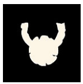

> "Chaos is not strong because it has better weapons. Chaos is strong because it does not play the same game as we do."
>
> — An initiate of the Storm Bull, before charging a horde of broos.

Chaos is the force of entropy, the absolute anti-creation that gnaws at the Cosmos. Mechanically, consorting with Chaos (willingly or out of despair) allows one to break the fundamental rules of the game and of reality, but this power is a poison. Chaos flatters, gives without counting the first time, then devours its host from the inside.

## The Condition of Deviance (The Gateway)

It is not possible to invoke Chaos for a trivial action or to simply make life easier. Chaos only responds to entropy and sacrilege. To have the right to call upon this force, the action described by the player must be transgressive, destructive, cruel or fundamentally against nature.
One does not use Chaos to convince a guard to let one pass or to pick a lock in silence; one uses it to make the guard's flesh liquefy or to make the door's metal howl in pain. The end no longer justifies the means: deviance becomes the indispensable means of action.

## The Chaotic Temptation (The Cheat)

When a character faces certain death, a bitter failure, or is blocked by a [Frame Factor](../bets), the player may invoke the force of Chaos to get out of it. Narratively, this translates into an unnatural act (absorbing the energy of an impious artifact, sacrificing an ally, or letting the corruption express itself).

## The First Pact: The Ecstasy of Omnipotence

The first time a character succumbs to Chaos to overcome an obstacle or escape death, the temptation must be absolute.

- **The Absolute Advantage**: The player does not even roll the dice. They automatically obtain a **Feat** (an overwhelming victory), regardless of the Bets or the power of the adversity. The chaotic anomaly purely and simply annihilates the problem, giving the player the dizzying thrill of omnipotence.
- **The Counterpart**: In exchange for this impious miracle, the character gains a Taint Keyword (e.g., _Tentacular arm_, _Pus-covered skin_, _Thirst for fresh flesh_, _Voice from beyond the grave_).

## The Addiction: The Devouring Spiral

Chaos is hungry. Once the breach is open, Chaos seeks to slip into it, more and more. If the first "fix" is offered to hook its prey, the following uses require being fed by the character's very existence. Like a drug whose effects fade, cheating demands heavier and heavier sacrifices.

To use Chaos again in a later conflict (which mechanically allows instantly converting the dice of one's roll into critical successes, or completely ignoring a Frame Factor), the player must sacrifice a part of what binds them to the Cosmos.

- **The Erasure of Identity**: The player must permanently cross off one of their positive Keywords, a runic Affinity, a Bond or an Attachment from their character sheet. Narratively, the character forgets the precepts of their ancestors, destroys the love they bore for their tribe, or sees their inherited sacred weapon become gangrenous to fuel their magic.
- **The Evolution of the Taint**: With each new sacrifice, the Taint grows and mutates. Destiny makes the Keyword evolve in stages: the discreet sign becomes constraining, then invasive, until total hold.
- **The Downfall**: at a certain stage, there is nothing left to sacrifice to obtain automatic successes. The character has become a monster and their chaotic traits are, in a way, stabilized. The chaotic creatures (broos, dragon snails, etc.) you encounter are at this stage and have no automatic success thanks to Chaos: they experienced it very early in their lives and were devoured by Chaos.

## The Evolution of the Taint

The Taint is not a fixed mark: it is a living Chaos Keyword that evolves at the pace of its use. Each cheat, each pact, each manifestation of corruption can make an existing Taint mutate rather than create a new one. Destiny makes the Keyword evolve in stages, from the most discreet sign to the most monstrous:

- **The first sign**: the Taint is discreet, almost benign, but already against nature. *Example: a strange lump, a passing craving.*
- **The sign asserts itself**: the Taint becomes visible and constraining. *Example: the lump opens into a small tentacle; the craving becomes a thirst for human blood once a month.*
- **The hold grows**: the Taint invades daily life. *Example: the tentacle grows; the thirst becomes weekly, then daily.*
- **Total hold**: the Taint leaves no room for the human anymore. *Example: the mutation spreads across the whole body; the thirst becomes permanent and unquenchable.*

Each stage strengthens the Keyword: Destiny uses it as an additional Bet for the adversity, and its new intensity lends itself to new Bets in conflicts involving nature, the gods or healthy society.

## Notes: The Chaotic Contribution of Worldviews

Reflections on the share of Chaos that each [worldview](../) carries within it.

- **Theism**: it believes it can contain Chaos, but that didn't work. It is likely that the explosion of the Six is partly responsible through **divine explosion**. Hence the mess in the mythic ages and the Great Compromise. The Gods are the main source of Chaos.
- **Mysticism**: it is not its subject. It even tends to make entropic sources (the Six) disappear through its **transformations**. If everyone were mystical, the very notion of Chaos would not exist.
- **Animism**: it manipulates **nature**, it does not innovate. New developments are exceedingly rare. If everyone were animist, Chaos would not exist.
- **Logic**: it does not carry Chaos within itself, but can produce results that seem chaotic through the magnitude of certain outcomes: it therefore brings novelty on a grand scale through **effects**.
- **The cultists of Chaos**: essentially theists (or even animists), they need no additional rules. The Chaotic Gods appeared because there were breaches, but they respect the usual rules as Gods (Great Compromise, etc.).

> Chaos must remain a particular philosophical vision: a perspective on change and novelty, and on what is against nature and what perverts it.
