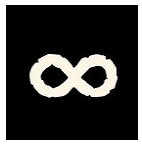
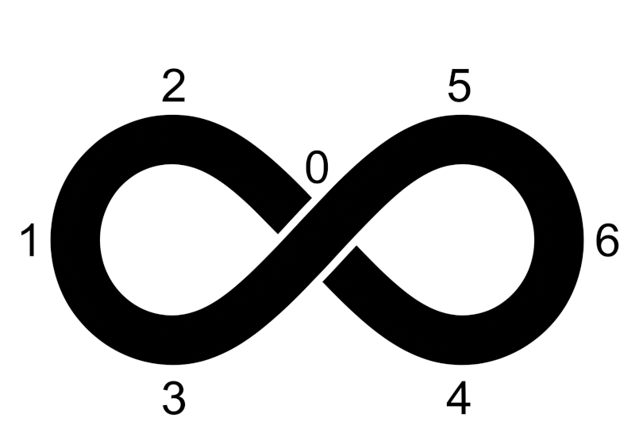

This grimoire explores draconic magic through the rune of infinity.

# Basic Concepts

The rune of infinity is a gauge. Only a true dragon can traverse the rune like a Möbius strip and obtain the desired level from the infinitely small to the infinitely large. Unfortunately, we humans cannot do the same. The rune is then a constraint. (In game terms, it is the rune level that serves as the gauge.)

Looking at the rune of infinity, we better understand how it works:

At the center is the Ouroboros (0). A point. A circle. A reptilian movement and the circle folds to create the rune. The maximum amplitude of the rune is equal to its size (1-0-6). The dragon can go towards 1 or towards 6. Due to its reptilian nature, it can create small amplitudes as well as large ones. There are always 4 paths to the 2 possible choices: 1 choice per path. The dragon has a choice.

For humans it is different, no reptilian movement (even though the schools of Kralorela tried with martial arts to simulate these movements to master the amplitude of the rune, as well as Orlanth Larnsting when Orlanth was still the friend of Dragons). And so the draconic magician finds themselves wanting to reach one of the points of the circle (their objective) but in case of failure (and even success) finding themselves on another point and especially mid-ford (points 2, 3, 4 or 5).

The magnitude depends on success or failure (number of successes) and the stakes (number of stakes or other).

As an example for Temporis Magica, the magnitude can trigger effects spanning 1 week, 1 month, 1 year, 10 years, etc...

When you are mid-ford, you observe an effect but often you lose something in the process (a life, a rune, an object, a memory...).

This magic is really not easy to master. Few dare to attempt it.

# Temporis Magica

This draconic magic comes from Ouroboros the cosmic dragon and allows the manipulation of time.

One of its first applications is of course time travel.

"At the center of infinity, the present. On one side the three pasts, on the other the three futures."

# Res Magica

This magic allows transforming a thought, a concept into an object or vice versa. Since dragons are rather spiritual beings, they seek more the reification of their dreams and concepts. But in accordance with the rune of infinity, the reverse is also possible. The use of reification, however, develops materialism (the Wyrm) in the practitioner. Think of those armies of dragonewt mercenaries hired by the Lunarians with their dara happan gold.
