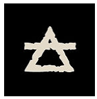
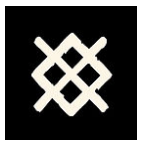
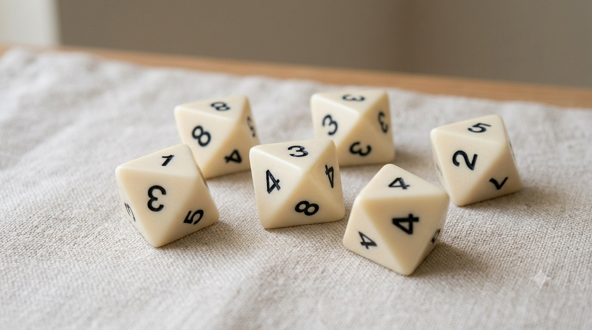

> An adept of the draconic path reads the world through paradoxes and a holistic view of their own draw. They participate in material reality like the others, but know that forcing the illusion with their cosmic magic ties them a little more to this world, delaying their own shedding into the True Dragon stage. Their true spiritual power lies in their strength to renounce victory when the magical opportunity presents itself.

`Utuma with II successes or Wyrm with IV successes?`

*Derogatory names for others: monsters, incomprehensible...*

**Resolution rules**

> Facing the illusion of conflict, one observes the patterns of the world, torn between the temptation to alter material reality to triumph, and the wisdom of renouncing to accomplish one's own shedding.

The dice draw reveals how the dragonewt integrates into reality or if they decide to twist it.

Draconic stakes are represented by D8s.

- We count the number of successes of a draconic [camp](../stakes) as follows:
    - **Materialism (The Standardized Action):** Every even die (2, 4, 6, 8) counts as a success with no negative spiritual consequence.
- **The Draconic Rend:** If the draw reveals patterns of alteration beyond the norm, a strict decision must be made for *each* complex pattern identified:
    - **The Egg's Stasis:** Dice showing identical values (doubles, triples,...).
    - **The Ouroboros:** The simultaneous presence of a "1" and an "8".

    Facing these complex patterns, the player (or Destiny) chooses:

    - **The Wyrm:** The complex pattern can be converted into a success. And that will allow winning the opposition in addition to the materialist successes. But as a consequence, the dragonewt forces the world with the Auld Wyrmish and becomes anchored in it. They are obligatorily given a new *link* or *negative attachment*. They win the material conflict but regress spiritually.
    - **The Utuma (The Sacrifice):** They choose to ignore the advantage of the Auld Wyrmish to maintain their spiritual evolution. In case of death, they will likely gain a higher stage upon their next incarnation.

> Note: in case of an abstract, non-draconic obstacle, thus a mirror of the draconic character, the opposing camp will have no scruples about playing the Wyrm.

**Power modes**

- **Weakened mode:** The spirit is numbed by matter. If complex patterns appear, the dragonewt is forced to assign them to the Wyrm (with its regression consequences). They cannot choose to elevate themselves through Utuma.
- **Heroic mode (The Awakening of the True Dragon):** The paradox is resolved and duality fades. The dragonewt no longer has to choose between material victory and spiritual evolution. All of their complex patterns (Stasis and Ouroboros) automatically count as spectacular successes for the conflict, **AND** they gain the spiritual benefits of detachment (Utuma). They twist reality to triumph without ever becoming bound to it, because they have fully realized that the world itself is but a Dream of which they are the author.

**Comments**

In Glorantha, Wyrms and Dream Dragons are draconic creatures that have remained prisoners of their earthly passions and matter. By choosing this option, it means the dragonewt consciously chooses to use their cosmic power for purely mundane purposes. They lower themselves to the level of a "simple" terrestrial monster anchored in the world, rather than seeking spiritual elevation.

Note also the correspondence of the 8 power runes with the 8 numbers of the D8. The even runes are Death (2), Stasis (4), Disorder (6), Illusion (8). The runes that yield successes in the material world are seen as imperfect (compared to Movement (1), Harmony (3), Life (5), Truth (7)), confirming if confirmation were needed that the materialist path is imperfect. However, the activation of these powers is not regressive and is tolerated as part of the lot of Dragonewts in their state of living creatures in Glorantha. It is the use of the patterns that poses a moral dilemma. It is as if there were the small conscience (the materialist path) and the great conscience (the egg's stasis and the ouroboros).

This mechanic allows the dragonewt to function normally (and without penalty) in everyday tasks via the Materialist Path. The drama only intervenes when deep magic operates: an exceptional draw (Stasis or Ouroboros) is no longer perceived as a simple opportunity to crush an adversary, but as a spiritual test in the eyes of their kind.

Since dragonewts are generally not explored as player characters (due to utuma), the system allows justifying and naturally playing these strange moments where overpowered creatures let themselves be slaughtered in order to elevate themselves. Whether to have the dragonewt reborn immediately or ages later remains at the full discretion of your narrative choices.

And for the Logicians, you can also consult the [grimoire Ars Draconis Magica](ars-draconis-magica)
