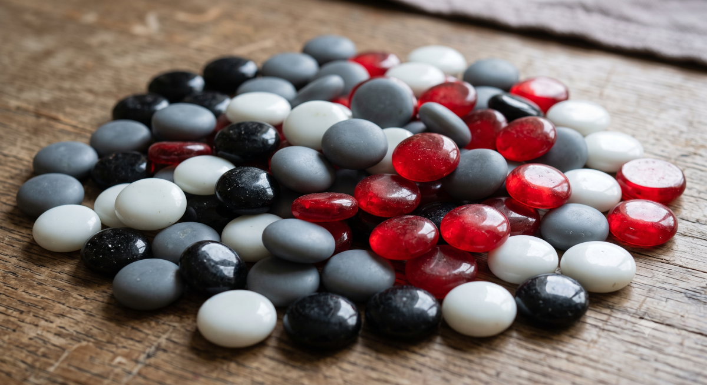

When a mystic faces adversity, they distinguish what is favorable or can act as a lever from what is unfavorable or must remain in the background. They also distinguish what can mutate and generate a transformation. They therefore only see black, gray, white, and bicolored (black and white) or red (like the Red Moon) marbles.

One could therefore replace the dice with a bag of marbles with the correct distribution (1/6 black marbles for 6s, 2/6 gray marbles for favorable evens, 2/6 white marbles for unfavorable odds, and 1/6 bicolored or red marbles for 1s).

You would need many marbles to prevent "cheating" and also to avoid having to reshuffle each time you set stakes. Number to plan for: 60 provides equivalent coverage for camps of 10 stakes (there are indeed 10 of each element).
