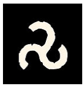
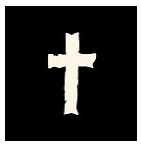
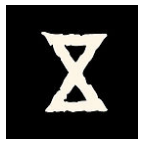
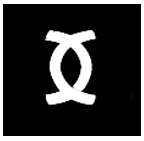

Runes are the building blocks of the world. They weave reality. They seep everywhere. They draw the fabric of Destiny.

Let us identify them.

Let us name them.

Let us observe their impact.

Sometimes two cultures or characters are bound to the same rune but its manifestation always differs.

Runes unite but also distinguish. They are never alone.

> Arachne Solara has 8 legs and you have only two hands.

The idea is to draw two runes to establish a connection with Glorantha.

This then allows pulling the threads until an idea emerges.

_Table of power runes:_

| **Number** | **Rune** | **Themes** | **Examples** | **Body** | **Question** |
| --- | --- | --- | --- | --- | --- |
| **[1]** |  | **Discovery** | what is around, the world, places, information... | legs | where? |
| **[2]** |  | **Threat** | what is different, the other, the enemy... | arms | who? |
| **[3️]** |  | **Relations** | what connects, emotions, feelings, bonds, dilemma... | heart | what? |
| **[4️]** |  | **Law** | what is frozen, morality, society, group, authority... | torso | how? |
| **[5️]** |  | **Resources** | what is necessary, material, reality... | genitalia | how much? |
| **[6️]** |  | **Revelation** | what surprises, shakes, twist, surprise, what is outside norms, improbable... | arms | when? |
| **[7️]** |  | **Knowledge, Knowing** | what must be sought, searched, studied... | head | why? |
| **[8️]** |  | **Mystery** | what is hidden, deception, illusion, vain, illusory... | internal organs | for what? |

Left hand and right hand (2d8 or 8 cards)

> Gloranthian scholars of diverse cultures have written extensively about the links between the power runes and the constituent elements of the world, whether at the level of bodily elements, the great universal questions, or any other grand categorization of the world.

This may seem abstract but it is much easier to handle than it appears. It constrains your Gloranthian imagination but you are totally free to invent whatever you want.

The relationship between the two runes is also free: it can be a cause-and-effect relationship, a temporal relationship, a hierarchical relationship, etc... or even have no relationship at all and be two independent things in the continuation of the narrative. They are symbolic entities serving the inspiration of the ongoing story.

### When to draw the runes?

At the beginning of a season, at the beginning of a situation, or when you feel lacking inspiration, or when the characters' objectives must confront reality.

Indeed, the narrative is centered on the characters' objectives above all. This allows thoroughly exploring their motivations and ways of thinking and acting. But that is not enough to write a story. The characters are plunged into a complex world (Glorantha) that moves, and this movement of the world is expressed by the Runes. It is as simple as that in a Gloranthian logic.

*Happy [meditation on the runes](../../../../../notes/runes-meditation) of power*
