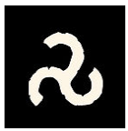
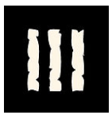
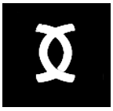
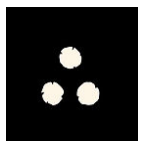

> When one wants the strength of gods, spirits or laws, one must first accept the chain one takes upon oneself. All power is paid for with obedience.

Glorantha is woven from bonds: the Web of Arachne Solara, the Great Compromise, the clan oaths, the spirit pacts. Nothing is gained without a prohibition coming in return. Some cults only reveal their secrets in exchange for a **geas**. A shaman who binds a spirit without a [Feat](../stakes) receives a **taboo**. The Brithini have made the **prohibition** their immortality.

## The Family of Bonds

These bonds bear different names according to their nature:

- **Taboo**: a prohibition *imposed*, willingly or not, by a spirit, a sacred place or a pact. One does not always draw power from it; one submits to it to exist in the spirit world. *Example: the taboo of the fetish.*
- **Geas**: an obligation or prohibition *voluntarily accepted* in exchange for power (often a secret). It is the bond of the cult. A geas is not a mere limit: it is an exchange. You bind yourself, and the world gives to you.
- **Vow**: a promise made *before a god*, most often unilateral.
- **Oath**: a *mutual* bond between two parties, sealed before a divine witness (Humakt is the god of oaths). The oath binds both camps.
- **Prohibition**: a ritual, legal or ancestral ban, which does not depend on an individual will. *Example: the prohibition of the Brithini.*
- **Curse**: an involuntary and destructive geas, often the consequence of perjury.
- **Wyrm / Utuma**: the draconic bond, chosen to bind reality (the Wyrm) or to renounce it (Utuma).
- **The secret name**: a taboo of naming. Revealing one's secret name is giving power over oneself.

These bonds are held by the runes: **Stasis** freezes the commitment, **Truth** calls upon testimony, **Death** makes one pay the ultimate price.

## The Principle of Exchange

The rule is simple: *no power without a bond, no bond without a price.* Every great secret, every bound spirit, every grimoire opens a space of power that must be balanced by a proportionate prohibition. When a bond appears, the Fate may ask:

- *What does the character gain?* (a runic secret, an allied spirit, immortality, a spell)
- *What does the character give in exchange?* (a freedom, a promise, a part of themselves)
- *What happens if they transgress?*

The greater the power, the more binding the bond must be — otherwise the power collapses, or worse, turns against its holder.

## The Sources by Frame of Thought

### Theism: Cult Geasa

A theist molds themselves into the exemplary deeds of their gods (see [theism](../theism)). Cults do not offer all their secrets for free: access to runic mysteries is often paid with a geas. The model is **Humakt**, the god of Death and oaths.

*The geasa of Humakt (examples):*

- Never refuse a single combat challenge.
- Never flee a battle.
- Never strike an enemy who cannot see you.
- Never break an oath.
- Never lie.
- Never be healed by the gods of other cults.
- At the highest ranks, chastity and the abandonment of family ties.

Each geas opens a secret of the Death rune. Breaking it means losing the secret and incurring the god's wrath.

Other cults have their own bonds:

- **Yelmalio**: chastity, never any alcohol, ritual purity.
- **Babeester Gor**: never back down from vengeance, never forgive.
- **Ernalda**: the Peace of Ernalda — do not bring war to sacred places.
- **Storm Bull**: never flee the Chaos, hunt it without rest.
- **Issaries**: fair measure, honesty of weights and exchanges.
- **Eurmal**: the trickster *reverses* geasa. Where others forbid themselves, he must lie, steal and break — his bonds doom him to transgression itself.

### Animism: The Fetish Taboo

An animist trades with spirits (see [animism](../animism)). When the relationship is free, the spirit comes and goes. But when a shaman seeks to *bind* a spirit without having obtained a [Feat](../stakes), the bond is not strong enough to be shared: the spirit lets itself be enclosed in a **fetish**, but the bond imposes a **taboo**.

- The fetish is *personal*: it cannot be shared, lent or resold. The spirit has only one master, the one who accepted its taboo.
- The taboo is specific to each spirit: not eating a certain meat, not crossing running water, not lying, not sleeping in a closed house...
- If the taboo is broken, the spirit flees... and may even turn against the shaman. The fetish empties, and the newly freed spirit is no longer an ally: it is a grudge.

The animist world also knows other bonds:

- **The totemic taboos** (the Hsunchen): never kill one's totem, respect the rules of the hunt (not being seen before the blow, asking permission, giving thanks).
- **Ghosts**: often they are spirits *bound* by an unfulfilled promise or oath. They stay because a bond holds them.

### Logic: The Prohibition of the Brithini

The logician invokes no god: they rely on reason (see [logic](../logic)). But reason itself has its bonds.

- **The prohibition of the Brithini**: the Brithini (the immortal Malkioni) must not *innovate*. As long as they follow the ancestral Law of Brithos to the letter, they remain immortal. The slightest deviation, the slightest innovation, makes them mortal. Immortality is not a gift: it is a prohibition one respects.
- **The sorcerer's vows**: a sorcerer often binds themselves to their grimoire with vows of method and non-disclosure. Breaking the vow unbalances their practice and betrays the school.

### Mysticism: The Illusory Vow

The mystic knows that bonds are only illusions (see [mysticism](../mysticism)). They can therefore *transcend* them. But voluntary asceticism remains a tool for them: to deprive oneself, to bind oneself, is to surpass oneself and reach the heroic mode. The Illuminated one, for their part, can combine opposites without suffering the usual backlash (see [Illumination](../illumination)).

### Draconic Thought: Wyrm and Utuma

The draconic bond is a choice (see [Dragons](../draconic)): the **Wyrm** binds the character to matter (they gain, but regress), the **Utuma** unbinds them (they renounce, but evolve). It is the geas of dragons: power is obtained by binding, and true freedom by renouncing.

## The Oath: The Mutual Bond

The oath is not sworn lightly. It binds *two camps* before a divine witness. Perjury is a cosmic crime: it releases the other camp from its obligations and makes the perjurer a cursed being.

> Even the gods are bound. The **Great Compromise** is the greatest oath of all: the gods renounced intervening directly in the world. The Red Goddess learned to circumvent its letter without breaking the bond — her power is the reflection of her mastery of oaths.

## Transgression

Breaking a bond is not a simple failure: it is a reversal.

- *Theist*: the god turns away. The runic secret is lost, divine support turns hostile.
- *Animist*: the spirit flees and may attack. The fetish empties.
- *Logician*: the practice unbalances, the grimoire closes.
- *Mystic*: the bond was illusion — but the price of this revelation is the loss of asceticism.
- *Draconic*: the regression is immediate.

**The curse of the perjurer**: the perjurer finds no peace. *"Death does not free the traitor."* Their spirit remains bound, can neither join the ancestors nor be reincarnated: it becomes a ghost or an undead, in the service of the one they betrayed.

**The spiral**: like the [Chaos Taint](../../notes/chaos), perjury is a permanent negative keyword. It can never be used to generate a stake in one's favor; the Fate uses it automatically against the character in situations of trust, justice and honor.

## Mechanics

A geas or a taboo plays as a **double-edged keyword**:

- **In its domain, it is always a stake in your favor.** *"Never flee"* is a strength when you stand firm against the enemy. The bond is not a weakness: it is a source of power.
- **But it is a lever for the Fate.** The temptation to break it, the moment when it forces you against your own interest, the person who knows how to push you there: all of this becomes a frame factor, or even a stake of the adversity.

*Swearing is a ritual.* Taking an oath is a sacred act: it requires a worthy place or witness, and can be resolved as an opposition (see [stakes](../stakes)). An oath sworn in haste is a trap; an oath sworn at the right moment is a feat.

*Perjury.* The transgression causes the loss of the favor (the secret, the spirit, the immortality) and the appearance of the *Perjurer* keyword, treated as a Taint.

## The Fate's Toolbox

### Bond Generator by Rune

Draw a power rune to invent a geas, a taboo or a prohibition:

| Rune | Geas, taboo or prohibition |
| :--- | :--- |
| [1]  *Movement* | Never stay two nights in the same place. / Never refuse a journey. / Never sit on a throne. |
| [2]  *Death* | Never flee. / Never refuse a challenge. / Never strike an enemy who cannot see you. |
| [3]  *Harmony* | Never lie. / Never refuse hospitality. / Never break a promise made to an ally. |
| [4]  *Stasis* | Obey the ancestral Law. / Never change your name. / Never leave the sacred place. |
| [5]  *Life* | Never eat meat. / Chastity. / Never let a creature die without permission. |
| [6]  *Disorder* | Always answer a challenge. / Never plan ahead. / Always say the first thing that comes to mind. |
| [7]  *Truth* | Never lie, even by omission. / Reveal any secret you are asked for. / Never steal. |
| [8]  *Illusion* | Never reveal your name. / Never show yourself twice under the same appearance. / Always wear a mask. |

### Concrete Examples

- **Varmand, initiate of Humakt**: to access the secret of the *Mercyless Edge*, he swore never to flee a battle. The Fate may place him before a necessary retreat — and turn his geas into a trap.
- **A shaman** has bound the spirit of the Great Deer in a fetish: the taboo is to never cross running water. The fetish is personal; lending it would expose the spirit to another master.
- **A Brithini**: the prohibition is innovation. They age with every compromise with novelty.
- **A secret name**: revealing your secret name is handing a permanent stake to the adversity.

### Narrative Hooks

- A character faces the dilemma of breaking their geas to save their own.
- A spirit demands a new taboo in exchange for its help.
- An oath sworn to an enemy releases them from their obligations — and turns them against the group.
- A ghost is none other than a perjurer seeking to be unbound.
