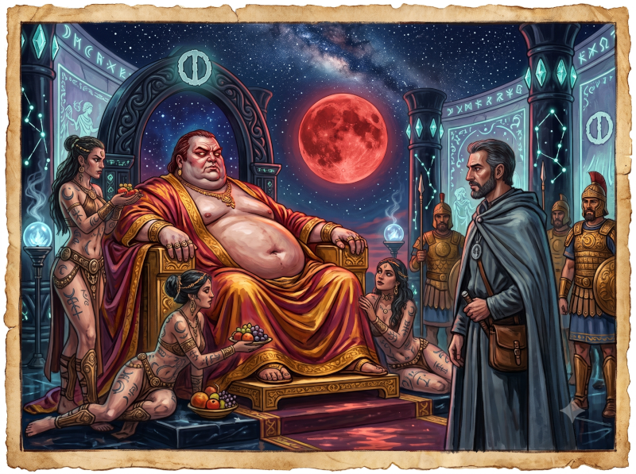
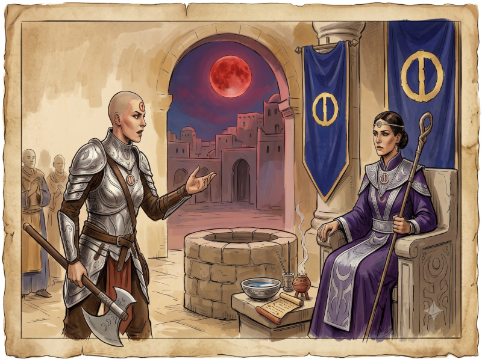
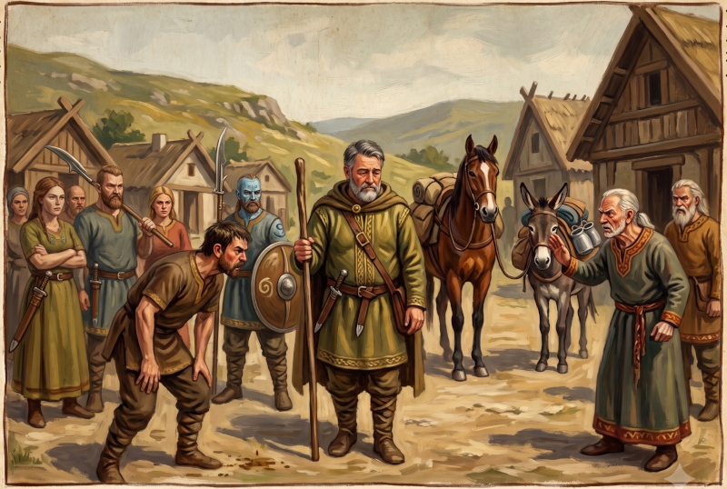
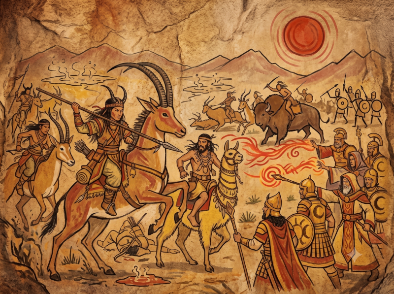

> Where we discover our heroes before they meet.

---

# The Prelude of Ikarnos: The Shadow Beneath Argenteus's Gleam

The Rune of Mastery beats strongly in my veins; it feeds within me the devouring ambition to face all situations, to never bow my head, even though it forbids me from acting directly upon Destiny.

The world is moving, and violently. Ignifer has been killed, struck down by the infamous savage Harrek the Berserk, that cursed Wolf Pirate. But glory to the Goddess! A new Mask has been revealed to the world: it is called Argenteus. Glory to the Red Emperor! The sun of the Empire continues to shine in the skies, and the quiet shadows — of which I am part — resume their underground labors so that the Lunar Way may triumph.

However, the wind has shifted at the palace. This new Mask swept away the rigid bureaucratic scheme that prevailed during Ignifer's time. From now on, he offers the inhabitants of the Empire to savor without hindrance the prosperity and pleasure offered by the Goddess. More power to them, but I am not fooled. The enemies will be vanquished, certainly, but they must be sought out and transformed or subdued. The Shadow of Orlanth still threatens us still and always. That is precisely why my mission orders me to venture deep into barbarian lands: I must prepare the ground for our fighting forces while the people, carefree, enjoy the splendors of the Empire.

Argenteus and his entourage of courtiers seem to royally ignore this state of affairs. So I went to meet my contacts to slip them a heartfelt warning. The dialogue was lunar: while my interlocutor delighted in speaking to me of pleasures and delights, I projected in his face the imminent dangers brewing at the borders. The situation was bogging down, the dialogue was deadlocked. Disoriented by such frivolity, I then tried everything by putting forward a third way...

> 🎲 Marginal Victory

He dismissed me with a weary gesture, as if washing his hands of it. That was at least something: I did not have their official veto on my hands. Without losing a moment, I organized my journey and set course for the Southern Kingdoms.

## The Prelude of Hanya: The Song of Movement and Stasis

After scrutinizing the sacred waters and completing my divinations at the well of Hwarin in Jillaro, my duty appeared to me with the clarity of crystal. I went without delay to find the priestess of the Order. The verdict of destiny was paradoxical: if one wished to protect Jillaro, I had imperatively to leave Jillaro, my beloved city, to venture forth into the dangers of the barbarian lands.

Facing her institutional skepticism, I poured out my entire soul in an attempt to open her mind to this necessity...

> 🎲 Major Victory

The success was total. Not only did the priestess acquiesce to my arguments, but the Order decided to fully and completely support my endeavor. This would take me further from my quest toward the Red Goddess, but the defense of Civilization must take precedence. My personal case is not the most important, and this argument made the Grand Sister smile as if she saw the beginning of something.

## The Prelude of Jaridan: The Bitter Scent of the Lunar Pax

Trade is my second nature, and I have the good fortune of being a regular visitor to the kingdom of Sartar, particularly with the various clans of the AldaChur confederation. But the world is changing: since the fall of Boldhome twenty years ago, the proud land of Sartar has become a Lunar Province.

It was the Dark Season, that time of year favorable to exchanging Ernalda's earthly blessings before the fury of the Storm Season descended. Confident, I guided my small caravan through the hills, taking care to visit my contacts and sometimes friends among the various clans. My goal was simple: sell my goods. But year after year, the atmosphere was degrading before my eyes. Faces hardened, people became more and more suspicious of me. Some, as I passed, even spat on the ground. What bitterness! Yet I am like them, a true Orlanthi at heart, but to no avail: my commercial past condemned me in their eyes.

The breaking point came the day I arrived on the lands of the Allalone Clan to participate in the weekly market. For the very first time in my peddler's life, I was not welcome. I had to fiercely negotiate my simple spot on the public square: what absolute shame! Me, an honest Orlanthi!

> 🎲 Marginal Defeat

The verdict fell, polite but implacable. My contacts, without tipping into outright hostility, refused to support me. I was formally forbidden from displaying my wares on the market. Out of regard for our shared past, they insisted that this was not an attack against me personally, but against what I now represented in their eyes. They nonetheless offered me hospitality for the night before asking me to leave.

In the darkness, quietly, I still managed to sell a few goods to clan members who came to find me discreetly out of sight. But what immense sadness... The clans are divided, grimly turned inward, unable to see the obvious benefits they could derive from the *Lunar Pax*. Oh, I understand their point of view, their pride... but their struggle is futile. We know this well, in Tarsh. All of this will only lead to new unnecessary bloodbaths, and meanwhile, trade withers.

## The Prelude of Peek-ee-peek: Blood and Dust of Bullion-of-Moon

Our tribe carved its glory in blood during the memorable Battle of Bullion-of-Moon. I was there! And by the spirits, what a Homeric battle! On one side, the lunar army, resplendent in gleaming weapons and armor, magic crackling in the ether and terrifying dragon-men out of legends. On the other, us, proud, terrible, cleaving the plain on the backs of our war antelopes! We literally crushed the other tribes.

My clan's mission was crucial: we had to form a bulwark around the Lunar wizards and protect their precious mystical resources from enemy assaults.

> 🎲 The battle was played as an advanced opposition in HQ/G

The enemy charged. My fingers clenched on my bowstring, I loosed my arrows to keep them at bay.

The horde did not retreat, they were damn numerous. Gritting our teeth, we continued to pepper them with arrows under a sky of death.

The storm of steel raged around us. Our wall of arrows continued to prevent the foot soldiers from reaching the imperial wizards who, in the rear, were performing terrifying feats of fire and light. But the pressure was too strong.

The front lines were breached! Seeing the enemy warriors closing in on us, I decided to drop the arrows and summon the *Spirit of the Beast*, projecting the wild wave to knock the attackers from their mounts.

Some riders tumbled into the dust, but the human tide remained too dense. I persevered, screaming my incantations until my throat tore.

This time, the impact made them reconsider. In the chaos, I saw them trying to regroup. No question of giving them time to catch their breath! I decided to push my advantage to destabilize them once and for all. Without their mounts, these dogs are nothing, they are as vulnerable as we would be without our antelopes!

The defense line held firm, but the balance was precarious, everything could still tip at any moment.

The fury of combat reached its peak, the smell of blood mingled with the intoxicating taste of a victory that was close at hand. That was when the tide turned.

Our line gave way, broken by a desperate assault. Overwhelmed, I cried out to Fta-Ah, my faithful mount, to tear us from the melee and give us a moment of shelter.

It was so close to snatching the victory... Fta-Ah, admirable in loyalty, allowed me to maneuver in the heart of the chaos, rearing up and unseating the riders who surrounded us.

The law of war is cruel and forgives no lapse.

Then, the surge! Hooray! Seeing the enemy ranks finally falter, I tried to push my ultimate advantage by casting my *Death Lance* at one of the fleeing. It was a high-lama, one of their great leaders without a doubt, given the abundance of fetishes and sacred tattoos adorning his skin.

My ultimate feat of glory failed by a hair... I could have been the legendary heroine of that day. But what does personal prestige matter, for in the end, we had won!

It was a **major defeat** for the attackers. The nomad tribes that had rushed to assault the lunar positions were lastingly broken by this disaster — crippled, handicapped, and morally demoralized for the seasons to come.

As for me, I came out alive but greatly weakened, my body marked by a few bloody abrasions and my mind emptied by a deep spiritual exhaustion from having called upon the Spirit of the Beast so much. Fta-Ah, exhausted by her exploits, is equally weakened. But what do our wounds matter: our victory at the Battle of Bullion-of-Moon remains absolute and historic.

| [Previous](..) | [Next](../02/) |
