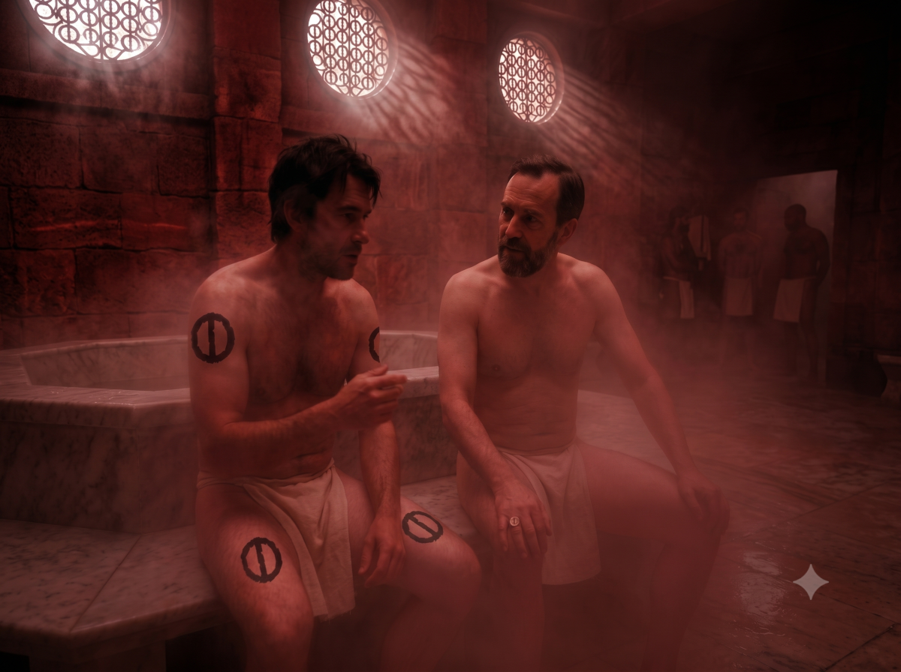

# From Dunstop to Bagnot

**Date:** 1611 – Sea Season – Harmony Week – Clay Day

We left Dunstop with a lunar squad that was heading to Bagnot to relieve the guard at the *Temple of the Quaking Earth*. From the start, the atmosphere was heavy: the soldiers' comments openly criticized Peek-ee-Peek. A small core of soldiers, led by one of their number who was particularly xenophobic, fueled the most rancid prejudices: nomad zoophilia, the supposed submission of sand men to their "females," etc.

The journey was off to a bad start and these tensions risked compromising our safety. Although she did not stoop to the soldiers' level, Hanya did not come to the nomad's defense either. She judged her boorish, swearing only by the beauty of civilization of which Jillaro was one of many jewels. Jaridan, for his part, tried to speak to the nomad, but she, on the defensive, would not let him approach with his horse.

The tension was at its peak when we made camp for the night. We hesitated to camp separately; but on the one hand, the danger would be greater, and on the other, I wanted to talk with the soldiers to learn more about Sartar and Prax.

## During the journey

**Ikarnos's Objective:** Obtain any intelligence about threats within the Empire.

> 🎲 Marginal Defeat 

Ikarnos's account: "I tried to speak with the decurion commanding the squad to see what he knew about threats and our enemies, but I obtained no information worthy of the name."
  
**Peek-ee-Peek's Objective:** Send *Spirit of the Beast* at the racist soldier's mount to cause an accident.

> 🎲 Marginal Victory 

Peek-ee-Peek's account: "I tried to cause an accident to the soldier who had been disrespectful to me all day. The spirits accompany me and guide my path. So I whispered to *Spirit of the Beast* to go make the decurion's horse suddenly rear and kick the soldier. The horse reared, but the soldier was not hit, and the decurion did not fall either. The event seemed strange to all and cast a great silence in the ranks. At least they stopped bothering me and became cautious, believing an invisible enemy was nearby. Scouts were dispatched. We lost time, but I smiled inwardly: I had obtained calm."

**Jaridan's and Hanya's Objectives:** Nothing special.

# Stopover at Bagnot

**Date:** 1611 – Sea Season – Harmony Week – Wind Day

After the previous day's incident with the decurion's horse, we decided to push harder on horseback and continue our journey without the squad. This choice proved worthwhile: we were able to reach Bagnot within the day.

During the trip, we discussed the group and how we should support each other to prevent the previous day's problems from recurring. Peek-ee-Peek then confessed that it was she who had made the horse rear, though she regretted not having managed to blind the soldier. Facing our remarks, she agreed to make efforts to allow us to approach our mounts near her antelope, despite the deep contempt she held for horses.

Then we finally spotted the stone fortifications of Bagnot, the former capital of the kingdom of Tarsh, before the kings settled at World's End. We also learned that the new king, Pharandros, was currently visiting the city. Armed with Fazzur's seal and our list of contacts, we were in a good position to meet him: Pharandros was none other than Fazzur's nephew, and he had just barely ascended to the throne.

## Immersion in the city

The city appeared of clearly Orlanthi inspiration and much less military than Dunstop. Jaridan, the Tarshite merchant, already had some commercial contacts there. Hanya remained doubtful, not finding the splendor of her beloved Jillaro, although she was told of the *Temple of Arim the Poor*, perhaps the only notable construction in the city.

We decided to go to Caius Brontex, a magistrate and friend of Fazzur on our list. He welcomed our small party in his home, whose exterior architecture was Orlanthi but whose interior furnishing was purely Dara Happan. Around a table, we discussed with Caius the regional situation. We gleaned several pieces of information:

* The *Lunar Pax* is fragile (but we already knew that).
* The young king Pharandros is particularly ambitious.
* He holds immense admiration for Fazzur for his military genius.
* He is in favor of strict and ruthless application of lunar laws, even in barbarian provinces, to "better educate" them (use of pillories, mass sending of slaves to the *Slave Wall*, crucifixions...).

We asked him about the interest of choosing an eastern route rather than bypassing through the north. Caius, who ventured very little outside his city, had no firm opinion on the matter, though he himself would have preferred the main road for obvious reasons of comfort and security.

### Companions' Activities

**Hanya** went to visit the *Temple of Arim the Poor*. She found herself alone among the barbarians. The temple was nothing exceptional in itself, but its wooden sculptures detailed the journey of this man who became a God, who had the courage to be the first to enter the *Dragon Pass* after the draconic killings. The bas-reliefs showed his various and mysterious encounters: a centaur, a woman with feathers on her head, or a priestess and a mountain.

**Jaridan** took the opportunity to sell a few goods and renew his commercial stocks.

**Peek-ee-Peek** preferred to keep a low profile and stayed most of the time sheltered at Caius's place.

## The royal audience

We decided to send only myself (Ikarnos) and Hanya as ambassadors to Pharandros. We did not know the new king's exact disposition toward non-lunar people, and the altercation with the squad encouraged us to be cautious.

So I had myself announced alongside Hanya to Pharandros. The king was young, handsome, charismatic, sporting curly blond hair and a contagious smile. We were perfectly received, for in his eyes, *"friends of his uncle were necessarily so."* The young sovereign was surrounded by advisors often much older than him, but I quickly noticed that they did not seem to dominate him for all that.

I presented our mission which brought me to travel to the lands of Prax, recently conquered. The young king's vision was clear: by bringing the lunar benefits to local populations, they would almost naturally cease to be a threat, while using force of course if necessary.

Suddenly, one of the advisors asked me what the Emperor's *Undulating Mask* would think of the cult of Arim the Poor. I immediately recognized a secret word: my interlocutor was no doubt a member of the *Society of Secret Phrases*. I stared at him intently. He was a thin, almost ascetic man, wearing a robe and carrying several scroll cases.

It was **Hanya** who spoke up to answer him: "The Goddess only fights her enemies and knows how to recognize the qualities of all in everything, for we are but One in her eyes!"

The man smiled mischievously: "Indeed, you are right, noble guardian of Jillaro. I was merely making a joke comparing the austerity of poor Arim to the current lifestyle of the new mask."

The audience ended on these words. It was obvious that I needed to contact this man again more discreetly. We left the king, informing him that we were staying at Caius's home and would remain a few days here to prepare our expedition toward Prax through the east. All that remained was to wait.

Back at the house, we told everything to Jaridan and Peek-ee-Peek. I had chosen to include them in the secret to bond our rather heterogeneous group. Hanya was of the opinion to be wary: in her eyes, Jaridan and Peek-ee-Peek not being "one of us," they could have reasons to betray us, and it was better they knew as little as possible. She agreed, however, that the information gathered was far from confidential.

**Peek-ee-Peek:** "You are strange to want to stay locked behind walls. But I will wait if it is the Goddess's will."

We went to sleep in Caius's spacious house, who proved to be an exceedingly considerate host.

## Secret meeting at the Lunarium

The next day, I met the advisor at the city's thermal baths. The latter, newly erected, had been inaugurated by the king a few days earlier (which explained his visit to Bagnot, as a way to establish his reign through a civilizing vision). I was accompanied by Jaridan.

It was in the heart of the red smoke of the *Lunarium* that the man reappeared. I noticed there were very few locals in the baths. He finally introduced himself: "**Imex Rapiis**, strategic and tactical advisor to the King. Pharandros is young and still discovering the barbarian world. This is not the Empire here, but merely a province. Fortunately, it is the richest of the Provinces. I am here so that Prosperity reigns, so that barbarian chiefs have no interest in rebelling, and so that the *Lunar Pax* persists. That is why we built these Thermal Baths."

Turning to Jaridan, he added: "It is the choice between victory with us, or defeat against us, so to speak."

I decided to advance my pieces:

**Ikarnos:** "However, taxes, levies, and slaves must be sent to the Empire. The balance is not simple to find."

**Imex Rapiis:** "As I told you, the Province is rich, so the situation could be far worse. You are courageous to venture forth like this. On the other side of the mountains lies the famous *Dragon Pass*: a territory of hills and summits, a mosaic of peoples that are essentially barbarian, but also non-human. Here in Tarsh, we have a few exiles in the mountains who revolt from time to time. But over there, on the other side, it must be hell, even though we vanquished them almost ten years ago. Be cautious, my friends, in any case."

## Departure

We departed a few days later heading for the mountains, marching toward what was indicated on our maps as the **Falling Ruins** — the only passage allowing access to the *Dragon Pass* without having to bypass through the North.

| [Previous](../02) | [Next](../04/) |
