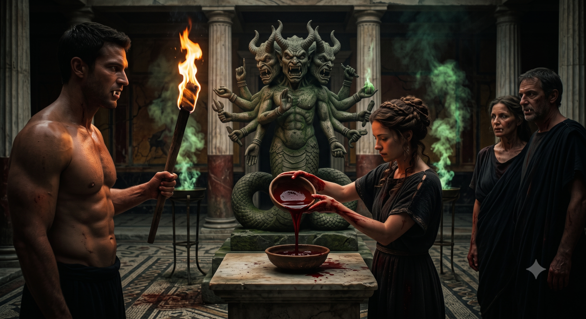
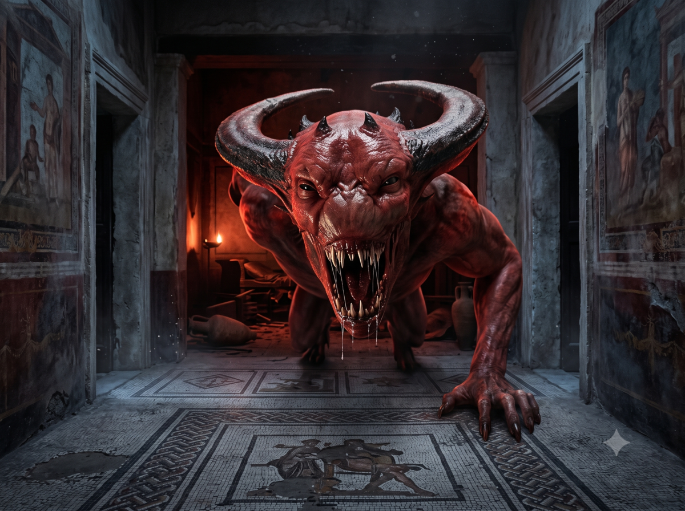

## On the road to Aldachur

The group advances through a landscape alternating between flat terrain and small hills. The lands are arid with just grass and trees here and there. Perhaps the presence of the Dwarves has something to do with it, knowing the aversion these latter have for everything that is plant-based: Aldrya the goddess of plants and her people the Aldryami that men call Elves are their ancestral enemies after all. Jaridan is a bit nostalgic, he knows that if they continue north, he could reach the northern road and branch westward and thus reach his family. The witch's prophecy haunts him and he knows he will not do it but what is more terrible is that perhaps he will never see them again. He decides to write them a long letter once at Aldachur. Ikarnos has decided to go south, to cross the River that runs through the kingdom of Sartar from north to south then follow one of its tributaries that according to his maps should lead them to the Aldachur plateau. Peek and Fta-Ah are happy to find the open air and gallop along filling their role as scouts. Hanya says nothing. Ikarnos watches the landscape. A few ancient stones marked by draconic symbols from the WFH catch his attention. He looks right and left where he might see traces of the Dragons, a subject that has preoccupied him since Elemenoria made her revelation about a destiny related to these creatures, but the landscape remains desperately empty.

This is not the case on the second day of travel. They begin to see fields and peasants working them. They also see livestock watched by armed shepherds. They pass far enough away to show they are only travelers and not a threat. Children come to spy on them. The region has been under the Empire for at least a generation and the Lunar presence is no surprise. One can even see from a distance in some villages on hillsides houses mixing the Heortic style and the Lunar style. And it is precisely while approaching a lunar-style house built on a small hill that they spot a columned domus surrounded by a group of about twenty men holding torches in broad daylight. They decide to continue their road but send Jaridan to find out what is going on.

## Angry peasants

Jaridan arrives on the scene. "Greetings, I am traveling and I saw the torches, what is happening?"

A man steps forward: "We are going to make those monsters confess!" he says, pointing at the house.

"Monsters? Explain yourself, I am traveling with a warrior and a nomad who know how to fight, perhaps we could help you!" he says, noticing that the men seem more like farmers than armed thanes.

"My name is Irken and in that house lives Cai Delli and his wife. They came 5 years ago like so many others since the colonization, and since Harvar Ironfist invited and accepted them on our lands, supposedly to become powerful and prosperous!" He spits on the ground. "They brought the vine and make wine. My brother Riken came to buy some. He was found butchered a few kilometers from here."

Jaridan: "they killed him?"

Irken: "6 months ago another body was found in the leg and atrociously mutilated, they said it was beasts. I went to see his mother and curiously the young man did not live very far either. I am sure it is no coincidence. Just looking at them, they are strange. Always smiling, beautiful, they deceive everyone I am sure. The Circle does not want to intervene and they think it is wild beasts, perhaps werewolves but since the arrival of Jomes Wulf, these have taken refuge much further east. We came so they would follow us and we could take them to see old Gartinor, a Grey Sage who can perform a divination and tell us the truth."

Jaridan: "and they agreed?"

Irken: "they refuse, arguing that they only answer before lunar justice!, which means we would have to go see Harvar in Aldachur but it is far and our clan is not the best off to make such a request. In any case, the clan will not do it."

He seems truly desperate.

Jaridan: "wait friend, I will go see my traveling friends and see if we can help you."

Irken: "but how?"

Jaridan: "wait"

And he rides back to join the other three and explain the story.

Ikarnos: "and you would want me to represent lunar justice with Hanya, is that it?"

Jaridan: "it costs nothing to try, right? If we resolve this story, we will have won the respect of a clan, unless you are in favor of the strong method to subdue Sartar and its peoples, but I doubt it." Hanya: "let us go and may justice be served on this matter."

The four heroes then ride up the hill under the astonished and suspicious gazes of the farmers.

Jaridan: "I am traveling with a lunar scholar and a guardian of the city of Jillaro. Lunar justice from Aldachur is too far but these two are able to speak to the man and woman locked in there."

After some explanations and deliberation on the plan to follow, it is decided that Ikarnos, Hanya, Jaridan and Peek will attempt to enter the domus accompanied by Irken to speak with the hosts. The mounts will remain outside, which Peek accepts after obtaining Irken's promise that the farmers will treat them well.

## Cai and Visa Delli

Ikarnos knocks on the door: "I am Ikarnos of Raibanth and I wish to speak with Cai Delli the master of this place, myself and my companions. We come in peace to help prove your innocence."

After a few moments, the door opens, an ephebe opens for them (undoubtedly a slave).

Ikarnos: "he also comes with us to defend against his accusations but the others remain outside, do not worry" and the ephebe guides them through the residence, along a cloister.. they spot beautiful servants here and there.

Curiously, from all these people they sense a sort of pride and no fear. They are led into a vast hall with benches and a table laden with food: grapes, roasted quail, heady wines. Standing there are a man and a very beautiful woman dressed in an elegant tunic and toga with jewelry for the woman.

The ephebe: "here are Cai Delli and his matron Visa Delli."

He steps back. The two hosts finally smile: "so here are our saviors! and what is he doing here?"

He seems to have nothing but contempt for Irken.

Ikarnos replies: "he lost his brother in atrocious conditions, even innocent you could show compassion. I am Ikarnos of Raibanth and I carry Fazzur's seal with me which makes me the legate of lunar justice in the absence of a proper tribunal. Your accusations are serious Irken. Leave us alone you others, I need to speak with Cai and his wife."

Everyone leaves for the next room. Ikarnos sits, massages his temples and intends to use the lunar charm that allows him to reveal a hidden secret.

> 🎲 Reveal a secret
> - Wild day: full moon
> - Conflict:
>   - reveal a secret
>   - hide a secret (We assume they are hiding something (even though we have not yet decided if it was them or not the culprits)
> - Result 1 vs 1: defeat -2

Ikarnos discusses with Cai and Visa but sees in them only charming and well-educated hosts and sympathizes with their life in these boorish and violent lands, understanding they came here because they could not stay in Peloria but he thinks of a political exile as happens so often within the Empire. Cai and Visa ask him to clear their names and to reward him offer to let him stay the night with his companions.

Ikarnos brings the others back and announces he has probed their hearts and has no doubt about Cai and Visa's innocence. He asks Irken to leave and stop bothering them. As proof of the trust he has in Cai and Visa, he even announces that he and his companions will stay the night and leave tomorrow for their journey.

The farmers grumble but Jaridan tells them they must find the real culprit and not stop at the first convenient one just to relieve his pain and he places his hand on young Irken's shoulder with great compassion.

Cai and Visa take the mounts to their stables then lead them to two fine rooms in the house.

Dinner. Werewolves are discussed.

## Chaos in the night

Bedtime. No living soul. A servant goes to Jaridan who rejects her because he thinks of his family. She goes to Ikarnos who does not reject her. The ephebe goes to Hanya who does not reject him either. Nobody goes to see Peek. Everyone sleeps except Peek who goes to the stable.

> 🎲 The smoke
> - Peek not concerned
> - Conflict:
>   - no suspicion
> - quick and effective trap
> - Result 1 vs 2: failure -1

Jaridan realizes someone is trying to poison him, he gets up but collapses.

Peek going to the stable notices red eyes and discovers a statuette with wings a tail and horns resembling the devil Wakboth! The eyes glow and pulse. She returns to the rooms Hanya sleeps. Ikarnos too. Jaridan on the ground. Impossible to wake them!! She takes the weapons and hides everything at the stables then goes to see the other rooms.

> 🎲 Stealth
> - Conflict:
>   - On guard, nomad
>   - suspect nothing
> - Result 2 vs 1: Success +2

She sees the occupants of the house: two servants, the ephebe, Cai and Visa performing a ritual with the statuette. They are naked. She sees their fangs and hears the name Cacodemon. She sees an hourglass and understands that when it ends it will be the end. She even understands the gas. She rushes to the rooms and drags her companions outside. They come back to life in the stables but that is the moment the ogres choose to attack them and rush upon them.

> 🎲 Omission of the various conflicts having allowed playing the combat

Peek kills Visa with her lance. Cai screams in rage!! The ephebe dodges and puts Hanya on the ground ready to bite. The servant cannot bite Ikarnos. Jaridan holds back the second servant.

Peek kills the ephebe! Jaridan and Ikarnos are surrounded by the remaining ogres.

Cai summons an infernal! Chaos falls upon the house.

Peek isolates the servant. The other servant joins her father. The infernal appears! It is 5m tall, smelling of sulfur!!

Jaridan resists the sight of Chaos. The others have already seen Chaos (Lunars and nomad)

Cai and the other servant retreat. Ikarnos steps back. The other servant escapes from Jaridan. Fta is wounded.

The heroes flee, feeling outmatched. They see the infernal's head through the door.

The infernal does not leave the house. Our heroes gallop at full speed through the night illuminated by the full red Moon!

> 🎲 Is Hanya pregnant? Yes!! 
> 
> 🎲 Is Cai's daughter pregnant by Ikarnos? No

The group flees the Ogres and slows down when seeing the houses a bit further that should correspond to Irken's clan center. No time to look at the maps. The heroes slow down.

Jaridan: "thank you Peek, without you, we would all be dead devoured by those monsters! But by the way, what were they?"

Ikarnos replies: "When Yelm was killed by Orlanth and fell from the Sky, the world was covered in Darkness. To survive some men practiced cannibalism. They became Ogres. And to think I saw nothing!"

Peek: "You see Ikarnos, that I can be useful! We need to get Fta-Ah treated."

Hanya: "we could also warn the village people and young Irken."

Ikarnos reflects: "yes, they would probably be grateful and could heal the antelope. I would be curious to know for what reasons they left Peloria: were they about to be exposed? Probably. But apart from their taste for human flesh, they are impressive beings, cultivated, elegant and what strength! Perhaps we could make allies of them, no?"

Peek: "you saw what I saw, these people pact with the Devil. We nomads defeated Wakboth and you will see what we did to him when we reach Prax! Haha. I do not think the Devil can be an ally for anyone."

Ikarnos: "you are probably right and thank you for saving us."

But he thinks otherwise and intends to report it to Fazzur as soon as he can find an information network in AldaChur. Hanya also offers a thank you toward Peek.

| [Previous](../06) | [Next](../08/) |
