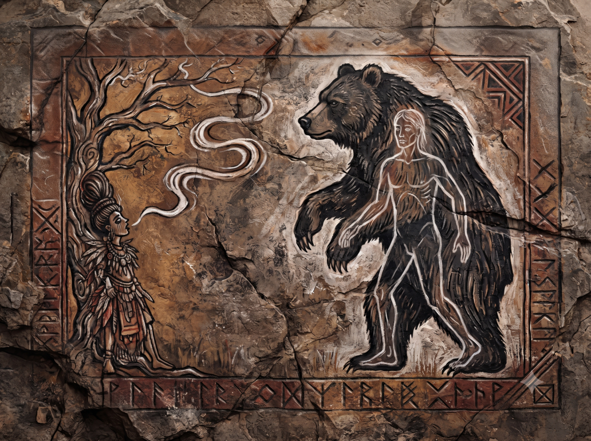
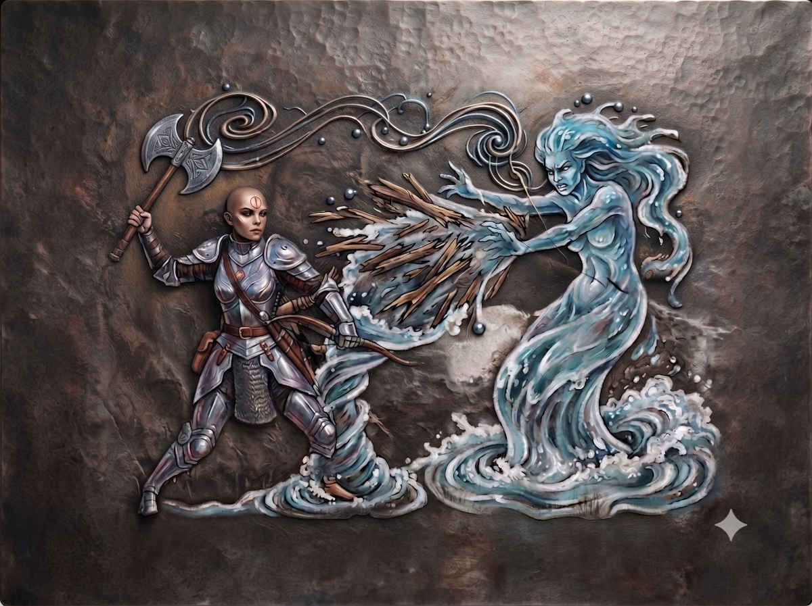

## Forced camping in the Dragon Pass

Peek demands that we find a quiet place to spend the week and that there is no question of advancing until her Antelope has recovered. The group agrees and they search for such a place: a place easy to defend, with a water source not too far and food for the beasts. For the men, they will hunt.

> 🎲 Find a quiet place
> - Conflict: 
>   - Peek's Nomadism, Hanya's Safe Route, Jaridan's Travel Knowledge
>   - Near the clan, unknown lands, accumulated fatigue
> - Result 3 vs 3: Defeat -1

The heroes are tired, they see the village smoke in the distance, the daylight is beginning to wane, and they advance into hostile lands. Peek and Hanya try to secure their march and spot signs that might indicate a path to a quiet place.

Peek spots bear tracks on the ground and the group decides to follow them with the aim of finding its den to shelter in and with a bit of luck, the den will be large enough and well-located to serve as their base for this week. It is decided that Ikarnos will stay with the mounts. Peek and Hanya thus follow the tracks.

> 🎲 Spotted by the bear?
> - Conflict: 
>   - Scout
>   - Smelling odors and intruders
> - Result 1 vs 1: Defeat -1

They suddenly hear a terrible growl that makes their hair stand on end. Impossible to know exactly where it comes from, as if the entire forest were emitting this growl. It sounds like a bear's growl.

Hanya: "this growl is not natural. I doubt we are tracking a normal animal. Is it wise?" 

Peek: "we need to know more and be ready to attack or to flee if necessary." 

Hanya: "the beast seems to have spotted us." 

They agree that they need a strategy. 

Peek takes out a small leather pouch and whispers a few words: "go find the beast and show it to me."

She leans against a tree and her eyes roll back.

> 🎲 Call to the spirit of the beast
> - Conflict: 
>   - Peek, Spirit of the beast
>   - "Bear"
> - Result 2 vs 1: Victory +2

A small smoke exits the pouch then mingles in the surrounding air. The spirit searches and finally finds the gigantic black-furred bear sniffing the air but the spirit has no scent and the spirit relays the image to Peek who also sees the bear, as well as where it is located. Moreover the spirit senses something strange and a human aura overlaps the bear's aura in Peek's vision. This bear would also be a human. It is incomprehensible. Praxian traditions do not usually incarnate animals. But it is a fact. They know a little more about their prey now.

Hanya and Peek return to camp and in doing so feign a possible withdrawal to reassure the beast. Jaridan explains that there are men who venerate the hunting god Odayla and that apparently some can even transform into giant bears. The companions decide to leave it at that, since the man in question probably belongs to the clan they just left. They need to find another place but if they stay in the area, they could see this man to talk to him, hoping he will be in his human form.

Night falls and our heroes are forced to camp rough in the woods. They make a fire and organize watch shifts.

The night passes without incident. Apart from distant growls and wolf howls. Morale is not excellent but they have no choice. It is early morning and they have the day to find a viable shelter. They decide to move away by advancing slowly so as not to tire Fta-Ah.

## The apple orchard

The heroes come upon a magnificent and immense orchard filled with beautiful apple trees bearing juicy apples. There is even a stream meandering through the orchard. The spot is idyllic and ideal. The heroes stop. They eat apples without suspecting that this orchard is the clan's sacred orchard and that the apples are protected and must be consecrated by a priestess before they can be consumed.

> 🎲 Resist the power of apples
> - Conflict: 
>   - Ikarnos: 1 vs 2 -> defeat -2
>   - Hanya: 1 vs 2 -> defeat -2
>   - Jaridan: 1 vs 2 -> defeat -1
>   - Peek: 1 vs 2 -> defeat -2

Ikarnos and Hanya give their horses apples. Peek tastes one before giving some to Fta-Ah. As for Jaridan, as he was about to consume one, he sees Ikarnos and Hanya's horses collapse, drooling at the mouth! As for Peek, drool comes from her mouth and she feels truly unwell and weak.

Jaridan: "wait the clan was called the Apple Clan, their apples are probably protected against animals in the first place and there is something to repel apple thieves as well."

The air heavy, he declares: "the two horses are dead."

Hanya is devastated at having lost her thoroughbred from Sylila.

Peek sighs: "fortunately my Fta-Ah is safe that is what matters, we must leave here. I will recover, do not worry."

The heroes must still continue but this time they have distributed the belongings on the back of the only remaining horse. Fta-Ah is too weak to carry anything.

Ikarnos: "we will be able to buy horses at AldaChur, if we get there."

## Crossing the stream

The group follows upstream the stream that flowed through the orchard, deciding to get as far away as possible from the clan's lands. Progress is slow.

Hanya: "As if they did not already have it in for us, they will not love us when they discover the two dead horses in their orchard.. With a bit of luck, it will pollute their orchard." she says sarcastically.

Jaridan: "that is why we must get away, especially if they have with them an adept of Odayla capable of transforming into a bear. Let us hope the carcasses are quickly found and removed from the orchard before they pollute this place which in my opinion is sacred to them."

They thus venture deeper and deeper and follow the stream which widens, bounding from rock to rock in a hilly landscape of smooth grass and stones. In the distance to the east, they see the ridge of the cliff behind which they know AldaChur lies on the plateau, their destination and perhaps a bit of rest, they hope.

Suddenly Peek raises her hand and points to a promontory a bit higher on the other side of the stream. "That could make a shelter, what do you think?" Ikarnos: "let us go see."

Ikarnos, Peek and Jaridan cross, but when Hanya crosses, the water begins to bubble. "Haaa what is happening?"

The others turn around. Hanya draws her kopi and looks around her. A waterspout erupts and tries to wrap around her legs to throw her against a rock!!

> 🎲 Hanya against the Potamid
> - Conflict: 
>   - movement
>   - surprise, powerful water force, anger against chaos
> - Result 1 vs 3: Defeat -1

Hanya is hurled against a rock. A female creature rises from a basin a bit further downstream and lets out a terrible chant. Her movements are graceful and her hands make increasingly rapid circles, which attracts all the pieces of wood floating in the torrent then she sends them at Hanya!

> 🎲 Hanya against the Potamid with Peek's help
> - Conflict: 
>   - speed to regain land, protect herself from water with her axe, Peek's help trying to calm the nymph
>   - floating wood attack, powerful water, anger against chaos
> - Result 3 vs 3: Defeat -1

The creature sends a current to try to drown Hanya but she manages to avoid it and gets out of the water exhausted but safe. The creature looks at the group with her big eyes. She does not understand. It seems the spirits contained in Peek's fetishes have calmed her.

Peek brings her fingers to her temples and receives the creature's message through the spirits returning to her fetishes. It is not really a language. It is between dream and thought with images and sensations.

Peek feels water around her, then sees Hanya differently from what she is, dark, dirty, defiled and the defilement pollutes the waters in the form of barbed filaments that hurt.

Peek sees Ikarnos, Jaridan in the form of sand and pebbles while the mounts appear as walking plants then she sees or understands that she herself is in the form of almost liquid gas.

The creature makes movements and the waters clear again. The vision stops and the creature departs, diving into the torrent. She has disappeared.

The group gathers to see how Hanya is doing and after a moment of respite,

Peek recounts what she saw: "It was an embodied spirit guarding this torrent no doubt and she saw you as an enemy who would defile her Hanya. It is madness... unless she is hiding something from us."

Hanya: "I do not understand either."

Suddenly she places her hand on her belly. Jaridan notices the gesture and Hanya notices his gaze and suddenly she freezes because she just understood and crouches down: "ohh nooo!"

The others ask her: "what is it Hanya?"

She stands up proudly: "it is possible that life is in me but this life is chaotic. I am probably pregnant with Cai's son!"

Armed with this revelation, the atmosphere is strange. Ikarnos imagines that Cai's daughter may also be pregnant by him and that somewhere he will have a little ogre offspring. He reassures Hanya telling her there is no reason her child should be as monstrous as those they have seen if she is not given access to her people's bloody rites but the subject is uncertain. They agree they will need to inquire with sages on the subject.

Hanya is morose. Peek takes care of Fta. Jaridan secures the camp, accustomed to traveling itinerantly when trading from clan to clan. They organize night watches because they are still impressed by these lands containing so many unknown wonders. But nothing happens and they manage to rest at last which they had not really done since their arrival in the region and their encounter with the ogres then the clan.

The next day they decide to explore the surroundings a bit to familiarize themselves with their immediate environment while remaining cautious because their stop must be temporary and they must not deviate from their objective. So they have quite a bit of time to themselves.

## The group rests

Peek goes to find Ikarnos: "we are going to have a problem with Hanya. What she carries in her could corrupt her permanently and moreover you know very well that if we run into Storm Bulls and there are many in Prax, they will immediately see what she is and we will be massacred without quarter. I do not like this at all."

Ikarnos: "out of the question to separate from Hanya. Unfortunately you are right, lunar magic does not allow separation but only inclusion. For example when the moon separated from the earth it was to integrate something greater, the sky. We do not destroy, we build. We sacrifice things for greater ones. I know that you nomads have always fought the Devil and chaos, perhaps you have rituals to heal these contaminations of chaos. But I will not accept that the solution be violent, hear me well."

Peek: "you do not realize what awaits us" and she turns on her heel.

That evening Jaridan tells us about his family, his wife, his children, grown now. He asks us to visit his clan in case he dies to tell them why he left and that he never abandoned them.

Hanya is locked in her silence and seems to be digesting the news of her pregnancy.

The group finally finds its bearings in these unknown lands and allows itself a few days of rest to recover from their wounds and fatigue.

Ikarnos writes a coded letter to Fazzur

> **Coded letter for Fazzur**
> 
> - "Pharandros: ambitious and enforces lunar law
> - Inquire about Imex Rapiis one of his advisors who may have wanted to manipulate the young King but does not seem to succeed as much as he would like.
> - Presence of exiles east of Bagnot: were attacked and prevailed but did not take the time to evaluate forces, passing rather discreetly through the lines.
> - The witch Elemenoria is dead
> - Had to pay for passage with the Dwarves of Dwarf Mine.
> - Isidilian their King wants us to stop digging the mountain on the Slave Wall side.
> - He told me to pass along the message and that we know why.
> - Isidilian wants us to recover 1 Dwarven artifact for him from an Orlanthi thief.
> - It is a Dwarven weapon: a deadly sort of sling.
> - The Dwarves could provide troops in the future but have not decided.
> - They no longer sell their objects.
> - The Dwarves have human slaves whom they treat "well"
> - Presence of ogres in an Orlanthi community the Apple Clan. Decimated almost the whole family but a man and his daughter remain. The man is named Cai Belli. They came from Peloria but may return there.
> - Do not eat the apples of the Apple Clan without their permission.
> - An adept of Odayla transforming into a bear lives in the clan's lands.
> - An embodied water spirit protects the stream upstream of the torrent that passes through the Apple Clan's orchard.
> - The Apple Clan does not seem particularly open to the Lunar Pax without being hostile either.
> - Did not have time to stay longer to detect possible rebel groups."

Ikarnos does not conclude because he knows he will probably have other things to write before their arrival at AldaChur and to date the document. He reflects for a moment wondering whether he should really pass everything along. The Goddess's mask told him to help Fazzur but he knows this means he must also spy on him somewhat and therefore must not give information that could through the strange combinations of destiny harm the Emperor. In particular, he omits the prophecies and the fact that Hanya carries an ogre offspring in her womb.

The week passes without major incident. Ikarnos asked the hunters not to stray too far to avoid being detected because according to Jaridan, the clan may search for them regarding the dead horses in the orchard, even if in his opinion, they will content themselves with this mishap which should please them well. The heroes train: Jaridan with the staff, Peek with lance or bow, Hanya with her axe. Jaridan and Ikarnos discuss routes and maps. Libations are also made to their respective Gods. But one evening, during dinner, Hanya declares the meat is overcooked!

> 🎲 Does Peek see the pointed tooth that has begun to appear?
> - Conflict: 
>   - Peek has good eyesight
>   - Hanya is too disturbed to oppose anything
> - Result 2 vs 1: Defeat -1

Peek does not notice that one of Hanya's incisors has strangely lengthened while she is eating.

> 🎲 Does Ikarnos see the pointed tooth that has begun to appear?
> - Conflict: 
>   - Observer, Sense a secret
>   - Hanya is too disturbed to oppose anything
> - Result 3 vs 1: Victory +2

Ikarnos discreetly notices Hanya's incisor but says nothing. The situation is more serious than it appears. Knowing Peek's aversion to Chaos, he decides to organize the group as best he can by separating them. He notices the tooth is only visible when she eats but Chaos is gaining on her. He finds a way to isolate himself and asks Jaridan about Hanya's child, whether among the Orlanthis there is a way to heal traces of Chaos. The latter reflects.

> 🎲 Does Jaridan know enough Orlanthi myths?
> - Conflict: 
>   - Knowledge of Heortian myths, aided by Ikarnos's find the 3rd way spell
>   - Rare myth
> - Result 2 vs 1: Defeat -1

Ikarnos attempts to apply the techniques of the Diplomatica Scriptoriae and in particular the magical writings on how to find the 3rd way but this does not help Jaridan recover in his memory whether he knows a Heortian myth or otherwise that could heal Hanya.

>  **Plot twist!**

Suddenly in the middle of the night, Hanya is seized by stomach pains. She vomits blood. Her eyes are red with blood, her 2 incisors are now clearly visible. She craves raw flesh! This time, the evil can no longer be hidden.

> 🎲 Does Hanya resist the call of her offspring?
> - Conflict: 
>   - Guardian of Jillaro (they are taught resistance and endurance)
>   - Mark of Chaos
> - Result 1 vs 1: Victory +1

Hanya resists and her fangs disappear.

Peek holds her lance pointed at her and declares: "I cannot kill you with arrows but I can do it with my lance!"

The conflict seems inevitable.

> 🎲 Jaridan tries to calm Peek
> - Conflict: 
>   - Shout in a clear voice, convince
>   - Chaos, strong opinions
> - Result 2 vs 2: Victory +1

Jaridan manages to convince her that it would not be honorable to kill one of his companions. But Peek declares it goes against the teachings of Waha to travel with a chaotic creature. Jaridan proposes to split the group in two. She would leave with him and Fta ahead. Ikarnos and Hanya could meet them at AldaChur. He gives them 60 days to resolve Hanya's problem after which they would consider the Prax exploration mission for Fazzur complete. He also declares that every day at noon, he would go to the temple of Yelmalion and they could meet there. May the Gods protect them.

Then with authority, he takes Peek aside and prepares the departure in the middle of the night. The group separates to avoid killing each other. Ikarnos is worried. Without mounts, on foot, in territory hostile to the Empire this will not be simple but he may have a plan. The ogres fascinated him and in the end if Hanya returned to Dunstop to serve as an emissary for the ogres and make the latter allies for the Empire, what formidable allies they would be! After all, Broos are found in the ranks of the Empire, so why not Ogres and Hanya could have a role to play there.

| [Previous](../08) | [Next](../10/) |
