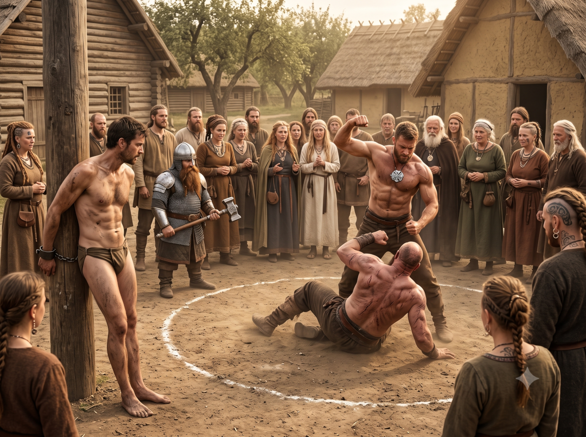

*Continuation of Ikarnos & Hanya's adventures*

## Return to the Apple Clan (Ikarnos, Hanya)

The Clan's Tula is quite close to where Hanya and Ikarnos met the Dwarves. Indeed, their laborious investigation has proven rather slow thus far because they did not want to let anything slip. This is rather a good thing because Hanya's presence given her condition could be a risk for our heroes.

Ikarnos thus proposes the following plan: "I could pass as your prisoner. We are not on good terms with the clan because they accused us of being behind the disturbances, which is absurd. Hanya will stay back in case things go wrong. And when I see the man either I will address him about the snakes, or I will address you about Isidilian. You will then know it is him. Only, how to succeed in stealing the object from him? I have no idea. We will see. The important thing is to be in the place. We also need to find a way to stay a bit on site to see people and have an opportunity. You could say that your companion who.. uh.. seems quite old needs rest before returning to Dwarf Mine."

The Dwarf sketches what seems to be a smile: "a Dwarf never needs rest except when forging and working hard. They will never buy that."

Ikarnos: "I have nothing better unfortunately.. they know nothing of your way of living and Gundaroum I assure you really looks like a tired old man so it could work... or else, we can say that I wounded him and you need to perform a Dwarven healing ritual so he can leave."

Everyone reflects intensely but agrees on the plan. Ikarnos, the robed Dwarf, the old Dwarf, and one of the warriors will go to the clan. Hanya will stay with the last warrior, which does not reassure Ikarnos at all but well, risks must be taken.

## Ikarnos's expedition

Our small group approaches the Tula. I agreed to be disarmed and to have my hands bound by iron bracelets, not without shivering because knowing the Dwarves' talent with metal, I know I would never be able to undo these bonds. But the game is worth the candle, I have known far worse situations at Raibanth when I scoured the city's underworld for the Emperor.

> 🎲 An endurance test

We finally meet the clan people and are brought to the village which reminded me of grim memories. The Dwarves speak with Jarlan and manage to deceive him quite easily I must say. Even old Pizidan is not so wise after all. The Dwarves even go beyond my expectations by offering, in exchange for their hospitality, to look at their weapons and any Dwarven-made objects to help them use or improve them. I realize that they probably did not need me after all to find their medallion. I nevertheless scan the crowd for familiar faces. I see Sheena the priestess who healed Peek's antelope. Brontos the Storm Bull casts dark looks at me and I rejoice at having kept Hanya sheltered. This brute would have no doubt seen the Chaos in her and that would have unleashed his fury. I do not see young Irken who must be in the fields. I also see the man who burned the fields of Cai's domain. Probably the same who unleashed Yelm's fury on the domus.

> 🎲 Does Ikarnos see the thane who took their medallion? 
> 
> This could be played as a yes/no roll or confrontation. 
> 
> It may be useful to know a bit more about this medallion and this thane, I think. 
> 
> The thane is named Korlan. Let us see his objectives? Korlan has a grudge against someone in the clan and aspires to use the Dwarven object to his advantage against this person. 
> 
> But what is the medallion's property? It grants great strength to its owner. Useful for a thane who would want to prove his worth at the expense of another. 
> 
> I think it is better to base it on a binary roll to know if he is present or not during the Dwarves' presentation. The man is absent, no doubt in his domain or on patrol.

While the Dwarves are installed in a hovel so they can "heal" their old "wounded," I am dragged to a post and tied to it, stripped of all my belongings.

I am confident in the encoding used in my writings for Fazzur, they should see nothing but fire, well I hope so. In any case, the danger lies elsewhere. Thirsty, hungry, tied to the post, the hours pass and I weaken. The Dwarven warrior accompanying the group stays nearby supposedly to watch me, which makes the Thanes laugh, but I know he is waiting for me to react if ever I saw the man we are looking for.

> 🎲 How will Ikarnos endure the ordeal and humiliation? 
> - Conflict:
>   - Self-sacrifice 
>   - Hungry, Thirsty, Physical bullying 
> - Result 1 vs 3: setback

The hours pass. Children throw garbage in my face. I concentrate on my mission and my mind focuses on the Goddess's teachings who endured far worse: dismembered in the Age of the Gods she came back even stronger and triumphed over everything. I try to stay vigilant to spot the man and warn Nigmar in case but I eventually fall unconscious.

>  **Plot twist!** 
> The Dwarves could manage on their own and Korlan would have come to see them of his own accord and they would have recovered the medallion and fled (that would really be the last straw for Ikarnos) or they would have freed Ikarnos (that would probably be too easy). Or the plot twist comes from elsewhere (Hanya? a Lunar visit? a clan attack? a divine message?...)
> 
> When there are too many options like this, it is a sign that a fate roll must be made. Result: relations. This leads to the Dwarves' track or Hanya's. An intervention by Hanya would be interesting I think but one must first know what is happening on her side.

## At the camp with Hanya

I crave raw flesh. The ogre growing in my flesh reminds me regularly. I try not to look too much at the Dwarf because I might pounce on him and devour him. I politely refuse his Dwarven food that looks like a mushroom broth, using the excuse of needing to relieve myself to go hunt. I eat the animals raw, the heart still warm after having felled them with an arrow. I cannot stop thinking about Ikarnos's plan and wonder if this is what the Goddesses expect of me to save the Empire in danger.

>  Hanya's objective: wait at the rendezvous point but something must happen due to the plot twist. And Hanya has a big secret to hide.

As I devour a raw rabbit I felled with an arrow, I sense movement behind me. The Dwarf has followed me and seems to have understood something, holding his war hammer and letting out a cry as he attacks me.

> 🎲 Hanya confrontation with the Mostali
> - Conflict:
>   - War axe, Cleaving blow
>   - Hammer, Hanya's delay to grab her great axe and stand up, well protected
> - Result 2 vs 3: setback

I must drop the rabbit, grab my axe and stand up, the Dwarf is already on me with his hammer. I manage to dodge. Can I flee? But he will warn the others. Must I continue the fight? I must fight thus and I wait to see what my opponent does.

> 🎲 Hanya confrontation with the Mostali
> - Conflict:
>   - War Axe, Cleaving Blow, Mask of Terror
>   - Hammer, Armor
> - Result 3 vs 2: victory +2

Fortunately the Dwarf has no particular tactic and simply attacks me again like the first time but this time I am ready and I invoke the Goddess's mask of terror to impress him, swinging my axe which wounds him badly. He collapses to his knees. *

I tell him: "This is not what you think. I do not want to kill you, know that. Stay here, rest." The Dwarf rolls his eyes and faints. I hesitate to kill him.

> 🎲 Hanya's resistance against evil
> - Conflict:
>   - Guardian of Jillaro, more or less satiated with the rabbit
>   - Mark of Chaos
> - Result 2 vs 1: victory +1

But I take the rabbit and finish it. This quells my thirst for flesh and I manage to control myself. It is better that the Dwarf survive in case things go badly and this could play in my favor. In any case he is incapacitated. Time is pressing, I must go to the village as discreetly as possible, retrieve Ikarnos and flee!

## Return to the Apple Clan (Hanya)

I run through the hills, slipping through the undergrowth to be as discreet as possible. After more than a week in the lands of the Dragon Pass I was able to observe the lifestyle of its inhabitants and I adapt my movements accordingly to avoid meeting anyone and approach the village as closely as possible, attempting an approach from the north where I spotted hillsides that would give me a vantage point where I hope I could see Ikarnos and the Dwarves.

*Hanya's objective: reach the village without incident to find Ikarnos*

>  **Setback!** 

Damn geography, impossible to climb the hillside that easily, to the west shepherds and their flocks, to the east guards who seem to be watching something and before me, this rock that rises almost sheer. I must nonetheless climb and pass through here to reach the village on the other side. Or wait for nightfall. That is what I decide.

>  Here the situation simply consisted of making a choice: face the warriors, try to pass through the pastures risking being spotted, attempt a perilous climb, or wait...

## Apple Clan (Ikarnos)

When I wake up I see a small crowd in the square. Gundar informs me that a challenge has been issued and a combat will take place. I even get the impression he has a smile on his lips. There are starting to be quite a few people. Two men step forward in the middle of a circle drawn on the ground. I recognize the man who took our medallion.

I exclaim: "You there, remember the snakes! You know very well it was not me who summoned them!"

One of the guards strikes me with the butt of his lance to make me shut up. I take the blow, hoping the Dwarves understood the message. Besides, I must really be tired because I realize the bare-chested man is wearing the medallion around his neck. His opponent is also bare-chested, a big strong man full of scars. I recognize a tough fellow there. The old Sage begins chanting and recalls a law of honor and truth. Apparently a grievance opposes the two men and the man with the medallion has decided to challenge the other to bare hands. He is going to be massacred I think at first. Then the combat begins and suddenly doubt assails me. The man with the medallion takes his opponent's blows without flinching and when he starts to retaliate his blows seem of supernatural strength. Finally the big fellow collapses. The man with the medallion raises his arms in triumph.

The priestess Sheena and her acolytes carry him away to heal him. Then the village chief speaks with Gundar who brings the man with the medallion. I do not hear what they say but sometimes they look toward me. Finally they seem to reach an agreement.

A man comes with my belongings and gives them to the Dwarves. I regain a bit of hope. The man with the medallion returns the medallion to the Dwarves who in exchange give him my Vision of Darkness medallion. The village chief gives the Dwarves my Diplomatica Scriptoriae as well as my writing materials, not without having spit on the book before handing it over. That's it they are going to come free me but shock, I see them leave the village without me! I scream my rage at them but they disappear into the night that is falling.

>  Here we played a little role-playing scene without confrontation or choice, just to prepare Hanya's intervention. The rules state that you are not obligated to make situation rolls if you already have a storyline in mind. Moreover in our case, the setback roll also seems obsolete given Ikarnos's limited objectives. The situation did not really allow Ikarnos to act with fate but it did allow the story to advance. On the other hand, we could make a plot twist roll but here we will consider that given the 1st plot twist has not yet been played, we move on to the next one to arrive there.

## The night at the village (Hanya, Ikarnos)

Hanya waits for night to bypass the rock mass. She tries to be discreet to reach the village without incident.

The night is calm. It is the night of the wild day that follows the fire day and the Red Moon is full. On one hand, it could have Hanya spotted as she slips through the shadows but she also sees and especially in it a sign that the Goddess accompanies her fully.

Ikarnos dozes while remaining vigilant. His thoughts also turn to the Goddess but it is especially the wind that disturbs him. At the end of the square, the chief's hall is lively. Men are celebrating. He hears laughter and noise. How noisy these barbarians are! The gusts seem to participate in their joy. Should he be worried? The Sartarites have nothing to really hold against him and they would probably pay dearly if they killed him. At the same time they cowardly stripped him of his belongings which they gave to the Dwarf and the fighter. They will therefore certainly not release him.

He is thus lost in thought when suddenly a shadow passes nearby. Fear seizes him: have they come to assassinate him? But the moment he spots Hanya, hope is reborn. "Hanya, blessed be the Goddess!"

Hanya smiles: "Where are the Dwarves?"

Ikarnos: "Gone, traitors, they have my grimoire too."

Hanya cuts Ikarnos's bonds.

He briefly recounts what happened. "We must find the Dwarves and force them to honor their debt" says Ikarnos.

Hanya looks at him "And your other belongings?"

Ikarnos reflects and replies: "I will go get them right away."

Hanya shudders: "Are you sure?"

Ikarnos points at the hall which is now quiet, the men must be sleeping off their drink now. "If I do not come back, go find the Dwarves, recover the grimoire and force them to show you where Cai is with their strange stone! Then do not forget our plan. We will see each other in limbo perhaps."

Then he moves away toward the hall.

## Recovery of the medallion and grimoire (Ikarnos)

Ikarnos uses all his stealth abilities to blend into the crowd as discreetly as possible.

> 🎲 Slip into the hall
> - Conflict:
>   - blend into the crowd, stealth, scouting, all asleep
>   - nearly naked, unknown place, numerous
> - Result 4 vs 3: victory +2

Ikarnos slips into the hall. Luckily, everyone seems asleep. He even managed to grab a shepherd's blanket at the entrance and in the dim light he would easily be taken for one of the many men who came to witness the afternoon's challenge. Now he must find the man who stole his medallion. If his intuition is correct, the man must have it around his neck.

> 🎲 Find his medallion
> - Conflict:
>   - imperial shadow, observation
>   - find the man among the multitude
> - Result 2 vs 1: victory +2

Ikarnos takes a bit of time to find the man. The hall is large and he must adapt his movements to appear as natural as possible in case one of the men sees his silhouette. And suddenly he spots him and hears him because the latter is snoring, drunk on his victory. The medallion gleams at his neck and by luck, the man even has Ikarnos's dagger with him. Ikarnos seizes it, tempted to plunge it into the man's heart and let the poison kill him. He brings his dagger to the man and cuts the medallion's strap, which he recovers. Holding it in his hand and thinking of the Goddess's Mask, his vision sharpens and he sees through the shadows. The lying men now appear clearly. He shudders. What madness! There are perhaps fifty of them. It is time to flee. His legs wobble a bit but courage returns. He has no choice anyway. He grabs a tunic and sandals lying around to dress himself then rushes through one of the exits.

Ikarnos takes a deep breath upon leaving the hall and finding again the brilliant Red Moon in the sky. He then starts running in the direction the Dwarves took with the aim of finding Hanya as quickly as possible. The wind of the Dragon Pass whips his flesh and he prays that these Orlanthi winds are not spirits capable of alerting the Orlanthis.

## Tracking the Dwarves (Hanya)

Hanya knows exactly where to go. The Dwarves will want to recover their warrior. Normally they should not find him since the latter is no longer at the rendezvous point but wounded several hundred paces from there, unless he was able to recover and reached the rendezvous point. Will they look for him? Will they abandon him? Will they use their strange magic? Impossible to say but in any case, they must have passed there necessarily and it is probable they will spend the night there.

> 🎲 Did the dwarves find their wounded companion? no.

Hanya has no trouble finding the initial rendezvous point and realizes there are only the robed Dwarf Gundar and the old Dwarf Gundaroum. The other warrior must be searching for him.

She advances holding her axe: "Greetings my builder friends!"

The Dwarves turn around, surprised, and reply: "where is our companion?"

Hanya smiles: "He is alive do not worry but it is not right to betray your oaths. I did not know the people of Mostal were capable of cheating."

Gundar replies angrily: "We betrayed no one! We have our medallion and that is all that matters. We recovered it without the help of your companion, we owe you nothing."

Hanya approaches, gracefully running her finger along the edge of her double-bladed axe: "And yet you stole his precious grimoire. Are these the practices of people who claim to be honest?"

Gundar looks at Gundaroum and replies in the old Dwarf's voice: "You may look in the stone if you return the iron Mostali to us."

Hanya: "That is better. And of course you return the grimoire?" She feels Dwarven avarice settling on their features.

"That is between him and us, we will not return it to you. And since he is not here, what do you decide?"

Hanya reflects. They are clever. She will only be able to see in the stone if she leads them to the wounded Dwarf and then there will be the other warrior and it will be a fierce fight if she wants to obtain the grimoire by force. Seeing no other alternative, she decides to lead them to the wounded Dwarf, leaving her cloak at the camp to warn Ikarnos in case he arrives and finds no one, hoping he will understand the sign.

On the road she decides to explain to the Dwarves what happened with the Ogres to justify why they are looking for them. She is carrying an ogre baby after all. Gundaroum seems to listen gravely to what this implies and confides in her: "Chaos is an external part to the machine and it cannot be repaired. But you humans do not seek to repair the machine, that is the error of your Goddess."

They finally find the wounded Dwarf, weakened but still alive. Gundaroum approaches him and places his hands on various parts of the Dwarf's body. The latter seems to feel better. He speaks in his language, pointing at Hanya. He does not seem to view her presence favorably. The Dwarves talk among themselves.

The Red Moon illuminates the scene as dawn peeks its nose. Gundaroum calls Hanya to his side and asks through Gundar to keep focusing on the Ogre she is looking for. The stone begins to glow then he asks if she is ready. She nods and the Dwarf invites her to place her hands on the stone. And there Hanya sees.

> 🎲 We must determine where Cai and his daughter went. Roll on list between: AldaChur, Pavis, Serpent Pipe Hollow, World's End. It is to Pavis that the Ogres are heading!

Hanya sees a desolate landscape that looks like a stone desert. There is almost no vegetation and there she sees Cai and his daughter riding. She tries to note all the details she can get from the scene, the position of the moon, the color of the sky. But the landscape is so desolate that she cannot make out a living soul. It is not Peloria that is certain. Another place in the Dragon Pass? She does not think so. Ikarnos would know, for he studied the maps. In any case, the two fugitives are safe and sound and they now have a means to find them. The stone fades and the vision disappears. Garun tells her that now is where their paths diverge. She hesitates. Is she capable of facing them? The valid warrior is absent and yet the old Dwarf offered her the vision. He must be confident in case of an attack from her or then, yes indeed, he trusts the other dwarf who has recovered his crossbow and is ready to shoot. Haha, blessed be the witch's gift!

She takes a deep breath and raises her axe: "you will now return my friend's belongings or someone here will die!"

> 🎲 Hanya confrontation with the Dwarves
> - Conflict:
>   - red mask of terror 
>   - crossbow
> - Result: defeat -1

Garun signals the warrior, the bolt flies from the crossbow. A perfect killing shot and there, shock of the Dwarves discovering the shot goes straight into the old Dwarf's heart who collapses. Thank you Elemenoria!

Hanya says: "return my companion's belongings and we will be even."

The Dwarves are stunned and let her recover Ikarnos's writing materials containing his coded letters but above all his precious grimoire. She leaves the Dwarves still in shock and runs back to the rendezvous point, retrieves her cloak and heads toward the village hoping to find Ikarnos if he succeeded. If he failed, she will know because he will not come. She will have to honor her vow then, find Cai and create this new order of Ogres for the greatness of the Goddess.

## Reunion (Ikarnos & Hanya)

Her heart beats a hundred miles an hour and suddenly she spots Ikarnos's silhouette, tottering, all weakened but finally free.

The two heroes join each other and embrace. Hanya explains everything that happened and Ikarnos declares: "decidedly our destiny pushes us resolutely toward Prax!"

Indeed, he recognized in Hanya's vision the landscapes of Prax. It is logical, the ogres will probably try a new life there. It remains to determine whether they will or will not rejoin Jaridan and Peek especially with their project in mind. But that, that will be the rest of the story to tell...

| [Previous](../11) | [Next](../13/) |
