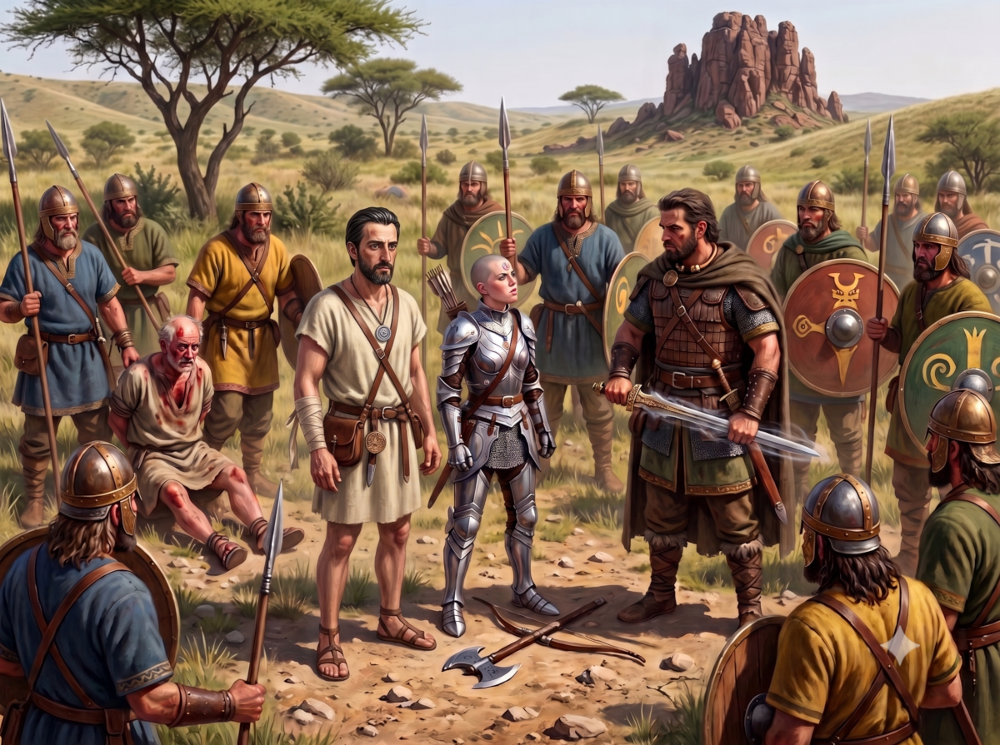

*Continuation of Ikarnos & Hanya's adventures*

## Fugitives

Day has fully risen and Yelm now shines in the sky. Hanya and Ikarnos are pressed for time. The clan will realize Ikarnos's escape and will set out searching for him. The Dwarves are no longer a priori a threat as they must be too busy healing or mourning their old Dwarf. Do Dwarves mourn? They decide to head north as quickly as possible in forced march, tiring themselves out as long as they have not found a reasonably safe shelter.

They walked for half a day without stopping and are now exhausted as they approach a farm. Ikarnos recovered his dagger, his writings, his grimoire, and his medallion but still has only a shepherd's blanket as clothing. Ikarnos proposes to Hanya to pass him off as an amnesiac madman she encountered on the road and this might perhaps awaken compassion during their encounters. They are now theoretically far enough from the clan and must have entered the lands of another clan. They must not linger but they need to rest and feed. They decide to go to the farm after observing its activity for a few moments and not having perceived particular signs of warriors or unusual agitation.

Ikarnos thus enters the role of amnesiac man and Hanya marches proudly toward the farm.

"Hello, is anyone there?" she says in a confident voice.

A woman replies: "Who goes there?" and a large woman exits the house flanked by two alynxes followed by two sturdy fellows who resemble her a bit (probably her sons) and look like farm boys.

Seeing the warrior with her gleaming armor and double-bladed axe, the boys seize lances. "Peace friend, I am a traveler and I found this man wandering. He has trouble speaking and seems to have forgotten even his name. Do you recognize this man?" she asks to lend credibility to their ruse.

The large woman replies: "No, never seen.. you can go on your way."

> 🎲 Convince the woman 
> - Conflict:
>   - Sense the other's weakness, Bless the family
>   - Hostile to strangers
> - Result 2 vs 1: setback

Hanya tries to play on the heartstrings, speaking of the large woman's sons, telling her they are two fine strapping lads for field work, and seeing the state of the fields tells her she could even give them a hand because she knows about construction, being a guardian of Jillaro one of the world's splendors, but the woman could not care less and replies rather curtly: "keep your spit, beauty, and go on your way, we do not know this man."

Ikarnos then decides to feign a sudden illness and simulate a fainting spell.

Hanya understands and says: "quick, we need to see what he has!"

The woman stops her: "wait beauty, he may have one of those diseases and out of the question that he gives it to us. We already have enough problems."

Hanya tries again differently by offering money, to stay in a barn and remain far from them and that perhaps if the woman told her of her problems, she could perhaps help them.

> 🎲 New attempt to convince the woman
> - Conflict:
>   - money, barn, help
>   - distrust, fear of disease, stubborn character
> - Result 3 vs 3: defeat -3

The woman seizes a lance and with a swift motion slashes Ikarnos's arm who lets out a howl and comes out of his simulated faint. "There now he is on his feet. Leave before things turn ugly."

The woman seems totally obtuse and half mad. It thus seems our heroes will get nothing out of this and they must leave still exhausted to continue their flight.

## The slavers

Ikarnos did not shed blood in the clan so apart from recovering his medallion, there is no reason to alarm the clan's men. Perhaps they even found the affair comical for the man who hoped to forge a reputation as a tough guy. As the saying goes, ill-gotten gains never prosper. Hanya tends a bit to Ikarnos's arm wound. For a week he will be handicapped in using his arm but the wound is not ugly.

Ikarnos reassures her with a smile: "In any case, I am a poor fighter."

 They decide to continue north. According to Ikarnos, they have two or four days of walking before rejoining the main road from Tarsh to AldaChur. There should normally be a few inns along the road where they can eat. In the meantime, wilderness awaits them. They now try to pass by all dwellings and if they run into anyone, they will retry the story of the mad and wounded man found wandering in nature.

While our two heroes eat as best they can, swallowing a meager meal of fruits and a rabbit killed by Hanya, they hear a murmur behind them: "mmm mmm hello lovebirds, are you lost?"

A man in a tunic wearing sandals and a gladius along his right leg (probably left-handed) sizes them up with a smile. "My name is Hazz and I saw the smoke from afar, may I join you?"

Hanya nods in agreement and the man settles in. She introduces herself and the man points his chin at Ikarnos: "And him, he doesn't speak?"

Hanya hesitates but replies: "I found this poor wretch wandering in the hills, wounded.. He speaks little and seems to have even forgotten his name."

The man smiles: "that is very sad. Are you Lunar?" he says abruptly.

Hanya replies: "Yes I come from Jillaro and I must go to AldaChur, is the road still far?"

Hazz replies: "No you will be there tomorrow if you continue north. What will you do with the man?"

Hanya replies: "I do not know, I think I will find a Deezola dispensary that could perhaps help him."

The man shrugs: "That is noble of you" but adds in a low voice so Ikarnos cannot hear: "We could share his belongings and sell him, what do you think?"

Hanya is shocked but restrains herself: "Out of the question."

The man seems bothered.

Hanya questions him about his motivations and he replies: "the lands are hard here. The barbarians are hot-tempered and quarrelsome, Chaos threatens to the north and for Lunar colonists like me it is not really the promised land. I won a small estate during the games of Glamour and I did not think it would be so hard. But it is your choice, you prefer to favor a stranger over a Lunar citizen."

The conversation continues and the man leaves, thanking her, but Hanya and Ikarnos do not feel right about it. They also leave and after an hour of walking, they fall into an ambush led by Hazz accompanied this time by four henchmen carrying lances.

"Hello Hanya, I reiterate my proposition. Leave us the man and share his belongings and we will be even. What do you think?"

Hanya has placed her hand on her axe and reflects but replies calmly: "Let me convince you that you would make a terrible error attacking us!"

> 🎲 Try to avoid conflict with Hazz and his men
> - Conflict:
>   - Fazzur's seal, mask of terror, Lunar citizen
>   - greed, confident in their numerical superiority
> - Result 3 vs 2: victory +1

Hanya looks at Ikarnos who straightens up and drops his role. He no longer has any appearance of the poor wretch he was playing seconds ago.

He runs his hand through his hair and produces Fazzur's seal: "I Ikarnos of Raibanth am here on these lands by order of general Fazzur. I have here as proof his seal. What you are about to commit will cost you dearly when the news reaches Bagnot and believe me, it will reach it Hazz!" he says, emphasizing the Lunar's name to frighten him.

He hopes his bluff will pass because deep down he knows his disappearance will not move the great General. In war, a loss is a loss and a soldier is above all a sacrificial resource. For her part, Hanya radiates the Goddess's Mask of Terror.

The men confer in low voices. Perhaps they tell themselves the price will be higher now that they know their true identity but Hazz seems hypnotized by Hanya's terrifying face.

He stammers: "I do not know if your story is true or not, but as I told you, life is hard here. Leave quickly then and may the Goddess be with you. We are even and free. You were lucky to run into us because I, Hazz, know how to act honorably. 

A Lunar citizen should not be sold and you should have told me that sooner." He signals to his men and the small party begins to retreat toward the woods, remaining on their guard against Hanya's threatening face who still firmly grips her double axe.

>  **Plot twist!** 

## Arrested!

While our heroes think they are in the clear, they hear a voice behind them: "Do not move Lunars and drop your weapons!"

They turn around and see twelve Sartarites armed with lances, some with swords (armed thanes).

Ikarnos: "And what is happening here? Is it a custom to attack honest travelers?"

The man smiles, his sword in hand with which he seems to have a special relationship given the way it vibrates in his hand: "We have found what we were looking for. Come, disarm these dirty slave traders and tie them up. We return to the tula."

Ikarnos and Hanya understand they may be taking them for Hazz's accomplices.

Hanya: "ho ho ho, you are mistaken, we have nothing to do with Hazz the greedy, he even tried to sell us! Ask him! Let us chase him, he will tell you himself."

Another man replies: "Silence viper, you are ready to do anything to save your skin and killing your slave supplier would not clear you."

The men surround them. They are too numerous and too armed to attempt anything too risky. If only Jaridan were still with them.

 Ikarnos replies: "you are mistaken and I place my destiny in the wisdom of your gods. If necessary, we will prove our good faith and if you provide us with men we will track down your real culprit who is none other than the man who calls himself Hazz."

 Then he sees other Sartarites emerge from the woods dragging Hazz wounded and battered along with two of his men. The other two missing may have managed to escape or their corpses now lie in the woods. The warrior with the sword: "do not worry, your accomplice is here and all the truth will be made about your sinister dealings that have gone on too long now. The wind rises and Lankhor Mhy sees all. Come, take them."

We leave the heroes tied and disarmed, dragged by the Sartarite party through the heath to reach the clan's domain.

| [Previous](../13) | [Next](../15/) |
