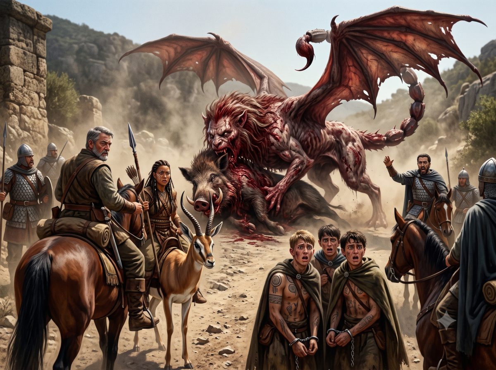

*Continuation of Jaridan & Peek's adventures*

## The escape

Dawn has not even risen when they take Peek and the three young rebels out of the dungeon.

Gomax the Lunar officer takes Peek aside and tells her: "you are going to rejoin the ranks now. We have our eye on you and soon you will join the Sables regiment of AldaChur. Your companion will find another guide once there. We will escort him to the city. No false steps if you want to live."

Hanya thus finds Fta-Ah then Jaridan. Fortunately they do not prevent her from speaking to him and the men are more occupied preparing the prisoner escort.

Thus Peek can discreetly tell Jaridan what she experienced and saw in the cell with the young condemned: "they are afraid, they are terrified. I do not know if they are more afraid of their own people or the Lunars or both. They did not even believe me when I told them I came to help them. It will be difficult to get them out of there and at the same time, it must be done because out of the question that I, a khan's daughter, be treated like a common soldier in their army!"

Jaridan: "I understand you but calm down. But if we do not manage to free them, you can always escape from the camp."

How to free the three rebels? The situation seems complicated for our heroes. Surrounded by Lunar soldiers, with little room to maneuver and pressed for time since the journey will be very short. Perhaps a violent approach is finally the only option even if it implies heavy sacrifices.

The small party leaves Glasswall as Yelm appears on the horizon. Jaridan notices one of the prisoners looking desperately toward the fort walls, face closed and tense but nothing shows. After an hour of travel the fort has disappeared and they advance at a walk on the road leading to AldaChur. At the head of the procession, four Lunars on foot, then Gomax on horseback, then 3 other Lunars flanking the prisoners. Behind Jaridan on horseback and Peek on her antelope. In the rear, two Lunars on horseback. Jaridan discreetly prepares three daggers from his stock of goods he always carries with him. Our two heroes wait only for the right moment to act.

The morning passes without incident and after lunch, the group resumes.

Jaridan and Peek are still on the lookout for any sign. The Lunars are on alert because the proximity of the Serpent Pipe Hollow can always be a source of chaotic danger.

During the crossing of a bridge, the Lunars ignore the local rites while Jaridan pours a flask of water into the river to mark his devotion, surprised that the Lunars do not do the same.

Questioning Gomax on this subject, he declares they are not there to bother with these rites from another age and that the future is now in the worship of Yelm and the Goddess, which our heroes could verify because at noon, the group stopped and Gomax raised his palms to the sky to address a few words to Yelm.

While Jaridan discusses with Gomax, around a bend, the group freezes before a monstrous spectacle. A creature with a human head, lion's body and mane, and a scorpion's tail is devouring a giant boar! The group stops and Gomax organizes his tactics. Meanwhile Jaridan moves back to approach the rear and thus the prisoners. The Lunars are occupied with other things. It is time to act.

> 🎲 Succeed in freeing the prisoners
> - Conflict:
>   - take advantage of the diversion with the Manticore, cut the bonds, pass daggers to the prisoners
>   - Lunar vigilance, prisoner distrust
> - Result 3 vs 2: defeat -2!

Jaridan takes time to decide to act. Indeed, the two mounted Lunars are not yet mounted at the front because Gomax has just created a defense line facing the Manticore. He watches the monster who also watches them with a cruel look.

But action must be taken, so he tries to cut the bonds of one prisoner but the latter takes fright seeing him approach with his dagger and declares: "What are you doing? Perandal ordered you to kill me, is that it? The dishonor is too great??"

This alerts the guards in the rear and one of the guards intervenes promptly, wounding Jaridan with his long lance! Jaridan lets out an oath.

> 🎲 Peek's Intervention
> - Conflict:
>   - death lance, combat with Fta-Ah, swift, stealth
>   - numerical superiority, mounted, armed, armored
> - Result 4 vs 4: defeat -2!

Peek tries discreetly and thanks to Fta-Ah's speed and agility to kill the two guards or at least one but she fails because the Lunars react promptly and wound her too. Jaridan shouts at her to flee!

> 🎲 Flee while helping the rebels
> - Conflict:
>   - Fta-Ah swift, Lunars occupied by the Manticore, the rebels understood
>   - cut a prisoner's bond, pass them daggers, remount on horse, wounded
> - Result 3 vs 4: setback

Jaridan tries to cut the bonds of a prisoner who now trusts him and presents his hands for him to cut the bond but he must give up because the Lunars charge him again. They must flee without being able to help them! They abandon the three daggers he had prepared on the ground hoping the prisoners will seize their chance but now he has only one thing on his mind: remount his horse and flee as far as possible with Peek.

> 🎲 Succeed in fleeing
> - Conflict:
>   - Fta-Ah swift, Lunars surprised by the commotion front and rear, Peek fires arrows
>   - wounded, remount on horse
> - Result 3 vs 2: victory +1

Despite the pain, Jaridan manages to mount his horse and thanks to Peek's arrows that destabilize the Lunars he manages to leave the combat zone. On the other hand, the prisoners rushed on the daggers which by luck created a diversion allowing Jaridan and Peek to escape into the woods at the edge of the road.

## In the woods

Jaridan and Peek gallop at full speed through the woods to put as much distance as possible between them and the Lunars. They finally stop at a clearing. Out of breath, both wounded.

Peek: "it's good, I think they did not follow us in fact."

Jaridan: "too busy with the prisoners and the manticore.. what a horror that beast!"

Peek: "I hope she ended up attacking and made short work of it."

Jaridan: "the Lunars are numerous and I think the beast died rather.. as did the young rebels.. may Orlanth welcome them bravely in the Kingdom of Storms. At least they died as heroes."

Peek: "they finally understood we were coming to their aid."

Jaridan: "yes, they even seemed to believe their king personally held a grudge against them. I think the inn man was right, the king did not act by chance in condemning these three young men."

Peek: "we will never know. We must move on. I can't wait to reach Prax."

Jaridan: "Should we not honor our oath and wait for Ikarnos and Hanya at AldaChur?"

Peek: "we would then have to hide. Do you think that is possible there?"

Jaridan: "I no longer know. Your antelope will betray us and from what I understood, they will not let you wander freely outside the Sables regiment. As for me, I think I can easily hide in the market."

Peek: "I have an idea, let us go to Bullion-of-Moon and ask a messenger to watch for our companions' arrival and deliver them the new meeting place. Let us bypass AldaChur and resume the road to travel more safely. We are wounded and we will find an inn to rest."

Jaridan: "your plan is judicious."

Then the two heroes tend to their wounds as best they can so they do not worsen. The pain will remain for a good week unfortunately unless they find a healer. Around them, the woods are calm. They resume the road at a walk, watching for every suspicious noise.

>  

They have been advancing for a few hours, slowly through the increasingly thick forest foliage when suddenly, a whirling form brushes past them followed by a small feline with pointed ears. Jaridan recognizes an alynx, a sort of large cat domesticated by the Orlanthis since always, since Yinkin, the God of Alynxes accompanies Orlanth in his adventures.

The alynx leaps and pounces on its prey. Our heroes then discover between its large paws a small being of a few centimeters with insect wings. It seems terrified but a fierce determination shows on its strange angular face. Its small voice murmurs unintelligible words. Is this an appeal, a spell or some curse against its predator.

Peek knows nothing about alynxes and spins her bow over her shoulder. It ends up in the hand of an expert archer and she nocks an arrow. Jaridan hesitates: his Orlanthi culture forbids harming Alynxes. Peek looses her arrow which flies.

> 🎲 Wound the alynx
> - Conflict:
>   - Bow, Alynx occupied
>   - Swift
> - Result 3 vs 1: setback

The small creature lets out a terrible cry, shrill, at the limit of bearable. This unsettles Peek at the moment of shooting and the arrow sticks in a tree.

The alynx turns around, bares its fangs and begins to growl in their direction.

Jaridan, holding his hands over his ears, shouts to Peek: "perhaps we should not get involved? The alynx may not be alone."

Peek replies by nocking a second arrow and aiming at the animal: "then let it leave the creature alone!"

She threatens the alynx who looks at her with a gleam of intelligence. Perhaps it realizes that only its victim's cry saved it from Peek's arrow?

Jaridan understands Peek's intention and seizes his staff with a threatening air: "Go away!"

> 🎲 Succeed in driving away the alynx
> - Conflict:
>   - shout in a clear voice, threaten it, appeal to its intelligence
>   - holds its prey, swift, wild
> - Result 3 vs 3: victory +2

The alynx seems to hesitate and plays a few more moments with the small being but finally, it leaps without momentum to perch on a branch of a nearby tree and a few moments later, it disappears into the forest foliage.

Jaridan and Peek then approach the creature who rises with difficulty and flaps its small bruised wings. It looks at them frightened apparently and stumbles while backing away but stands up then its wings begin to vibrate in the air and the small creature takes flight. It pronounces a few incomprehensible words. Peek tries to make contact.

> 🎲 Succeed in making contact with the marcotte
> - Conflict:
>   - spirit beast superior to man
>   - fear
> - Result 1 vs 1: setback

The creature seems to hesitate while Peek has released the spirit beast superior to man and now seems to radiate an aura in harmony with the surrounding woods, but the small creature is perhaps too cautious or too weakened to risk contact with such giants and finally it flies higher and higher and with a sudden acceleration, it dashes deep into the forest disappearing from the sight of our two heroes.

| [Previous](../14) | [Next](../16/) |
