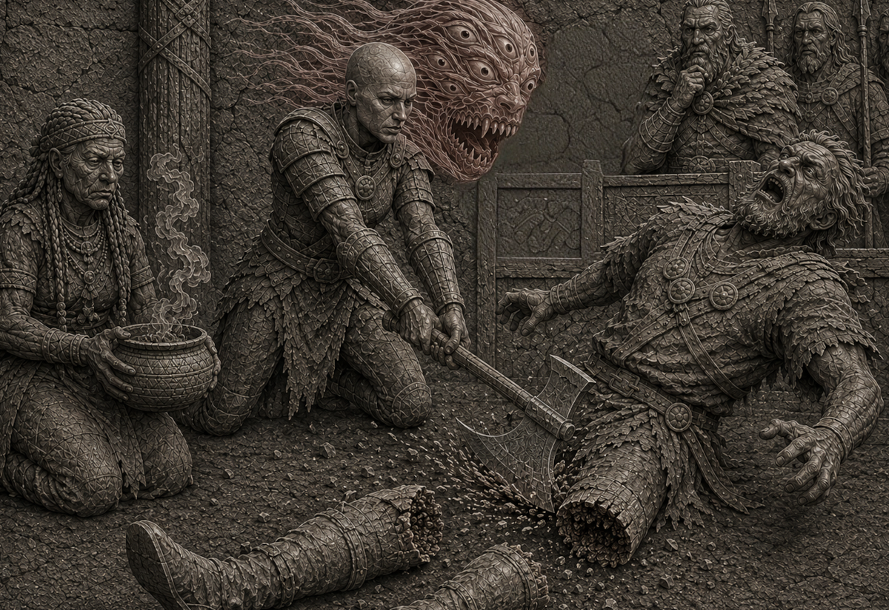

*Continuation of Ikarnos & Hanya's adventures*

## Accused by the Cherusii

Ikarnos and Hanya follow the Sartarites without resistance and eventually arrive at a fortified village. They learn the clan is called the Cherusii clan. The inhabitants watch them pass and the warrior leads them to the chief's hall. They are pushed to their knees before a thin man who looks at them with curiosity.

The warrior speaks: "You, Farindar, never wanted to shed light on the mysterious disappearances in our clan and never believed in the guilt of that traitor Hazz whom we nonetheless welcomed years ago. Yet I bring you proof of his guilt and here are his instigators! I saw them plot their crime. I demand that the Justice of Orlanth be rendered and that the truth of Humakt be pronounced for this scum!"

The chief strokes his goatee and seems doubtful. "Hynir, Hynir, always quick to call Death on what I see. Hmm.. perhaps to make up for your latest feat."

The assembly bursts out laughing.

But the said Hynir glares at them darkly. "So Hazz, do you have an explanation to give us?"

Hazz steps forward, weakened and trembling: "these two are envoys of Fazzur, I was trying to be clever when Hynir came to murder my men repeating his nonsense!"

Hanya nearly reacts with rage but Ikarnos dissuades her by placing his hand on her shoulder.

> 🎲 Try to clear themselves
> - Conflict:
>   - find the path to the solution, offer help
>   - Hazz's lie, anti-Lunar prejudices
> - Result 2 vs 2: victory +1

Ikarnos addresses Farindar: "this man speaks the truth, we are under Fazzur's protection and perhaps in your eyes this represents a crime but you would be wrong. Fazzur asked us to consolidate the Lunar Pax and not to inflame it. We are heading to Pavis and were only passing through the Dragon Pass when this man tried to enslave us, an activity he boasted about to us and I thus think this is not his first offense. I do not know the said Hazz and have no sympathy for those who exploit the weak for in doing so they show only weakness themselves. Surely you fought against the Red Moon, but we respect you because we know your strength. Individuals like Hazz are a disgrace. If you do not believe me, question my spirit and you will know. I am not afraid. My death may go unavenged because Fazzur is far but I will die as I have lived, with dignity. If you decide to kill us, grant me just one favor: let my warrior behead this worm."

The king strokes his goatee and says: "how unfortunate all this. What do you think Urulvir?"

An old man rises and looks at the prisoners. He extends before him a staff adorned with a transparent stone, squints to look through the stone's prism and closes his eyes.

> 🎲 Make truth prevail while hiding Hanya's chaos contamination
> - Conflict:
>   - make them forget names (to divert attention), they speak the truth
>   - Hanya's contamination
> - Result 2 vs 1: setback

Urulvir clears his throat and speaks: "They speak the truth but I cannot see the whole situation clearly. Hazz is guilty in any case. The others are innocent regarding the slaves but are not reliable for all that." He sits back down.

Farindar: "I see you are wounded Lunar, you will be able to heal and will be our guest while we clarify your intentions a bit better. Hynir find them lodging. As for you Hazz I sentence you to become a slave. You will be taken to the slave market of AldaChur."

Ikarnos: "if I may, if Hazz is a Lunar citizen, he may escape your judgment, noble chief. Let the warrior end his pathetic life."

Farindar: "you seem quite eager to eliminate Hazz's life. I find that strange even though the wise Urulvir does not think you accomplices. Wind Day will bring me counsel and I will know what to do."

The trial is thus adjourned. Ikarnos and Hanya are led to the Armed Thanes' building. The lodging is spartate but correct. Hazz's cries of protest can be heard, probably being taken to a separate room to keep him prisoner with his two henchmen.

## The trial

> 🎲 Having lost the notes on the conflicts, only the narrative remains.

Ikarnos and Hanya are led to the guest house. They are not mistreated but four men bearing shield and lance stand guard outside the hut.

Ikarnos sits on a bench and stretches his legs: "here is another unfortunate setback but I do not think they will execute us. The fact that Hazz, a Lunar, lived among the clan means that they have somewhere accepted the Goddess's victory."

Hanya replies bitterly "they are quarrelsome barbarians, capable of changing their minds like the wind, like their master Orlanth."

Ikarnos: "that is why we must make sure to represent something interesting. We could help them find the real instigators of this trafficking even if it will unfortunately take us even further from AldaChur."

Hanya darkens: "I think for my part that this is not our business. Let us rather try to take the opportunity to heal your wound."

Forced to brood, at nightfall, a meal is brought to them. Ikarnos tells Hanya they can eat without fear because it is not in the traditions to assassinate a guest. Time passes. They know the torque is gathered with the thanes in the clan dwelling.

After a while, the guards ask them to follow. It seems Chief Farindar has finally decided something. The clan dwelling is packed. A feast has taken place. Hazz and his two men are in chains. Ikarnos and Hanya are brought before the chief.

The latter stands and everyone falls silent: "I, Farindar son of Kilin, chief of the Cherusii, will render justice."

A obese man adorned with feathers on his head and clothes bursts out laughing: "Justiiiiiiice!!" then begins to imitate pig grunts.

"Enough pig!" declares the chief. The jester falls silent, emitting a small meow. People laugh.

"When my father fought the Lunars, we were defeated. Few still remember it but it was not the Lunars who defeated us but the perfidious Lamars who betrayed us that day. We learned the lesson and have always respected the Empire's rules without betraying our own."

His gaze falls on the fierce warrior who arrested Ikarnos and Hanya. He resumes: "Our laws forbid death except by duel. We should therefore banish Hazz."

A murmur of disapproval runs through the hall.

A woman screams: "This will not avenge our husbands and children taken from us!"

Farindar strokes his goatee: "we should but we will not!"

Men strike their shields with their lances: "Yeah! Well said!"

The chief continues: "we cannot kill him, we cannot exile him.. so what to do?" He shrugs. He signals to his wife who rises. She carries a smoking gourd.

Then he addresses Hanya and Ikarnos: "you proposed that your warrior rid us of the scoundrel. We do not want to be rid of him. We want to remember."

Men approach Hazz and hold him with legs extended. The chief declares: "Take your axe and cut off his legs!"

Hazz begins to scream: "Nooooooon.. you have no right, I am an Empire citizen!!! You will be annihilated by my allies!!"

He drools. Hanya looks at Ikarnos. The latter closes his eyes a moment and reopens them: "blood calls for blood Farindar. Do you not want me to investigate the friends of this scoundrel?"

Farindar: "one does not prevent the other. Justice must be rendered, I owe it to my people. I add that if your warrior refuses, I will take this as a sign of loyalty to this scum."

Hanya: "then I have no choice." She advances. Hazz stares at her, terror in his eyes. Hanya raises her axe and it falls on the unfortunate man's legs: "tchak! tchak!"

The crowd averts their eyes from the horror: horror of the mask of terror Hanya invoked, horror of seeing the two legs cut above the knees, horror of hearing Hazz's screams as he falls unconscious.

Warriors are admiring of the precision of the warrior's cleaving blow. The chief's wife kneels and takes from the gourd a smoking mud to apply on the stumps of the legless man.

Hazz still breathes. Farindar speaks, addressing Hazz's henchmen: "you and you, I banish you for participating in this infamy. I authorize anyone to kill you if you approach the clan's lands."

Men release them and push them toward the exit. People throw garbage at them. The unfortunate man's legs are thrown into the fire. "Hazz will remain in the clan and live like a pig eating our scraps. Let this remind each of us what happens when one tries to betray the clan."

Ikarnos takes the opportunity to declare: "may I tell you something in private?"

Farindar: "approach."

Ikarnos whispers in his ear: "let me follow the two men, I am sure they will rejoin their accomplices. If I were them, that is what I would do."

Farindar looks at him. "So be it, Lunar, but your warrior stays with us until you return."

Ikarnos understands the chief's distrust and sees himself forced to accept. Time is running out. It has been a few minutes since Hazz's two men left the hall and every instant counts. "This will not make my task easier but I accept despite my wound."

He quickly goes to Hanya and tells her discreetly: "I will track down the two men and return as soon as I know more."

Hanya casts a dark look at Jarindar but complies with Ikarnos's orders who leaves the hall.

Ikarnos finds the men's tracks in the mud. Wide strides, signs of fleeing. They head toward the village exit. Ikarnos thus passes the gate and finds himself at the fields. Exiles would not have risked treading the fields property of their Earth goddess Ernalda. He thus stays on the path and arrives in the wild lands around the clan and continues his pursuit.

| [Previous](../15) | [Next](../17/) |
