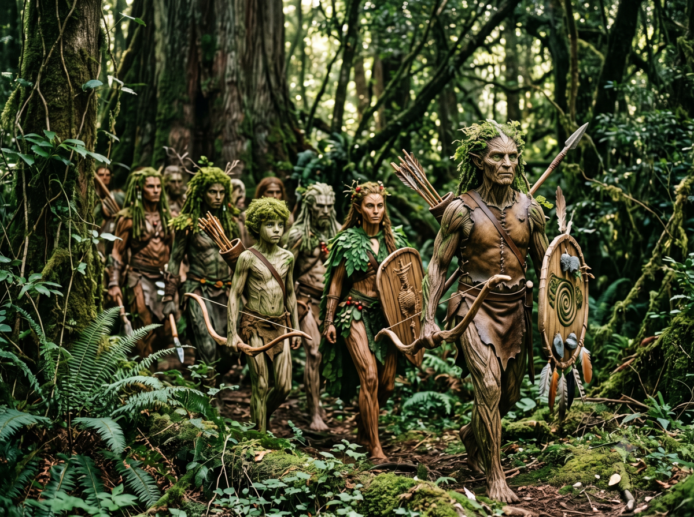

*Continuation of Jaridan & Peek's adventures*

# The deep forest

> 🎲 Having lost the notes on the conflicts, only the narrative remains.

Jaridan and Peek advance through the forest at random, trying to orient themselves by the glimmers filtering through the increasingly thick foliage. But Yelm is sinking lower and lower, ready to return once more to the world of Darkness in accordance with the cosmic law of the Great Compromise.

Wounded, tired, they walk in silence, leading their mounts by the bridle. The surrounding sounds do not reassure them. They seem surrounded by an intense life they do not see, except from time to time: a squirrel slipping through, a bush rustling, leaves moving, a bird singing, an insect chirping.

They finally take a break. Sitting on a mossy rock,

Peek looks around her: "What a strange and oppressive place!"

Jaridan replies, biting into a piece of dried meat: "It certainly does not much resemble the great plains of Prax from what I have heard."

Peek sharpens her arrows: "Have you ever been to a forest? What dangers await us?"

Jaridan: "We sometimes go into the woods but never very far. We cut down trees to build our houses or to heat ourselves in winter. Only the mad or the outcasts venture beyond. It is the kingdom of Aldrya the great Goddess of Elves."

Peek: "Elves? They really exist then? And you have seen some?"

Jaridan: "Never.. but the small creature we rescued resembled them. They say they are both man and plant. They say they hate men because men destroy their forests."

Peek: "they also say a lot of things about us Nomads.. I only believe what I see or what the great spirits whisper to me."

Jaridan: "Shhhh!".

Peek and Jaridan seize their weapons because they heard a noise around them, then suddenly the foliage parts around them and they see advancing in a circle at a distance of about twenty paces, humanoids armed with pikes and bows, with bark armor, shields shaped like long leaves.

They are slender, their skin resembles wood, their eyes have no pupil but resemble brown fruits, some have moss instead of hair, others leaves. There are about twenty of them and they advance slowly, inexorably. Peek and Jaridan stand back to back, ready to defend their lives dearly. The Elves, for it is indeed a group of Elves, stop ten paces from Peek and Jaridan.

One of their number steps forward and begins to speak. The phrasing is strange, melodious and slow, like a chant. "Oooou aaanimaaaal baaaaad ooooooears leaaaaf?"

Fta-Ah begins to grow agitated and Peek tries to calm her. Jaridan tries to understand what the strange creature seems to be asking them.

Jaridan replies: "Me not understand, me not danger!" placing his hand on his heart.

The Elves seem to misunderstand his gestures or words and some draw their bows. Fta-Ah grows more and more agitated. Peek tries to calm her. The Elves see the nomad begin a calming chant to the antelope.

The latter lies down on her front legs, calmed. A few Elves unstring their bows, perhaps themselves calmed by Peek's song.

Peek then takes advantage of this to declare: "We, lost, we, wounded, we, friends." And she kneels, placing her weapons on the ground and inviting Jaridan to do the same as a sign of humility.

Time seems frozen. Suddenly a slight rustling is heard and the small creature that Peek and Jaridan saved from the alynx's claws emerges from the forest. It heads toward one of the warriors in the rear, perches on his arm and speaks to him in a crystalline language. The man then begins to speak in a language of such beauty that shivers run along Peek's and Jaridan's cheeks.

When he speaks, the forest itself seems to respond to his words and one has the impression that everything that is plant vibrates in unison. "Tree grow" says the Elf who seems to know a few Theyalan words.

Jaridan and Peek do not understand but his gesture commands them to stand. Elves approach and recover their weapons. They seem to touch them as if it were poison. Then with a tongue click and pointing a direction, the Elves invite them to move. Peek and Jaridan lead their mounts by the bridle, surrounded by warriors behind, on the sides and in front, and begin to advance into the deep forest.

Peek declares: "you see Jaridan, I only believe what the great spirits whisper to me."

| [Previous](../16) | [Next](../18/) |
