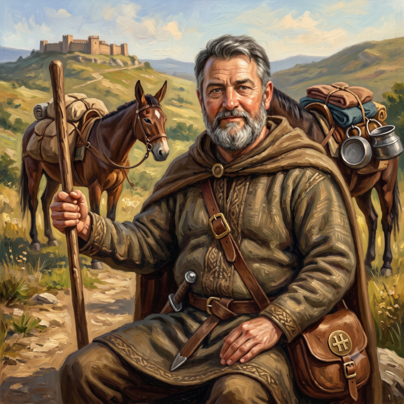

> "War is never good for trade"

* Man, 48 years old
* **Standard of living**: comfortable
* **Wergild**: Thane
* **Equipment**: a mule, a horse, bags, merchandise, dagger, staff 

# Runes

* Pragmatic
* Resilient
* Pacifist, gentle, benevolent

* Travel discreetly
* Energetic
* Curious

* Diplomatic
* Empathic

# Tarshite

* Basic knowledge of culture and animal husbandry
* Geography of Tarsh 
* Customs & Alakoring Myths 
* Knowledge of the Tula
* Storm Pantheon (without Orlanth)
* **Relations**: 
  - Family 
  - Clan 
* **Virtues**: Courage, Generosity, Personal Honor, Social Justice, Piety, Wisdom, Vassalage 

# Merchant

* Numerous contacts
* Knowledge of neighboring cultures & cults (Empire + Sartar)
* Travel discreetly
* Negotiate
* Bookkeeping (accounting)
* Frugal
* Negotiate
* Evaluate goods
* Merchant's tongue

# Initiate of Issaries

## Communication
 - Shout clearly 
 - Impressive speech 
 - Convince buyer or seller 
 - Soft tongue 
 - Speak with hands

## Merchant
 - Bless a market 
 - Create a win-win bond 
 - Evaluate currency 
 - Spot a thief 
 - Lock a box 
 - Recognize a magical object. 

# Initiate of Gultha Languedor

- Staff combat 
- Cartography
- Orator 
- Organize a caravan
 - Song
- Speaks New Pelorian and Sartarite
- **Virtues**: spirit of adventure

## Travel 
 - Cover tracks 
 - Detect an ambush
 - Find an escape route 
 - Find a path 
 - Protection during sleep

## Communication 

 - Make oneself understood 
 - Friendly greetings

> Jaridan is a long-standing accomplished initiate. He therefore has enough experience to attempt whichever miracle as taught by Issaries or Gultha. 

*Wealthy merchant who has succeeded and wants to try to preserve his clan, his family from the future troubles to come. His wife, sons and daughters manage his trade in his absence. An entrepreneur at heart, he hopes to develop new outlets by traveling.*
