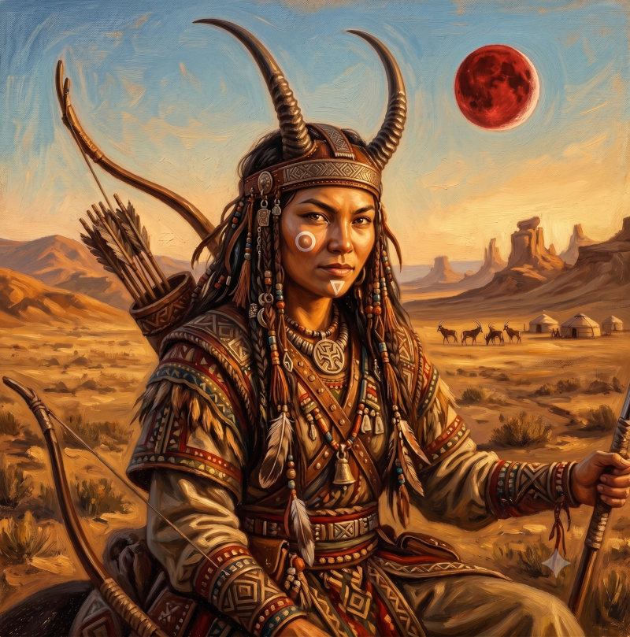

> "The prophecy is coming true and our tribe was chosen a very long time ago to be the protectors of the Moon"

* Woman, 22 rains
* **Standard of living**: poor (relatively)
* **Equipment**: bow, lance, helmet, fetishes

# Runes

* Sense of superiority
* Curious

* Sure arrow
* Sharp opinions
* Impulsive

* Sensitive
* Feel, see spirits
* Bargain with spirits

# Sand Nomad

* Ride an Antilope (is one with Fta-Ah)
* Contempt for horses
* Contempt for sedentary people
* Survival in the Wastes
* Navigate
* Sense of superiority
* Customs, myths and geography of Prax
* Read Praxian knots
* Praxian Animism: Waha & Eiritha
* **Relations** 
  - Tribe
  - Khan's Daughter 
* **Virtues** : pride, freedom
# Scout

* Stealthy
* Good sight
* Bow
* Lance 

# Tradition of Waha the Butcher

* **Virtues**: Eliminate Chaos, Pacification of the soul (killed animal), Nourish, defend, alert the tribe
* **Miracles**: Death Lance 
* **Fetishes**: 
   - Kill the stranger (do not kill for one moon after)
   - Know the lineage (sacrifice to ancestors at each full moon) 
   - Beast superior to man (vegetarian) 
   - Water-seeking spirit (drink nothing but water) 
   - Pacification of spirits (never desecrate a place inhabited by a spirit)

# Fta-Ah 

* Sand Antilope
* Courageous
* Fast
* Faithful

*Being the only daughter of Paak-the-Cunning, he spoils her more than her brothers and allowed her to follow the guardians and hunters but as a scout. It was she who decided to head toward the Empire, hoping to trace a destiny for her people whom she estimates in danger of corruption by the Empire.*
