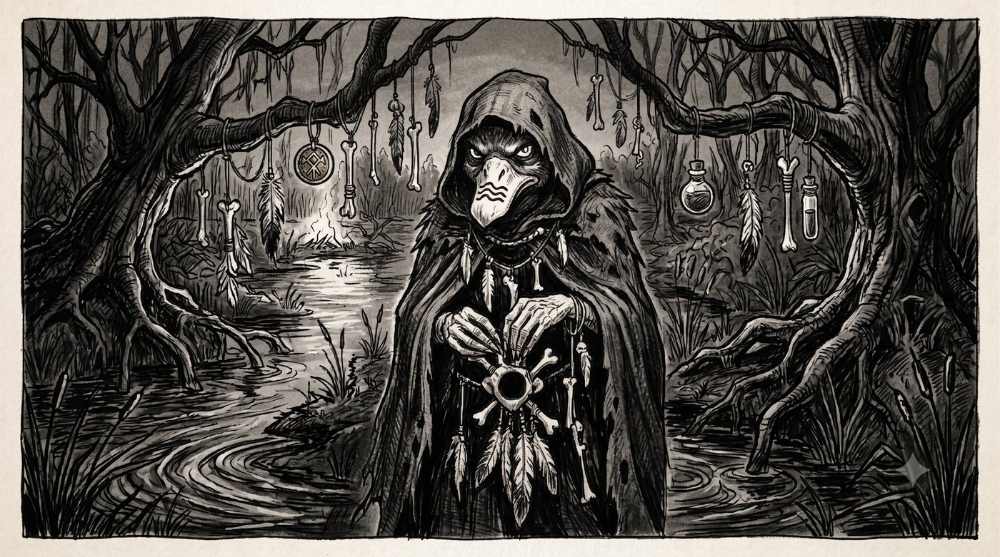

> "Could be scary if it weren't a duck"

* Durulz duck, "old", indeterminate age
* **Standard of living**: poor
* **Equipment**: feather fetishes

# Runes

* Moody
* Perched
* Lives by night

* Hear, feel the spirit world
* Negotiate with and fight spirits
* Travel in spirit

* Slip into the night
* Sinister
* "See" in the dark
* Summon a shadow

# Durulz of the Dragon Pass

* **Virtues**: survive, distrust of humans, pride despite the curse

# Shadow Swimmer

* Slip through fingers
* Very good hearing
* Bargain with spirits
* Appear harmless
* **Virtues**: explore the shadows to lift the Durulz curse, patience, discretion

### Wonders of the Shadow Swimmer

* Imprison a spirit in a feather
* Summon a shadow
* Travel in spirit

* **Weakness**: sensitive to light — she lives by night
* **Relations**:
    - Hatred of Yelmites

*Hooded duck with dark plumage, Duckita flees the anti-Durulz persecution of the Dragon Pass: her clan was decimated. She learned the basics of the Shadow Swimmer from the clan's teacher, killed during the battle, who saved her so that the tradition could continue. Sinister, she lives by night, surrounded by her feather fetishes.*
