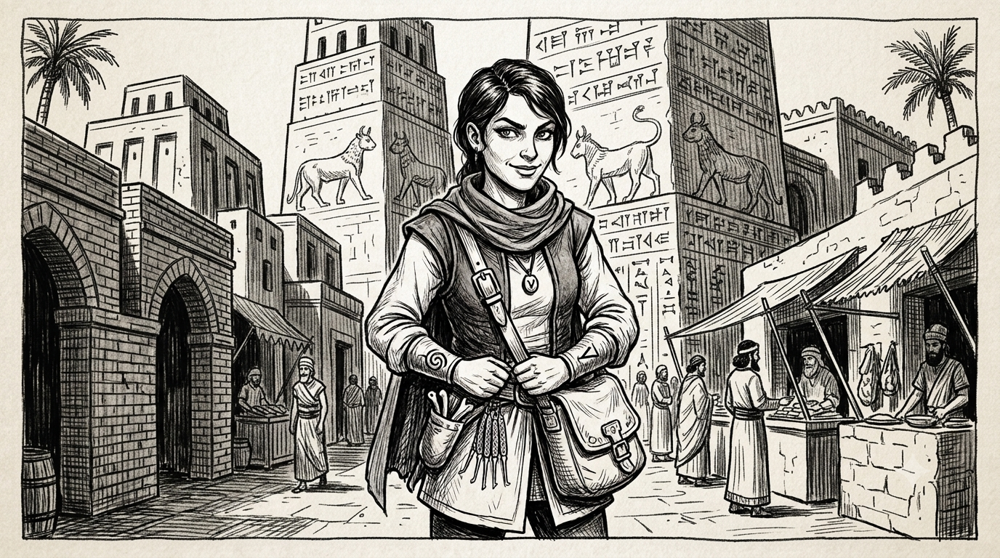

> "Stealing from a thief isn't theft, is it?"

* Woman, 20 years old
* **Standard of living**: average
* **Equipment**: books and scholar's gear, burglar tools (picks, rope, pliers)

# Runes

* Blend into the crowd
* Erase one's tracks
* Perfect hiding place
* Perfect theft

* Unrecognizable mask
* Conceal the truth
* Lie with conviction
* Hide an object

* Selfish
* Resourceful
* Persuade
* Steal from a thief

# Pavisite

* Rogue scholar
* Bookworm
* Meticulous
* Knowledge of Pavis and the Old Town
* **Virtues**: independence, resourcefulness, merchant spirit, distrust of the Lunar Empire

# Initiate of the Grand Mystery

(Thieves' cult of Pavis)

* Daring move
* **Virtues**: absolute discretion, never betray the Mystery, steal from thieves, the ends justify the means
* **Relations**:
    - Her father Hamar, antiquarian of the Old Town
    - Tuck, her contact in the Grand Mystery

### Spells of the Initiate of the Grand Mystery

* Blend into the crowd
* Unrecognizable mask
* Erase one's tracks
* Conceal the truth
* Hide an object
* Perfect hiding place
* Perfect theft

*Well-educated, playful and lively, Fazia is the daughter of Hamar, an antiquarian of the Old Town. A bit of a thief on the side, she hides her membership of the Grand Mystery — punishable by the cutting off of the hand and banishment under Pavisite law, and Lunar law too — but for how long?*
