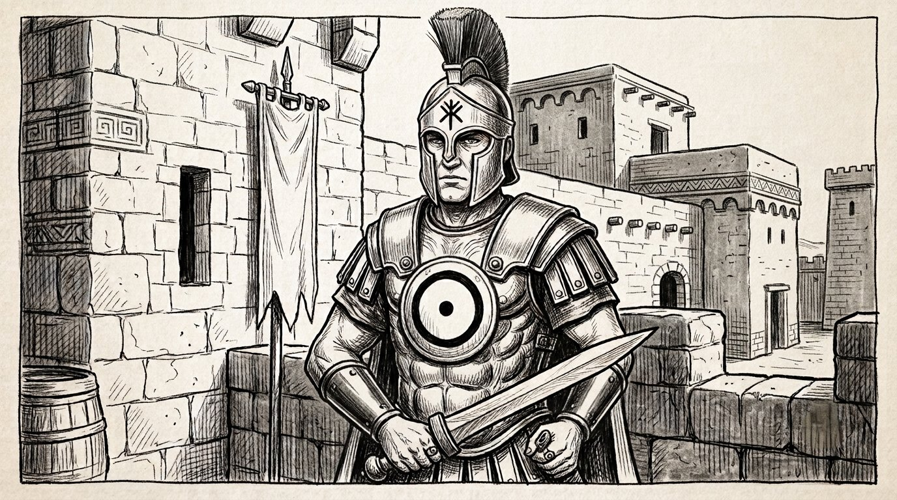

> "Organized war with rules, not butchery"

* Man, 30 years old
* **Standard of living**: average
* **Equipment**: the danger ring

# Runes

* Thoughtful
* Man of duty
* Personal discipline

* Merciless
* Intimidating
* Organize a plan

* Organized war with rules, not butchery

# Dara Happan

Decurion

* Knowledge of Dara Happan culture
* Celestial Pantheon (Yelm)
* Squad tactics and command
* Marching in step / formation warfare
* **Virtues**: honor, duty, obedience, loyalty to the Empire, order and discipline
* **Relations**:
    - Family honor
    - Defense of the Empire's interests

# Initiate of Urvairinus the Conqueror

* **Virtues**: organized war with rules, not butchery, merciless toward the enemies of Dara Happa, command

### Light of Action

* Courage
* Demoralize the enemy
* March in step
* Several attacks in one

### Military Strategy

* Manage food supplies
* Persuade the inhabitants
* Enlist an army
* Send battle orders

### Fighting the enemies of Dara Happa (Yelm)

* Trolls
* Undead
* Chaos... and Orlanthi rebels

* Being everywhere on the battlefield
* Ultimate command (even over enemies)

*Born into an old military family. Sent to Prax to shine.*
