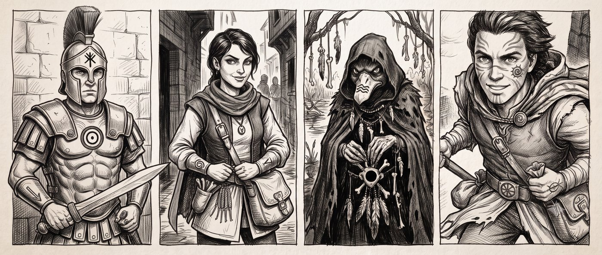

Exploration of the Multisim campaign released in 2001 for HeroWars, freely adapted.

**Download the consolidated PDF: [les-heritiers-de-zola-fel.pdf](les-heritiers-de-zola-fel.pdf)**

# Premise

This is the story of Fazia, who stole a map of the mythical Puzzle Canal from adventurers returning from the Big Rubble. But stealing from thieves isn't really stealing, right?

This is the story of Irinus, a Lunar army decurion who caught her red-handed. Having come to shine in the desolate lands of Prax, what better than to hunt down the magical secrets of the Scholars of the Ambiguous? And since he has no trustworthy wizards at hand, he takes Fazia aboard, who demonstrated her scholarship skills to him. Thanks, Dad the antiquarian.

But he also needs arms to row and to fend off the dangers of the Big Rubble. Slaves and hoplites are not lacking, but to lead the boats he stopped and threatened Duckita, a stubborn duck. What he doesn't know is that for her, going with him into the Puzzle Canal doesn't displease her in her anti-Yelm quest. Opposites sometimes find common ground, don't they?

Oh, I almost forgot, it's also the story of Korlanth called Lucky, who is currently rotting in a Lunar prison following a brawl in a Pavis inn where he reportedly made outright revolutionary remarks, which he takes with optimism since it is his destiny.

# The heroes

- [Irinus Solantis, Dara Happan decurion](heroes/irinus)
- [Fazia Hanout, young rogue scholar](heroes/fazia)
- [Duckita, Durulz, Shadow Swimmer](heroes/duckita)
- [Korlanth Lucky, young Orlanthi](heroes/korlanth)

# The others

They are gathered in a [glossary](others) in alphabetical order.
