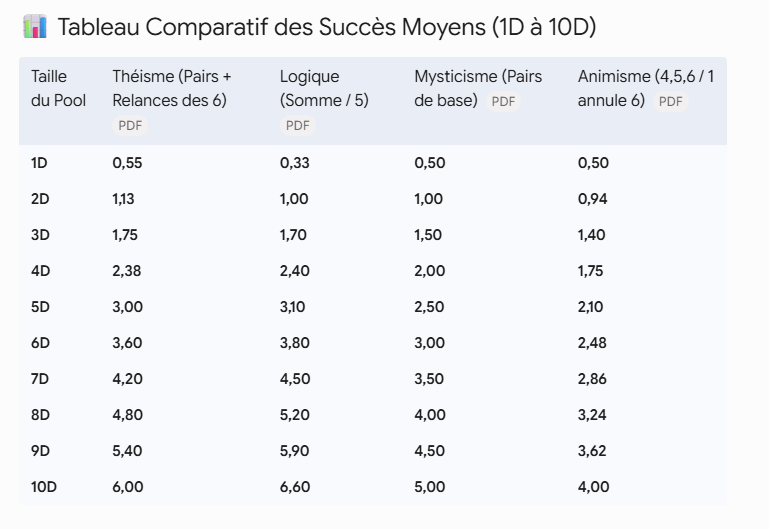

# Stats

Ces stats ont ete faites a la louche par IA

Notons les stats 1D intéressantes. 

La logique n'est pas efficace pour résoudre des cas triviaux. Cela explique pourquoi elle veut compliquer les choses. Obtenir plus de dés, couper les cheveux en quatre. Foutus rationalistes! 

Ajout des stats draconiques: qui écrasent tout le monde mais c’est bien légitime. 

Par contre, si le dragonewt choisit l’utuma et donc la voie matérialiste, on retrouve les stats du mysticisme. 

- **1D :** 0,50 réussite
- **2D :** 1,16 réussite
- **3D :** 1,93 réussite
- **4D :** 2,78 réussites
- **5D :** 3,68 réussites
- **6D :** 4,63 réussites
- **7D :** 5,60 réussites
- **8D :** 6,57 réussites
- **9D :** 7,56 réussites
- **10D :** 8,54 réussites