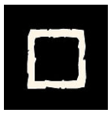
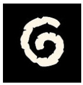
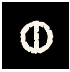

Les runes sont les briques du monde. Elles tissent la réalité. Elles s'immiscent partout. Elles dessinent la trame du Destin.

Identifions les.

Nommons les.

Observons leur impact. 

Parfois deux cultures ou personnages sont liés à la même rune mais sa manifestation diffère, toujours. 

Les runes réunissent mais distinguent aussi. Elles ne sont jamais seules. 

> Arachne Solara a 8 pattes et vous n'avez que deux mains.

L'idée est de tirer deux runes pour établir une connexion avec Glorantha. 

Main gauche et main droite (2d8 ou 8 cartes)

Cela permet ensuite de tirer les fils jusqu'à ce qu'une idée émerge. 

_Table des runes de pouvoir:_

| **Chiffre** | **Rune** | **Thèmes** | **Exemples** | **Corps** | **Question** | **Direction** | **L'instant** | **Distance** | **Relation** | **Objets** | **Habitation** | **Personnalités** | **Options militaires** |
| --- | --- | --- | --- | --- | --- | --- | --- | --- | --- | --- | --- | --- | --- |
| **[1]** |  | **Découverte** | ce qui est autour, le monde, lieux, informations... | jambes | où? | en-dessous | Le Transit: le temps qui s'écoule, l'éphémère, l'urgence de l'action en cours | L'Approche: la distance dynamique, celle qu'on est en train de franchir (le voyage) | Le Passant: l'étranger croisé en chemin, l'éclaireur, le contact furtif ou nomade | carte, boussole, longue-vue, bottes, véhicule... | vestibule, couloir, observatoire, balcons... | curieux, explorateur, agité, instable... | éclairage, patrouille, manœuvre de contournement... |
| **[2]** |  | **Menace** | ce qui est différent, l'autre, l'ennemi... | bras | qui? | à droite | L'Échéance: le temps compté (le compte à rebours), la fin abrupte, le passé mort | L'Abîme: la séparation radicale, la frontière infranchissable, la distance qui isole | L'Exclu: l'ennemi juré, le banni, la rupture de ban, la relation rompue à jamais | arme, poison, piège, symbole d'avertissement... | armurerie, cachot, fosse, mur d'enceinte... | agressif, cruel, paranoïaque, protecteur... | assaut frontal, intimidation, raid destructeur... | 
| **[3]** |  | **Relations** | ce qui relie, émotions, sentiments, liens, dilemme... | coeur  | quoi? | à gauche | La Synchronicité: le "Kairos" (le bon moment), le temps partagé, être "en phase" | La Proximité: l'espace partagé intimement, le réseau (la distance est abolie par le lien) | L'Allié Intime: l'âme soeur, le membre du clan, la synergie totale et l'entraide | contrat, alliance (bijou), cadeau, instrument... | salon, salle à manger... | empathique, diplomate, charmeur, dépendant... | négociation de trêve, soutien mutuel, coalition... | 
| **[4]** |  | **Loi** | ce qui est figé, moralité, société, groupe, autorité... | tronc | comment? | devant | La Routine: l'éternité, le temps suspendu, le cycle immuable et répétitif | L'Ancrage: le point fixe absolu ("Ici"), l'immobilité, le repère immuable | L'Institution: le lien formel (hiérarchie, devoir familial), le supérieur, le vassal | torque, fétiche, habits cérémoniels, balance, sceptre... | salle de consultation, cour centrale, agora... | rigide, traditionaliste, autoritaire, inflexible... | formation stricte (phalange), siège, garnison... |
| **[5]** |  | **Ressources** | ce qui est nécessaire, matériel, réalité... | parties génitales | combien? | derrière | La Croissance: le temps qu'il faut pour mûrir, la patience récompensée, le cycle des saisons | L'Expansion: le rayonnement autour d'un centre, la zone d'influence, le domaine | Le Nourricier: le protecteur, le membre de la famille élargie, le créancier/débiteur | bourse, provisions, outil de récolte... | cuisine, cellier, grenier, coffre-fort... | pragmatique, travailleur, généreux, matérialiste... | logistique, ravitaillement, pillage, guerre d'usure... |
| **[6]** |  | **Révélation** | ce qui surprend, bouscule, rebondissement, surprise, ce qui est hors-norme, improbable... | les sens | quand? | au-dessus | L'Interruption: l'instant foudroyant, l'imprévu, la rupture brutale de la chronologie | Le Labyrinthe: la distance erratique, la désorientation, le chemin brisé ou chaotique | Le Traître: le perturbateur, l'antagoniste imprévisible, le rival toxique | objet cassé, objet rare... | pièce inattendue, zone sinistrée ou détruite... | imprévisible, visionnaire, fou, rebelle... | tactique de choc, effet de surprise... |
| **[7]** |  | **Savoir, Connaissance** | ce qui doit être cherché, recherché, étudié... | tête | pourquoi? | dedans | La Clarté: l'instant décisif, le fait historique immuable, la ligne temporelle exacte | La Ligne Droite: le plus court chemin, la trajectoire mesurée et absolue | Le Garant: le témoin fiable, la relation transparente et sans arrière-pensée | livre, parchemin, instrument de mesure, relique... | bibliothèque, scriptorium, bureau, autel... | renseignement, cryptographie, stratégie calculée... | érudit, rationnel, observateur, pédant... | 
| **[8]** |  | **Mystère** | ce qui est caché, tromperie, illusion, vain, illusoire... | organes internes | à moins que? | nulle part et/ou partout | Le Contretemps: le faux souvenir, le temps perdu, la boucle trompeuse (l'attente vaine) | Le Mirage: l'espace trompeur (ce qui semble proche est loin, et inversement), l'impasse | Le Masque: l'inconnu, le manipulateur, la relation fondée sur un non-dit ou un secret | masque, double-fond, fausse monnaie, cape... | passage dérobé, labyrinthe, pièce dissimulée... |  secret, énigmatique, manipulateur, menteur... | camouflage, guerre psychologique, feinte, diversion... | 

> Les lettrés Gloranthiens de cultures diverses ont beaucoup glosé sur les liens entre les runes de pouvoir et les éléments constitutifs du monde, que ce soit au niveau des éléments corporels, que des grandes questions types de l'univers, ou tout autre grande catégorisation du monde. 

Cela parait abstrait mais c’est beaucoup plus facile à manier que ça en a l’air. Cela permet de contraindre votre imagination gloranthesque mais vous êtes totalement libre d’inventer ce que vous voulez. 

La relation entre les deux runes est également libre: ça peut être un rapport de cause à effet, un rapport temporel, un rapport hiérarchique, etc... voire même n’avoir aucun rapport et être deux choses indépendantes dans la suite du récit. Ce sont des entités symboliques servant l’inspiration du récit en cours. 

*Bonne [méditation sur les runes](../../../notes/runes-meditation) de pouvoir*

### Quand tirer les runes?

En début de saison, en début de situation, ou quand vous vous sentez en manque d’inspiration ou lorsque les objectifs des personnages doivent se confronter au réel. 

En effet, le récit est centré sur les objectifs des personnages avant tout. Cela permet de bien creuser leurs motivations et leurs façons de réfléchir et d’agir. Mais ce n’est pas suffisant pour écrire une histoire. Les personnages sont plongés dans un monde complexe (Glorantha) qui bouge et ce mouvement du monde est exprimé par les Runes. C’est aussi simple que ça dans une logique Gloranthesque. 

### Se repérer dans le temps

Le Temps est l'enfant du Diable et d'Arachne Solara conçu pour le Grand Compromis. Le Temps n'existait pas pendant les Âges Divins. 

Le Temps a engendré les chronologies. Les Erudits de l'Ambigu estiment en particulier qu'au commencement fut créé l'Obscurité, puis l'Eau, puis la Terre émergea et le Ciel au-dessus. L'Air vint alors séparer la Terre des Eaux. Et au 3ème Âge, la Lune monta dans l'Air Médian. 

Ainsi il apparut qu'une relation temporelle existait entre les divers éléments. 

| **Chiffre** | **Rune** | **Repère temporel** | **Commentaire** | **Logiciens** |
| --- | --- | --- | --- | --- |
| **[1]** |  | **Bien avant** | Le temps des origines | Avant (Passé lointain) |
| **[2]** |  | **Il n'y a pas longtemps** | Fluctuation du temps autour du présent | Avant (Passé proche) |
| **[3]** |  | **Maintenant** | Le temps émotionnel | Maintenant (Présent) |
| **[4]** |  | **Passé-Présent-Futur** | Le temps sociétal | Maintenant (Présent) |
| **[5]** |  | **Demain** | Le temps qui amène le changement | Après (Futur proche) | 
| **[6]** |  | **Futur** | Les longs cycles | Après (Futur lointain) |

### Se repérer dans l'espace

En observant la réalité environnante, le regard permit d'établir l'échelle de distance suivante. 

 
| **Chiffre** | **Rune** | **Repère spatial** | **Commentaire** | **Logiciens** |
| --- | --- | --- | --- | --- |
| **[1]** |  | **Ici** | L'Intime, la proximité de l'ombre | Ici |
| **[2]** |  | **Proche** | Le Proche, là où l'on vit, Ce qui porte nos pas | Ici |
| **[3]** |  | **Séparé** | Le Séparateur, la frontière | Proche | 
| **[4]** |  | **Autour** | Le Vaste, l'espace à côté | Proche |
| **[5]** |  | **Loin** | L'Ailleurs, la lune lointaine dans le ciel | Loin |
| **[6]** |  | **Très loin** | L'Absolu, Yelm le lointain, dans un autre Plan peut-être | Loin |

> Note: pour les Triolinis, l'Eau est le 2 (le milieu où l'on vit) et la Terre est le 3 (le milieu qui sépare)
