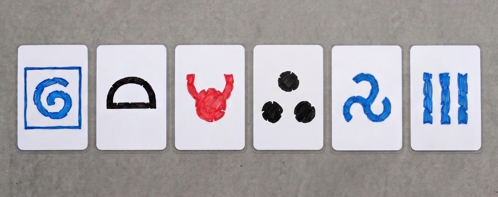

On pourrait remplacer les mises par un paquet de cartes contenant:
- 1/6 de la rune majeure du Dieu (pour les 6)
- 2/6 avec des runes mineures du panthéon ou du Dieu (pour 2 et 4)
- 2/6 avec rien ou des runes neutres (pour 3 et 5)
- 1/6 de la rune la plus opposée au Dieu (pour les 1)
   
Il faudrait beaucoup de cartes pour éviter la “triche” et aussi pour ne pas avoir à remiser à chaque recherche d’un soutien runique. Nombre à prévoir: 60 couvre de manière équivalente des camps de 10 mises (il y a bien 10 éléments de chaque en fait). L’explosion divine est légèrement contenue mais c’est statistiquement négligeable.