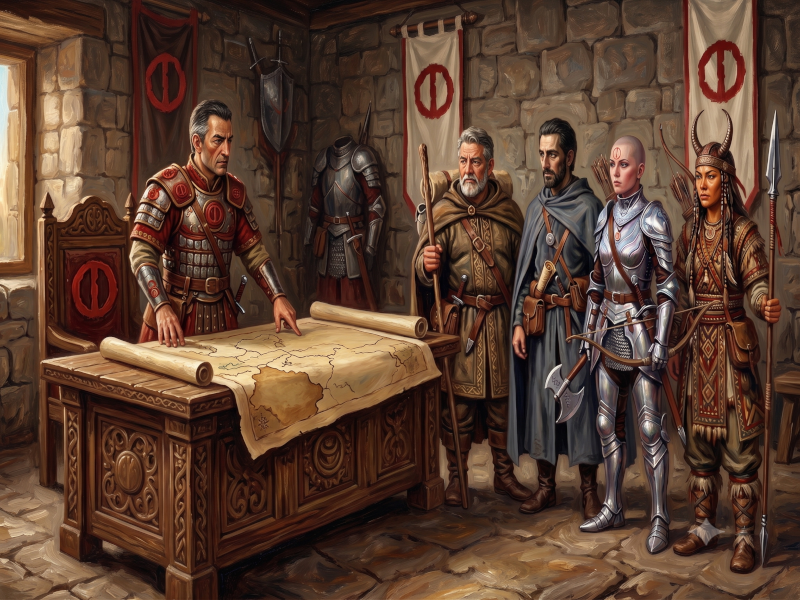

# La Mission de Fazzur

* **Lieu :** Dunstop — Palais du général provincial *Fazzur l'Instruit*
* **Date :** 1611 — Saison de la Mer — Semaine de l'Harmonie — Jour du Gel

---

## L'Audience avec le Général

### Ikarnos

Après 3 jours d'attente dans la cité de Dunstop — si loin de Raibanth, si différente, si militaire — je fus enfin admis au palais pour m'entretenir avec Fazzur. Il était au courant de mon arrivée car l'Empereur l'en avait informé et il savait que j'allais être à son service. Je laissais donc mes écrits en suspens et mon étude de la *voie Rashoranique* pour arriver avant le zénith de Yelm.

Le palais n'était pas grand, ni ostentatoire comme les palais impériaux, et ressemblait plus à une caserne avec son lot de gardes, de contrôles... Je me demandais d'où Fazzur tirait son surnom d'"Instruit", car je voyais mal une bibliothèque dans un tel endroit, à moins que ce surnom ne vienne d'un réseau d'informateurs étendu. Je me préparais à l'entretien en méditant.

> 🎲 Défaite marginale ➔ Pas d'augmentation

Fazzur me reçut debout dans son bureau. Une belle table ouvragée était recouverte de cartes et de pions en tout genre, simulant sans doute de futures batailles pour ce général si talentueux, au visage dur et sûr de lui. À côté de lui se tenaient trois autres personnages :

* Une femme guerrière à la tête rasée et au regard déterminé.
* Un barbare lunarisé de forte carrure (peut-être un marchand).
* Une femme nomade à fière allure, **mais sentant fort**.

*Drôle d'assemblée.*

"Salut à toi Fazzur, le conquérant !" Je vis la femme guerrière sourire. "Que la Déesse soit louée pour avoir permis que nos routes terrestres se croisent".

Il répondit : "Puissions-nous satisfaire le Fils de la Lune, et bienvenue à toi à Dunstop." Il marqua une pause et montra la carte devant lui : "Voilà Prax, la nouvelle victoire de l'Empire. Une terre aride peuplée de Nomades, comme **Peek-ee-Peek** qui fait partie de la tribu vouée à notre Déesse, mais les autres tribus sont nos ennemis. Nous les avons vaincus, mais la paix reste fragile et il faut la consolider."

Je regardais la nomade des pieds à la tête et frémis en pensant que ce sont des gens comme elle qui, plusieurs fois, mirent l'Empire à feu et à sang, jusqu'à même assassiner l'Empereur.

"Même s'il est difficile de gagner une guerre, il l'est tout autant de conserver et d'imposer la paix", reprit Fazzur. "La guerre laisse des traces, des ressentiments parmi les vaincus et ils cherchent toujours à prendre leur revanche. Nous les écraserons s'il le faut, mais nous devons être prêts. C'est pour cela que j'ai besoin de vous quatre pour consolider nos positions, être mes yeux, mes oreilles. Furetez, enquêtez, représentez notre cause. Vous avez carte blanche. Revenez dans un an pour faire votre rapport. Vous pouvez disposer."

"J'accepte volontiers", dis-je.

"Voici mon sceau, Ikarnos. Je ne vous connais pas mais l'Empereur vous fait confiance, donc cela me suffit. Vous pourrez donc agir en mon nom. Ne me décevez pas. Cherchez les menaces mais aussi les sources d'alliance ou les ressources magiques. Nous vaincrons."

"Nous vaincrons et l'Empereur glorifiera tes succès, Fazzur. Pourrais-je prendre un peu de temps pour préparer notre **périple luminescent** ?"

Fixant Fazzur, j'attendais sa réaction car j'avais employé un *mot secret*. Si ce dernier était relié, je le saurais de suite.

> 🎲 Victoire marginale

---

## Les Négociations et l'Accord

Mes nouveaux compagnons n'étaient pas en reste :

**Jaridan** se lança dans une diatribe sur les dangers de la non-préparation, faisant moult gestes de la main (j'appris plus tard qu'il s'agissait de gestes pour établir un "lien gagnant-gagnant" que les initiés de son Dieu **Issaries** apprennent). 

**Hanya** prit un ton grandiloquent pour rappeler son engagement envers la Déesse et la cause. Elle approuva avec une moue, confirmant que le barbare avait raison : même si la rapidité d'action est souvent source de succès, bon nombre d'expéditions ont échoué faute d'avoir pris le temps nécessaire.

La nomade observait et ne dit rien.

> 🎲 Bilan de la confrontation: victoire majeure

Fazzur ne répondit pas au mot secret, mais il accepta que je passe un peu de temps à regarder les cartes. Il nous alloua également une **substantielle cagnotte** destinée à créer des connexions fructueuses ou à *corrompre les âmes faibles*.

Je découvrais les ressources de mes nouveaux compagnons et étais plutôt satisfait de leur profil. Ils avaient l'air acquis à la cause lunaire. Nous prîmes donc congé de Fazzur en le remerciant, l'assurant que nous serions dignes de sa confiance. J'annonçais que je repasserais le lendemain pour consulter quelques cartes. Nous quittâmes le palais pour nous rendre dans une taverne située sur la place afin de faire connaissance et d'élaborer un itinéraire.

---

## Immersions & Préparatifs

À l'auberge, nous fîmes connaissance et chacun exposa un peu sa vie et son rapport à la **Lune Rouge**.

**Hanya** paraissait un peu hautaine et prenait de haut Jaridan et Peek-ee-Peek, mais elle semblait digne de confiance.

**Jaridan** avoua vouloir que la paix triomphe avant tout. Je lui promis de tout faire dans ce sens mais, au fond de moi, je savais que *les excès étaient parfois nécessaires* pour faire triompher la cause.

**Peek-ee-Peek** parla peu. Elle ne maîtrisait pas bien le pélorien, mais elle parla d'une **prophétie reçue par son peuple il y a plus de 50 pluies**, affirmant que *le vent se levait*.

### Le Choix de la Route

D'après Jaridan, la route la plus sûre mais la plus longue pour rejoindre Prax était de faire un détour par le nord pour contourner les montagnes et atteindre **AldaChur**.

Hanya, quant à elle, invoquait la **Fille Conquérante** et semblait motivée pour trouver une autre route, plus rapide et directe, par le sud.

Peek-ee-Peek, fidèle à elle-même, *n'aimait pas les routes*. Nous décidâmes finalement de recopier les cartes nécessaires le lendemain au palais de Fazzur.

L'après-midi fut occupé à préparer l'expédition : vivres, mules, chevaux. Je n'étais pas un bon cavalier, mais le voyage sera plus facile à cheval. Hanya et Peek-ee-Peek semblaient plus à l'aise avec leurs montures.

> **Note :** Peek-ee-Peek voyageait montée sur son **Antilope**, qu'elle surveillait d'un oeil constant par la fenêtre de l'auberge. Elle déclara que **Fta-ah** (son antilope) et elle n'aimaient pas les chevaux, et qu'elle se tiendrait devant, en éclaireur.

Jaridan haussa les épaules en rigolant. Je compris que notre compagnon était pressé de repartir.

## Le Départ

Le soir, nous avons dormi au palais de Fazzur : notre expédition était ainsi à l'abri. Le lendemain matin, nous sommes montés revoir Fazzur qui nous donna une liste de contacts potentiellement utiles.

Je copiais mes deux cartes :

1. Une du nord du royaume de **Sartar**
2. Une de **Prax**

Nous décidâmes de partir à l'aube le lendemain. Notre groupe se divisa pas mal de temps sur la direction à prendre, mais nous optâmes finalement pour **la route du sud**.

De l'avis de Jaridan et de moi-même, cela semblait être la route *la plus courte en distance*, mais assurément **la plus longue en temps et la plus dangereuse surtout !**

| [Précédent](../01) | [Suivant](../03/) |