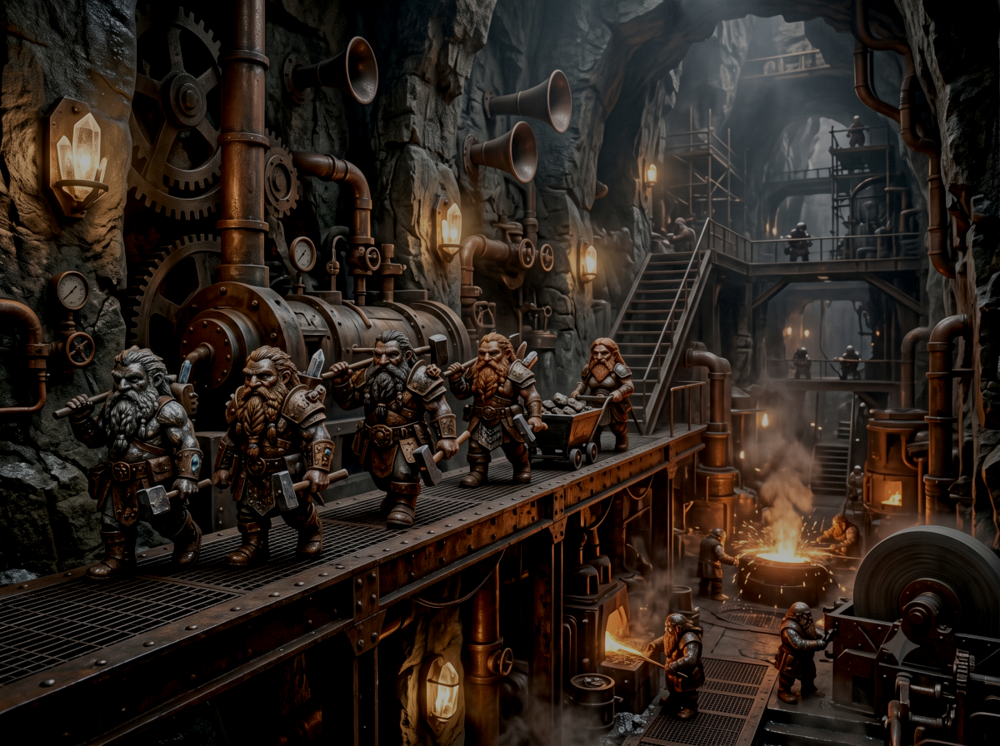
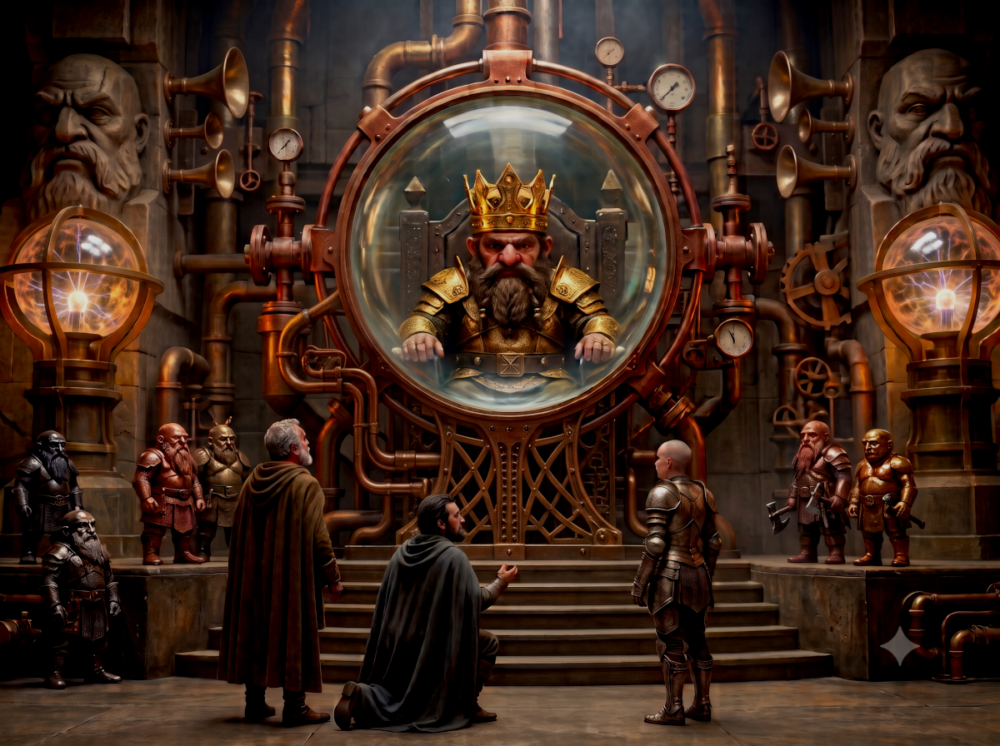

## Mine de Nain (accès montagne)

> 
> 
> Qui?  Rencontre avec l'autre
>
> Quoi ?   Autorité
>
> Interprétations possibles: Ikarnos tente d'affirmer sa position de chef. 
> Un tirage sur comment pourrait donner la condition du passage.

Les héros arrivent à Mine de Nain et demande un passage

Les héros continuent de longer les contreforts de montagnes. Impossible de descendre vers la plaine de leur position. Ils sont sur une sorte de plateau et les falaises sont trop hautes. D'après les cartes, ils marcheraient même sur une immense ville naine. Drôle de peuple, qui vit terré dans les montagnes depuis l'aube des temps. Petits, trapus, étranges, aucun des personnages n'en a côtoyé. Nos héros échangent sur ce qu'ils connaissent des nains ou pensent en connaître.

Peek: "leur construction sont comme vous aimez, en pierre et immobiles. Pour nous elles sont fragiles et ressemblent à la mort, figée. La grande cité de Pavis a été construite en partie par des Nains. Cela ne l'a pas préservée pour autant, car nous autres nomades, plus mobiles, trouvons toujours un moyen de détruire ce qui est immobile tout comme l'eau ravine le sol petit à petit" 

Jaridan: "ils sont différents de nous mais il paraît que certains marchands ont déjà réussi à commercer avec eux, en tout cas ceux de Mine de Nain. Ils sont matérialistes et il y a toujours moyen de négocier avec quelqu'un qui aime l'or" 

Hanya: "leur construction sont certes solides mais ils n'ont aucun sens de l'esthétique, ils n'ont pas été touchés par la grâce de la Déesse. Ils auraient aidé à la construction de la route de la Fille mais ce sont nous Lunaires qui avons créé la beauté et le but de cette route. Ils sont donc pour les peuples, ce qu'un outil est aux choses" 

Ikarnos: "voilà des paroles pleines de sagesse Hanya mais je me demande s'ils n'ont pas un but caché et je me demande si nous pourrions le découvrir lors de notre passage. Ouvrez grand vos yeux et vos oreilles mais pas d'initiative malheureuse, surtout toi, Peek, ils seront sans doute des milliers et nous ne sommes que quatre. D'ailleurs à ce propos, Peek j'aimerais m'entretenir un instant avec toi"

Ikarnos et Peek partent discuter en retrait.

Hanya: "ca va barder" 

Jaridan: "elle n'a pas mauvais fond, elle défend ce en quoi elle croit et l'a fait pour nous aider avec sa façon à elle. Mais quel caractère ! Moi elle me plait" 

Hanya: "la fierté peut mettre en péril la cause commune et c'est ça qui m'inquiète" 

Jaridan: "je pense qu'Ikarnos va savoir lui parler. Il parle peu mais je ne pense pas que ça soit un hasard si Fazzur l'a choisi pour cette expédition. Parfois il me fait plus peur que Peek je dois bien avouer. Sans vous manquer de respect, nous, hommes libres de Tarsh, avons parfois du mal à comprendre vos coutumes et vos moeurs. Il porte le sceau de l'Empereur et d'après les rumeurs, Argenteus le nouveau masque est très différent d'Ignifer." 

Hanya: "la Déesse a toujours bien choisi. Ce sont nous les hommes qui sont faillibles. J'ai toute confiance en l'Empereur actuel malgré les rumeurs. Il annonce une prospérité sans précédent dans l'histoire de Glorantha." 

Jaridan: "Puissent les Dieux t'entendre..."

> 🎲 Tentative d'affirmation de l'autorité d'Ikarnos sur Peek 
> - Conflit:
>   - Protagoniste: Peek 
>       - Fidélité de Peek
>       - Peu impressionnable
>   - Antagoniste: Ikarnos
>       - Enseignement de l'Empereur (convaincre) 
>       - Faire triompher la 3eme voie 
> - Résultat: succès +1

Ikarnos flatte Peek et reconnait qu'elle a essayé de bien faire en prenant ses initiatives. Il lui fait part des différences dans le groupe et dans leurs facons de voir les choses différentes. Il lui dit qu'ils ont besoin de trouver une solution pour survivre. 

Peek écoute avec ses grands yeux de braise mais finit par conclure à son habitude: "j'écoute la voix dans mon coeur Ikarnos et je sais que malgré tout ce que tu dis, un jour, cette voix nous sauvera tous. Et je n'ai pas besoin d'une sorcière pour me révéler à moi-même. Nous sommes toujours là et bien en vie, plus vivants que jamais même. Tu crois vraiment que je suis folle au point de mettre en péril une mission qui va me ramener chez moi en Prax! Nous sommes loin de la Pélorie maintenant et je n'ai pas l'intention de saper ton autorité mais j'ai l'intention de conserver ma liberté d'action car sans liberté de mouvement, c'est la mort, nous sommes comme ça nous les nomades et c'est comme ca que nous triomphons." 

Au fond d'elle même, elle pense à ces hommes Sable qui maintenant se pavanent de leurs richesses acquises depuis leur victoire avec les Lunaires. Elle sait qu'ils ont été achetés et que ce qu'ils ont gagné ils sont en train de le perdre autre part. En tant que fille de chef de clan, elle n'a pas besoin de ça et c'est une femme. Elle n'est pas là par hasard et elle est très fière de tenir tête à ce Lunaire. 

Ikarnos conclut: "alors nous triompherons ou tu périras. E pluribus Unum"

La petite équipée repart à dos de montures en longeant le plateau. Après un jour de voyage, ils aperçoivent au loin, un fort carré entouré d'une muraille qui épouse totalement la montagne.

Ikarnos: "voilà ce que nous cherchons. Avançons prudemment".

Arrivés en bas de la muraille, ils observent mais ne voient rien. Aucun mouvement, aucune âme qui vive, aucun garde sur les murs et aucun moyen de contact. Ca s'annonce mal.

Ikarnos: "le problème c'est que cette issue est sur la montagne. L'accès doit être plus ouvert en bas de la falaise. Attendons. Faisons un feu pour nous faire remarquer. Nous sommes là en paix et ca serait étonnant que personne ne nous voit."

Ils font donc une veillée et attendent. Au réveil, ils se retrouvent soudain cernés par une dizaine de petites créatures en armure lourdes, armées d'arbalètes, barbus et méfiants. Un des nains s'approchent:

"Vous êtes en terre naine humains. Que faites-vous ici ? Que voulez-vous?"

Ikarnos: "Nous venons en amis et nous voulons descendre. Nous avons été attaqués par des Gazzams et avons du remonter la route de la montagne."

Le nain: "votre histoire est étrange car ce n'est pas une route commerciale ici." Il semble méfiant. Peut être les prend il pour des espions.

Ikarnos: "nous venons de Dunstop et allons en Prax. Nous sommes mandatés par Fazzur. Voici son sceau". Et il tend le sceau au Nain. 

Celui-ci le prend et dit: "attendez, nous revenons" Et il repart avec le sceau. 

Hanya: "C'est malin ils vont en faire une copie."

Ikarnos: "peu m'importe. Seul compte notre passage et que feraient les Nains avec le sceau de Fazzur, personne ne les prendrait au sérieux."

Un jour plus tard, les Nains reviennent et ils rendent le sceau à Ikarnos. "Nous vous laissons passer mais à une seule condition, écris une lettre à ton maître pour que les tiens arrêtent de creuser la montagne à côté du Mur des Esclaves". 

Il doit sans doute parler de Mur d'Esclaves une cité au nord de Tarsh réputée pour son marché aux esclaves et en particulier ses mines de sel exploitées par des esclaves. Un moyen d'occuper les vaincus barbares, nomades ou opposants politiques. 

Ikarnos hésite, la requête des Nains est lourde de conséquences économiques et stratégiques. "Cela me parait beaucoup pour un simple passage. Ne voulez-vous pas de l'or à la place?"

> 🎲 Négociation avec les Nains 
> - Conflit:
>   - Trouver le chemin de la solution + vénalité des Nains 
>   - Position de force 
> -  Résultat 2 vs 1: victoire +2

Les nains acceptent le passage en échange de l'or. L'objectif est atteint mais avec une perte d'or.

Les portes de la muraille s'ouvrent et le groupe pénètre dans l'enceinte de la forteresse. Les constructions sont massives, étonnamment grandes pour un peuple de si petite taille. Les nains ne parlent pas entre eux. Ils avancent de manière organisée et font penser à des fourmis. On ne voit rien de spécial: des ouvertures, des portes de fer .. il n'y a aucun élément végétal, tout n'est que métal et pierre. Les nains mènent les joueurs par une grande ouverture et là devant eux se trouvent une plateforme. Ils les invitent à monter dessus avec leur monture. La plateforme fait 10 m sur 10m et est suffisante pour les 4 héros et leurs montures. 

Un nain parle dans un tuyau dans une langue gutturale qu'aucun personnage ne comprend. Puis il active un levier et la plateforme se met à vibrer. Le nain sourit. Peek serre sa lance. Jaridan pose la main sur son épaule et lui murmure: "calme, l'amie". La plateforme s'ébranle et ils commencent à descendre le long de la montagne à travers un tunnel aux parois lisses éclairées de globes lumineux. Ils n'en reviennent pas. La descente est longue et lente mais ils sont rassurés. Les Nains les font bel et bien descendre vers la plaine!

## Mine de Nain (accès plaine)

*Note: caractéristique de Mine de Nain: morceau de l'aiguille cosmique, Isidilian, individualiste et ouvert, recherche d'artifacts*

La plateforme se stabilise et ils arrivent en bas de la falaise à l'intérieur d'un grand hall. Ils quittent le hall et sont pris en main par un groupe de nains lourdement armés qui les emmènent à travers divers halls où ils croisent des nains affairés .. Des groupes qui portent des pierres ou des pièces de métal, d'autres qui "chantent" avec leurs outils en mains. Ceux-ci les regardent passer avec l'air suspicieux mais n'interviennent pas. 

Ikarnos demande à l'un des nains de l'escorte: "Comprenez-vous notre langue l'ami?".

L'escouade s'arrête et un des nains de tourne et dit: "j'ai suivi des cours et je vous comprends. Que voulez-vous?" 

Ikarnos répond: "nous ne faisons certes que passer pour aller en Prax mais ne serait il pas possible de s'adresser à un dirigeant de votre peuple pour peut etre .. heu forger une alliance entre nos peuples?" 

Le nain réfléchit en se touchant la barbe, il a l'air en proie a une intense réflexion et on le voit bouger ses doigts comme s'il comptait quelque chose.

> 🎲 Va t'il accepter la requête ? 
> - Conflit: 
>   - Lien gagnant-gagnant (Jaridan), rune de maitrise (Ikarnos)
>   - Peur de se faire punir pour son initiative 
> - Résultat: Victoire +1 

Jaridan dit au nain: "sans mélange, il n'y a pas d'alliage". 

L'autorité naturelle d'Ikarnos semble aussi fonctionner et le nain accepte. Il les conduit donc à une salle pour les invités. Le mobilier est en pierre et les nains prennent les montures. Pfa-ah est nerveuse et Peek refuse de voir sa monture emportée par les Nains. 

Sentant les problèmes arriver, Ikarnos déclare: "la femme va suivre son antilope aux écuries et restera auprès d'elle." 

Le nain écarquille les yeux: "comme vous voulez". 

Peek suit donc les Nains. Les trois autres restent dans la salle et attendent. Longtemps, très longtemps. On leur sert une sorte de repas fait de mousse au gout peu ragoutant. Pendant ce temps les montures sont menées dans les écuries des poneys des nains. Peek se retrouve donc avec les bêtes. Elle ne sent pas très à l'aise enfermée dans la montagne, elle, habituée au grand air des plaines de Prax et elle s'efforce de rassurer Fta-Ah. Elle aussi a droit au ragoût des Nains mais elle le supporte un peu mieux que ses compagnons sans doute habituée aux nourritures des nomades. 

Au bout d'une nuit, on vient chercher Ikarnos, Jaridan et Hanya. On les fait passer par des halls. Il fait parfois très chaud. Le Nain qui les guide leur répond que ce sont les Forges qui participent à réparer la Machine que les hommes ont cassés. Ils voient étrangement quelques humains qui portent un collier de fer au cou. Ils comprennent que ce sont des esclaves. Mais à part cela ils ont l'air d'aller et venir librement en exécutant leurs tâches: des porteurs pour l'essentiel. 

Avant d'arriver devant une immense porte, les nains leur demandent de laisser leurs armes et ils sont ensuite fouillés. Puis ils arrivent dans un immense hall, magnifiquement ouvragé. Chaque cm de roche est ciselé de motifs géométriques, des têtes de Nain sculptées ornent les hauts de colonnes, une lumière chaude et jaune irradie de la voûte et de globes sur pied. Il y a devant eux, un Nain assis sur un trône portant une couronne dorée d'un or pur presqu'aveuglant, son armure l'est tout autant mais dans un autre métal. Autour de lui des Nains de toute sorte, en armure mais aussi en robe, et d'autres dans des matières indéterminables. L'instant est solennel. 

Les héros avancent et Ikarnos montre l'exemple en s'agenouillant devant le monarque Nain. "Votre majesté, merci de nous recevoir" et attend la réponse. 

Le roi plisse ses yeux et d'un geste les invite a se redresser. "Moi Isidilian, Roi de la mine des montagnes de l'Aiguille, vous accueille avec plaisir." 

Il parle le Pélorien! et continue: "vous êtes lunaires d'après ce qu'on m'a dit. Savez-vous que l'élévation de la Lune Rouge était dans le Grand Schéma pour réparer la Machine? Haha .. je vois à vos têtes que vous l'ignorez. Normal, vous êtes si jeune, vous n'avez pas connu les guerres des Dieux ni les guerres des Empires, vous ne voyez qu'un petit bout du Plan, vous êtes comme le lapin dans son terrier mais vous faites partie du Plan. Fazzur votre employeur fait partie du plan" 

Hanya s'avance: "Noble roi Isidilian, vous avez construit avec nous la Route de la Fille et bientôt d'autres routes seront construites, serez-vous encore des notres dans le Grand Plan que vous évoquez?" 

Le roi répond: "Cela dépend de vous. Certaines variables nous pousseront à l'être mais d'autres non. Comment dire dans votre langue ? Disons que si vous commetez certains actes ou si vous n'en commettez pas certains, alors les chemins seront différents." 

Ikarnos: "justement, vous avez émis le souhait que les Lunaires cessent de creuser la montagne. Je peux en référer à ma hiérarchie mais pour décider nous aimerions comprendre." 

Le Roi: "ce n'est pas l'esclavage qui nous pose problème quoique nous pensons que vous utilisez mal vos recrues. Elles creusent mal et vous les punissez. Nous traitons mieux nos esclaves: nous entretenons nos outils.. mais peu importe, renseigne-toi Lunaire et mais sache que nous ne sommes pas dupes de votre plan là-bas." 

Ikarnos: "j'en informerais Fazzur et reviendrais vers toi mais je serais en Prax." 

Le Roi: "tu pourras informer mes compagnons de Pavis .. Demande Clousilex .. et justement en parlant de Pavis, comme je te disais il y a ce que vous ne ferez pas comme pour ce qui se passe dans la montagne près du Mur d'Esclaves mais aussi ce que vous ferez à Pavis. Il y a quelque temps, un homme est venu et nous a dérobé des armes naines ainsi qu'un bracelet très précieux. Nous l'avons traqué dans la Passe du Dragon et avons appris de son clan qu'il avait fui vers Prax. Retrouve la a Pavis, reprend les armes et le bracelet, ramene les nous ou laisse les aux Cloussilex et on pourra forger des liens." 

Jaridan: "comment s'appelle cet homme et comment le reconnaître s'il a changé de nom O roi?" 

Le roi: "il s'appelle Jaknar le Rouge, du fait de sa chevelure rousse, il a les tatouages d'Orlanth, cest tout ce que je peux vous dire et voici le genre d'arme qu'ils nous a dérobé". 

Il fait un signe à un autre nain qui arrive en ouvrant un coffret de pierre et dedans se trouve une sorte de tube en métal relié à une crosse en pierre, crosse creuse dans laquelle on peut mettre des billes et surmonté d'une sorte de levier. 

"Disons que c'est un lance pierre avancé qui peut tuer d'un coup. Seuls le peuple de Mostal a le droit d'utiliser les outils de Mostal! Vous nous avez trop volé par le passé et le Plan est très clair la-dessus, cela n'est plus permis." 

Jaridan: "vous ne commercez donc plus avec les hommes?" 

Le Roi: "nous ne fabriquons plus d'armes pour les hommes. Dans la guerre à venir, nous fournirons peut etre des guerriers mais comme les variables du Plan ne sont pas toutes renseignées, nous ne savons pas encore mais nous serons prêts quelque soit le camp car c'est notre lot à nous d'être prêts." 

Ikarnos: "je te remercie Isidilian le Sage et je ferais passer le message à Fazzur pour le Mur des Esclaves et une fois à Pavis, nous retrouverons le voleur et récupérerons vos biens. Tu sais bien que nous Lunaires ne tenons pas spécialement les Orlanthis dans nos coeurs non plus." 

L'entrevue se termine, les héros récupèrent leurs armes et sont escortés par les Nains jusqu'aux écuries.

Les héros retrouve Peek et sont prêts à repartir: "ils ont des poneys et des moutons mais c'est tout ce que j'ai vus. Ils sont aussi des esclaves humains qui s'occupent des bêtes. J'ai essayé de leur parler mais la plupart semblaient effrayés."

> 🎲 Peek a t'elle réussi à établir un contact avec un esclave? 
> - Conflit:
>   - Peek: se montrer sympa (1)
>   - Esclaves: peur de mal travailler (1), bien traité (1), pas la meme langue (1) 
> - Résultat: Défaite: -1 donc trop peureux pour parler et en plus ils ne comprenaient rien à ce que disait Peek.

Les Nains amènent les héros devant deux immenses portes d'acier forgés de motifs hallucinants. La porte s'ouvre sans bruit ce qui est une prouesse pour une double porte de plus de 20 m de haut! La lumière leur fait mal aux yeux. Ils s'avancent en saluant les Nains et en les remerciant même si ce passage a été chèrement payé. 

Ils se trouvent en bas de la falaise au début d'une grande plaine. Ils regardent derrière eux et voient deux immenses statues massives de 30 m de haut encadrant les portes qui se referment déjà. Statues casquées, armées de lances et de boucliers aussi gigantesques que sublimes. 

Jaridan murmure: "on dit que ces statues peuvent s'animer pour défendre l'entrée. Brrrr, je n'aimerais pas être face à de tels colosses en mouvement."

| [Précédent](../05) | [Suivant](../07/) |