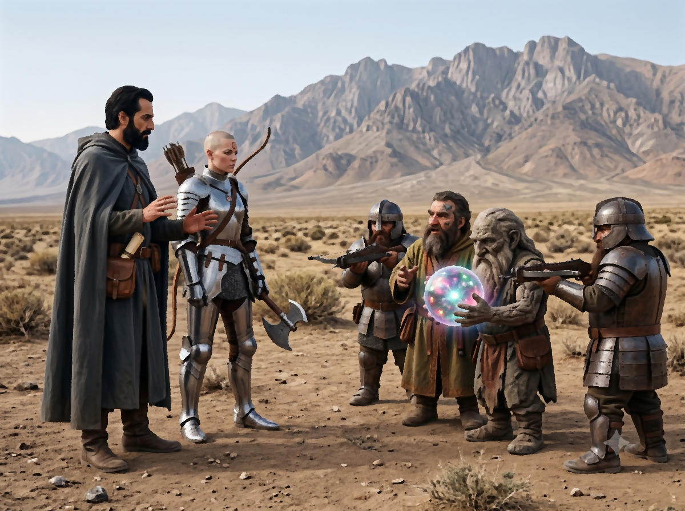

*Suite des aventures d'Ikarnos & Hanya*

## Une alliance avec les Ogres, pourquoi pas ?

Hanya a dormi jusque assez tard. Elle se réveille. Ikarnos lui dit: "Pars chasser. Essaie de résister au sang mais si tu n'y arrives pas, nourris-toi. J'ai réfléchi pendant que tu dormais. Si tu ne nourris pas le bébé de sang, à mon avis celui-ci va prendre en toi et cela pourrait provoquer ta perte." Hanya part donc chasser et revient avec un lapin pour Ikarnos. Elle ne lui dit pas qu'elle a goulument dévoré cru un autre lapin. Elle s'assoit. 

Ikarnos lui dit: "toi comme moi, avons été séduits par les Ogres du domaine. Je ne pense pas que nous ayons été drogués ou sous un charme. J'étais pleinement conscient à ce moment là. Ces créatures sont intelligentes, raffinées et possèdent une magie qui pourrait être utile à la Déesse. J'ai décidé si tu es d'accord d'en faire une force plutôt qu'une faiblesse mais ce choix t'appartient. Peut-être que Peek et Jaridan trouveront un moyen de te soigner, mais au fond de toi, le souhaites-tu vraiment?" 

Hanya reste silencieuse: "j'ai juste peur de ne plus être moi-même." 

Ikarnos: "J'ai avec moi un traité de magie qui parle de l'oubli des noms. Je l'ai utilisé contre l'exilé tarshite, tu te rappelles ? Je ne sais pas ce qui est en train de se passer mais peut-être que les mécanismes sont similaires."

> 🎲 Tentative de compréhension du phénomène que vit Hanya
> - Conflit: 
>   - Oublier les noms
>   - Transformation chaotique
> - Résultat 1 vs 1: Victoire +1

Ikarnos comprend que ce qui se passe en Hanya est différent. Le Chaos des Ogres n'enlève pas les souvenirs. Il semble s'immiscer tout simplement en créant un appétit de la chair humaine. 

C'est ce qu'il dit à Hanya et il ajoute: "ce ne sont pas les ennemis de la Déesse qui manquent. Nous pourrions les utiliser pour nourrir notre armée d'Ogres. Cai et sa famille semblait être tout à fait humains en dehors de ça et je ne pense pas qu'ils simulaient être des humains. Tu deviendras différente c'est tout. Me suivras-tu dans ce projet Hanya alors?"

Hanya réfléchit et fait l'inspection de ses valeurs mais si cela procure un avantage à la Déesse cela pourrait marcher. Elle sait que la Déesse a apprivoisé le Chaos comme la Chauve-souris Pourpre par exemple et elle finit par concéder que c'est une bonne idée. Ils passent ensuite un peu de temps pour détailler leur objectif et les différentes étapes ou options pour y arriver.

* arriver à retrouver Cai et sa fille survivante.
* trouver une autre communauté d'Ogres.
* se rapprocher d'un culte Lunaire qui connait le Chaos
* en parler aux autorités : L'Empereur ou Fazzur ? ou les deux ?
* une fois les choix faits, Ikarnos retournerait sans Hanya voir Jaridan et Peek en leur mentant pour continuer la mission de Fazzur ? (dans un délai de 60 jours)

Ils sont d'accord pour dire que retourner au clan des pommiers n'est pas une bonne idée, d'autant plus que Cai doit être loin maintenant. Ils pourraient remonter vers le Creux du Serpent Pipe un lieu réputé comme hautement chaotique et situé plus au Nord mais cela pourrait être excessivement dangereux sans garantir qu'ils arrivent à trouver des Ogres là-bas. La seule piste qu'ils ont c'est de repartir depuis le domaine et chercher des traces de l'Ogre. Ils savent qu'il est parti à cheval avant de semer les serpents pour protéger leur fuite. Il faut qu'ils remontent la piste même si elle date de plus d'une semaine maintenant. C'est leur seule option. Donc voici les étapes à court terme: 
1. retourner au domaine en contournant les terres du clan 
2. remonter la piste.

S'ils rencontrent des Lunaires, leur dire qu'ils cherchent deux fugitifs. S'ils rencontrent des Orlanthis, se faire passer pour des explorateurs dont le groupe a été séparés. Cai et sa fille seraient partie à cheval chercher du secours car Hanya avait été blessée. Mais elle a été soignée par la prêtresse Sheena du clan des Pommiers pour accréditer leur histoire avec un nom réel. Et maintenant ils recherchent leurs acolytes. Pour la suite on verra après.

Ikarnos et Hanya se faufilent sans problème dans les terres et arrivent au domaine. La villa a été brûlée. Quel gachis, pensent Ikarnos et Hanya. Ils remontent la route de fuite que semble avoir pris les Ogres.

Ikarnos et Hanya remontent donc avec méthode la piste en interrogeant discrétement toute personne rencontrée. Malheureusement personne n'a vu le couple fugitif mais cela ne désespère pas Ikarnos qui sait que la patience paie toujours dans le renseignement. Les options de Cai sont sans doute limitées également: soit il retourne vers Tarsh, soit il bifurque à l'est vers AldaChur, soit il remonte vers le Creux-Serpent-Pipe. Il leur faut trouver la petite trace qui pourra leur permettre de déduire la direction qu'ils ont choisis. 

## Les Marches Naines

Or un jour, alors qu'ils longent les Marches Naines en remontant vers le Nord, ils apercoivent un petit groupe de quatre nains qui semblent discuter un peu plus loin entre eux. Un des nains est en robe, deux autres ont l'air de soldats, et un autre semble très âgé. Les Nains les repèrent et les soldats lèvent leurs arbalètes dans leur direction. Ils s'approchent en levant les mains: "Paix mes amis!" Les Nains les laissent avancer et finalement les deux groupes se font face à 5m l'un de l'autre. Les soldats toujours méfiants crispés sur leurs arbalètes. 

Le Nain en robe se met à parler: "Salutations hommes, je suis Goundar de Mine de Nain et nous aussi, arpentons les terres des hommes en paix." 

Le Nain qui semble âgé (presque de pierre) tient une boule translucide entre ses mains dans laquelle son regard semble plongé. 

"Nous cherchons deux fugitifs, un homme et une femme. Ils ont commis des crimes atroces et nous devons les arrêter. Les auriez-vous vus?" 

Le Nain en robe se tourne vers le Nain plus âgé. De la boule sort un son cristallin et celle-ci semble palpiter en changeant de couleur et à sa surface apparait de multiples petites lumières qui clignotent de manière apparemment aléatoire. Le vieillard parle d'une voix gutturale au Nain en robe et ce dernier semble se renfrogner. Le temps est suspendu.

> 🎲 Résister à la boule de vision des Nains
> - Conflit: 
>   - Le côté énigmatique d'Ikarnos, ne sont pas coupables
>   - Ont vu l'objet Nain, Analyseur de trames runiques
> - Résultat 2 vs 2: revers

Le Nain en robe s'exprime: "Rendez nous l'objet que vous nous avez volés ou mourrez!". 

Les choix binaires des Nains sont toujours très clairs. 

Ikarnos s'exprime: "Nous ne vous avons rien volé. De quoi parlez-vous ?" 

Les Nains s'avancent et leur demande de se laisser fouiller. Ils optempèrent et les Nains ne trouvent évidemment rien. Ikarnos se souvient de l'objet trouvé dans la demeure de Cai. 

Il sourit: "Serait-ce un médaillon hexagonal que vous cherchez ?". 

Le Nain acquiesce: "Ou est-il?" 

Ikarnos: "Donnant, donnant, l'ami ! Je te dis où il est et toi tu me dis si tu as vu un homme et une femme qui voyageaient ensemble." 

Le Nain: "Et si je n'avais pas vu cette homme et cette femme, tu ne dirais donc rien?".
 
Ikarnos et le Nain en robe se toisent. 

Le vieillard s'éclaircit la voix et le Nain en robe se met à parler d'une autre voix comme s'il traduisait ou comme si le vieux Nain parlait à travers lui: "Moi, Grindaroum, t'ai vu à Mine de Nain, tu as parlé avec Isidilian, si tu sais quelque chose, tu dois le dire. Tu veux être notre allié alors prouve-le." 

Ikarnos leur raconte alors le combat contre les Ogres et que le médaillon est maintenant dans les mains d'un clan Orlanthi, le clan des pommiers. "Tu vois Grindaroum, la Déesse est honnête. Alors vous pouvez nous laisser passer et continuer de traquer les deux ogres en fuite." 

Le Nain s'exprime de nouveau: "Je te remercie Ikarnos de Raibanth" *(Ikarnos est impressionné par sa mémoire des noms)*. "Ces ogres ont tué trop de Nains et notre expédition avait pour mission de trouver la raison de toutes ces disparitions. Nous savons maintenant mais devons récupérer le médaillon. Or tu sais qui est l'homme qui a pris le médaillon. Si tu nous conduis à lui, alors tu pourras te connecter à la boule de vue lointaine et tenter de retrouver les deux ogres. Acceptes-tu de nous aider?"

*Un choix est donc proposé au protagoniste: continuer une enquête dans ces terres sauvages sans la moindre piste pour l'instant ou tenter d'obtenir une information par un moyen magique ?*

Ikarnos jauge la proposition et discute à voix basse avec Hanya: "c'est risqué vu nos relations avec le clan mais c'est tentant, qu'en penses-tu ?" 

Hanya: "c'est terriblement risqué et tu en connais les raisons Ikarnos. Je ne sais pas. Tu te souviens du visage de l'homme qui a pris le médaillon ?" 

Ikarnos: "oui, je pense que je le reconnaitrais mais pour approcher il faudra user d'un stratagème" 

Puis il annonce au Nain: "J'accepte mais il faudra qu'on ruse pour que je puisse retourner voir le clan et Hanya qui m'accompagne ne pourra pas venir avec moi. Si tu es d'accord pour élaborer un plan avec moi, je suis ton homme et tu retrouveras ton médaillon." 

Le Nain en robe répond: "Marché conclu alors."

*Et c'est ainsi que nos deux héros se retrouvent embarqués dans une mission avec les Nains pour récupérer un de leurs objets au sein du clan des Pommiers.*

| [Précédent](../10) | [Suivant](../12/) |

