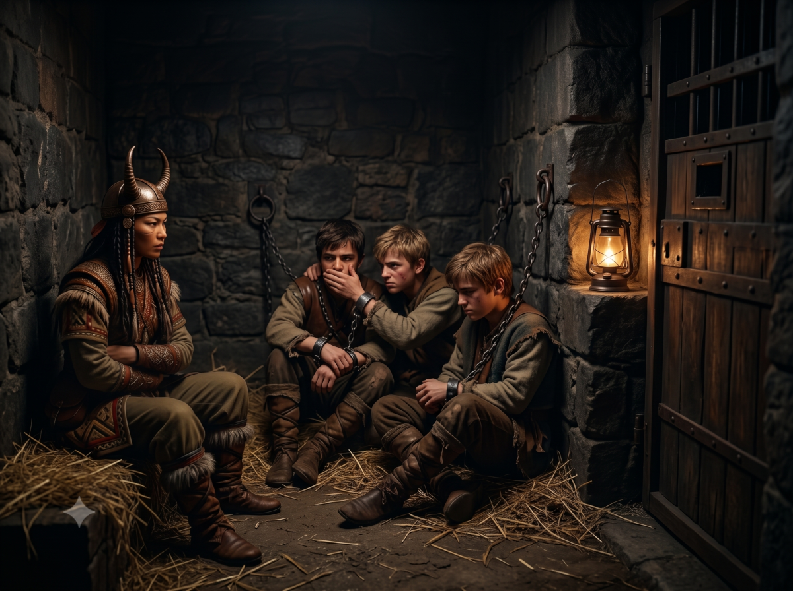

*Suite des aventures de Peek & Jaridan*

## Arrivée à Glasswall

Peek passent les deux prochains jours à maugréer sur le comportement du chef du village au pied de la falaise. Cela amuse Jaridan qui fait quelques échanges avec certains habitants qu'ils croisent, troquant nourriture, boisson contre tissage ou colliers de Prax au gré de leurs rencontres. D'ici un jour ou deux ils devraient retrouver la route principale qui vient de Tarsh et qui mène à AldaChur. Dire qu'ils auraient pu emprunter cette route et tout cela ne serait pas arrivé.

*Objectif: rejoindre au moins la route à défaut d'AldaChur sans encombre.*

Les héros devrait donc bien rejoindre la route de Pavis. Géographiquement parlant voilà ce qu'il pourrait rencontrer comme danger : le chaos du fait de la proximité du Creux Serpent-Pipe ou arriver sans encombre a Glasswall fief de la tribu Princeros.

Nos deux héros finissent par rejoindre la route de Pavis, une des routes royales du temps du Roi Sartar qui ironie du comble a bien servi l'armée lunaire pour ses incursions et invasions en Passe du Dragon. En avançant vers l'est, ils pénètrent sur une terre aride faite de morceaux de verre pilées sur laquelle rien ne pousse puis finissent par apercevoir un fort circulaire aux étranges murs de verre sombre, Glasswall. Jaridan y a déjà séjourné et Peek y est passé quand elle est venue en Tarsh l'année dernière. Ils se dirigent donc sans encombre vers l'entrée du fort, bien contents d'être arrivé avant la nuit car la nuit dans cette région est souvent synonyme d'incursion du chaos qui rampe au niveau du Creux Serpent-Pipe, une meurtrissure de la Terre située plus au nord et qui vomit des hordes de monstruosités à intervalle régulier. Si on peut parler de régularité avec le chaos! La nuit tombant, ils décident de prendre une chambre à l'auberge de l'Arbre Blanc. Les temps sont calmes et l'auberge n'est pas bondée. Ils s'installent alors pour un dîner copieux et sont à l'écoute des nouvelles du coin.

Une table pas très loin semble particulièrement agitée. Les hommes parlent entre eux à voix basse. D'après leur allure, ce sont plutôt des guerriers si l'on en juge à leurs épées qu'ils portent à leur flanc. Ils remarquent des coups d'oeil vers eux et soudain un des hommes se lèvent et vient les voir.

"Bonjour, étrangers. Je vous souhaite la bienvenue. Puis-je vous offrir à boire quelque chose ? Nous avons un excellent vin ici à Glasswall. Si si, vous allez voir." Il fait un signe au serveur, un molosse qui leur amène un grand pichet qu'il sert à nos héros ainsi qu'à lui-même. "Alors voyageurs, que venez-vous faire dans nos contrées lointaines?"

Jaridan répond: "Nous allons à AldaChur mais en fait nous faisons route pour Pavis. Comme tu peux le voir j'ai avec moi un guide et une garde du corps pour Prax. Je compte y faire du commerce. Sais-tu si la route est sûre en ce moment?"

L'homme répond: "Rien n'est sûr dans ce monde avec le chaos, tu le sais bien, l'ami mais le danger est parfois plus de l'intérieur que de l'extérieur." Il a un air énigmatique.

Peek: "Est-ce une menace?"

L'homme: "Oh là l'amie, tu es sous la protection Orlanthi, tu ne risques rien en ces murs ni sur nos terres si tu te conduis bien. Tu connais et respectes les vertus d'Orlanth?"

Peek: "je ne vénère que Waha, Eiritha et les Esprits. Orlanth est un grand esprit sur vos terres mais il n'a jamais mis les pieds en Prax hormis depuis votre défaite contre l'Empire qui nous a amenés bon nombre de vos semblables à Pavis. Orlanth est-il couard au point de fuir loin de chez lui au lieu de rester combattre avec son peuple?"

Jaridan fronce les sourcils. Il est vrai que Peek est assez remontée contre les Orlanthis qui les ont empêchés de prendre la route de la falaise. Ils seraient déjà à AldaChur. Mais l'homme se gratte le menton et dit à voix basse: "Il y a des combats qu'on gagne autrement que frontalement. Et cela, nous l'avons appris depuis qu'Harvar a manigancé, trahi et mis sous sa coupe AldaChur."

Jaridan tempère: "tu ne sembles pas apprécier Harvar. Les Princeros seraient-ils en froid avec lui?"

L'homme: "Les Princeros ? Quels Princeros? Elle est loin l'époque où nos ancêtres affrontaient les géants des montagnes. Maintenant nous en sommes réduits à livrer nos jeunes sous prétexte d'allégeance au Duc d'AldaChur." Il se renferme sur lui. "Je ne devrais pas vous embêter avec cela." Il boit son verre puis fait mine de s'en aller.

Peek: "Reste et parle franchement. N'y aurait-il que les nomades pour honorer la droiture dans ce monde ?"

L'homme se rassoit et s'éclaircit la gorge: "Demain à l'aube, trois de nos jeunes vont être amenés à AldaChur pour être jugés là-bas. Nous savons tous que nous les reverrons jamais."

Jaridan: "Et qu'ont-ils commis comme crime pour être traités de la sorte?"

L'homme: "Ils ont juste osé clamer leur dévouement pour Orlanth le Tonnant par bravade. Tu as l'air d'un homme assez mûr pour savoir ce que sont les emportements de la jeunesse. Malheureusement, Perandal notre chef actuel a pris la chose très au sérieux. Nous ignorons pourquoi et il a décidé de faire juger les trois jeunes. On sait tous qu'ils vont être crucifiés. Bienvenus dans la Paix Lunaire!"

Jaridan: "ton chef .. Perandal c'est ça, et le Duc d'AldaChur m'ont tout l'air de faire preuve d'un zèle hors-norme et en quoi penses-tu que nous puissions t'aider ? Je ne suis qu'un marchand après tout."

L'homme: "vous pourriez accompagner l'escouade et si nos jeunes pouvaient vivre ou au moins mourir en se battant, vous seriez alors à nos yeux le bras de la justice des Dieux."

Peek: "Et pourquoi ne le faites-vous pas vous-même ? Je veux dire, libérer les jeunes quoi."

L'homme: "Nous avons tenté par le passé ce genre de coup d'éclat mais pour en sauver trois nous ferions neuf autres victimes. Tel est le tribut d'Harvar. Si vous allez voir Perandal vous verrez que les Lunaires sont là pour surveiller tout ce qui se passe ici. Alors que si les jeunes étaient libérés par des étrangers, la faute ne retomberait pas sur le clan."

Jaridan à Peek: "Qu'en penses-tu?" Puis à l'homme: "Laisse-nous quelques instants s'il te plaît."

Peek: "Cela semble périlleux. Penses-tu qu'on pourra se cacher à AldaChur si les choses tournent mal?"

Jaridan: "La cité est suffisamment grande pour qu'on puisse s'y faire discrets. Il y a pas mal de nomades Sable dans la garnison autour de la ville donc ta présence ne sera pas trop repérable. Et bien sûr, nous devons user de faux noms à partir de maintenant: que penses-tu de Taros pour moi ?"

Peek sourit: "Enchanté Taros, moi c'est Rouk alors."

Jaridan enchaîne: "Finissons le repas et allons nous annoncer dans le hall de Perandal."

Jaridan fait signe à l'homme qui revient et l'informe qu'ils acceptent de tenter le coup. L'homme a un sourire radieux et veut leur offrir une autre tournée mais Jaridan l'arrête: "Nous devons maintenant voir Perandal. J'ai un plan en tête." 

## Le fort de Glasswall (Hanya, Jaridan)

L'objectif de Jaridan est de rencontrer Perandal et de trouver un moyen pour se greffer dans l'escorte des trois prisonniers qui se rend à AldaChur. 

>  **Contretemps!**

Peek et Jaridan sortent de l'auberge de l'Arbre Blanc dans l'intention de pénétrer dans l'enceinte principale du fort pour aller dans le hall du chef du clan et lui parler mais au moment où ils arrivent dehors, une escouade de lunaires les arrêtent et un officier lunaire les interpelle: "toi, la nomade, que fais-tu ici ? et pourquoi n'es tu pas dans ton régiment ?" 

Peek en tombe bouche bée et n'en revient pas et se retient de rire. 

Jaridan explique: "c'est ma guide et elle n'appartient à aucun régiment." 

L'officier au regard sévère répond: "c'est pratique pour couvrir une déserteuse. Je me rappelle d'elle, elle est passée ici il y a quelques mois avec une troupe de nomades qui devaient consolider les forces en Tarsh pour combattre les Exilés et la revoilà seule d'un coup."

> 🎲 Convaincre le lunaire 
> - Conflit:
>   - langue douce, convaincre
>   - petit chef, désertions nomades
> - Résultat 2 vs 2: revers

La discussion est âpre et difficile avec l'officier. Les héros apprennent qu'il y a beaucoup de désertions chez les nomades et qu'apparemment les lunaires ne trouvent pas leurs alliés Praxiens si fiables que cela et que ceci explique le zèle de l'officier. Finalement, Jaridan cède et déclare que Peek restera avec eux et que de toute façon, ils vont à AldaChur demain et que c'est de cela qu'il veut parler à Perandal. Jaridan pose le bras sur l'épaule de Peek pour lui signifier que tout va bien se passer. 

L'officier conduit alors Peek dans le bâtiment juste à côté de l'auberge qui sert à la fois de caserne lunaire, de centre de contrôle des passages et de temple des 7 Mères et il l'enferme dans la même geôle que les trois jeunes Orlanthis! Jaridan lui a le droit de passer l'enceinte et d'aller voir Perandal. Le lunaire a l'air satisfait: il a récupéré une des siens et ce que fait le Tarshite ne le regarde pas.

## La rencontre avec Perandal (Jaridan)

Jaridan pénètre dans l'enceinte du fort. Il fait nuit et il se dirige vers le plus gros des bâtiments. Il passe devant un poteau en verre noir de plus de 10 mètre de haut dressé au centre du fort circulaire et n'a pas de mal pour trouver le bâtiment où se trouve le chef du clan et son entourage. Il explique la raison de sa venue à des hommes dehors qui le laissent rentrer. La nuit est assez avancée maintenant du fait du contretemps avec l'officier et il espère que Perandal le recevra.

Perandal n'est pas couché et accepte de parler à Jaridan mais semble pressé: "Qu'as-tu à me donner marchand ? Ou ne me dis-pas que tu es venu me déranger pour me vendre quelque chose?" dit-il d'un ton peu amène. 

L'homme semble martial, d'un certain âge et porte son armure et son arme, comme s'il s'attendait à tout moment à devoir se battre, sans doute du fait de la proximité du Chaos dans la région, en déduit Jaridan. 

Mais pris de court, Jaridan essaie de retrouver sa contenance. Il vient effectivement de se rendre compte qu'on ne visite pas un chef de tribu sans cadeau. Il décide de peser ses mots et de prévenir Perandal de leur rencontre avec les ogres et que s'il lui en parle c'est que demain il doit partir pour AldaChur mais qu'un homme tel que lui réputé dans sa lutte contre le Mal devait être mis au courant qu'il y avait un homme et une femme Ogre dans la région et connaissant la perfidie de ces créatures, il fallait l'avertir au plus vite avant qu'ils ne commettent leurs méfaits. 

Cela fait rire Perandal qui déclare que jamais un ogre ne se risquerait à venir ici ! Mais il remercie Jaridan et s'apprête à finir l'entrevue quand Jaridan essaie de pousser son avantage en lui demandant s'il pouvait accompagner l'escorte de lunaires qui part demain à AldaChur. Il se sentirait plus en sécurité.

> 🎲 Convaincre Perandal
> - Conflit:
>   - art du discours, être en sécurité
>   - n'a pas envie que des Héortiens soient trop au courant de cette histoire de livraison de traîtres
> - Résultat 2 vs 1: victoire +1

Perandal semble hésiter mais il se dit au fond de lui même que Jaridan est un Tarshite avant tout et donc un étranger donc qu'il ne va fouiner dans les affaires de la tribu. Il pense même que Jaridan est même un peu simplet (du fait de l'histoire des ogres) et sans doute obnubilé par l'argent vu sa tête quand il lui a parlé de cadeaux. Il accepte donc et demande à un de ces hommes de l'accompagner voir Gomax pour le prévenir que le marchand les accompagnera demain et profitera de leur escorte. Puis il congédie Jaridan qui se confond en remerciements.

## Dans les geôles de Glasswall (Peek)

Peek pénètre dans la geôle et en voyant trois jeunes hommes enchaînés aux regards tristes elle comprend qu'elle est avec les trois rebelles qu'ils doivent sauver. Elle sourit intérieurement. Les hommes la regardent et la lueur de leurs yeux se ravivent. Une fois le geôlier parti, Peek se présente et explique pourquoi elle est là. Elle espère juste que Jaridan pourra les accompagner car sinon l'évasion sera d'autant plus difficile et le temps jouera contre eux car AldaChur n'est qu'à une journée ou deux de marche suivant leur allure. Elle regrette tellement d'avoir perdu son esprit Tuer l'Etranger qui lui aurait permis d'éliminer cet officier borné. Mais d'après ce qu'elle a compris, elle n'est pas vraiment une prisonnière mais les Lunaires veulent juste s'assurer qu'elle ne filera pas dans la nuit. Elle retrouvera donc ses armes et Fta-Ah demain encadrés par des Lunaires qui comptent sans doute l'amener à un campement nomade Sable pour qu'elle y reste. Elle compte donc mettre à profit la nuit pour mieux connaître les jeunes, leurs forces, leurs faiblesses, la raison exacte de leur enfermement et qu'ils soient prêts au moment de leur évasion.

> 🎲 Réussir à obtenir des informations intéressantes
> - Conflit:
>   - leur donne de l'espoir
>   - ils ont peur de parler, méfiance envers une nomade sable
> - Résultat 1 vs 2: défaite -2

Alors qu'un des jeunes semble sur le point de parler, soudain un autre l'arrête. "Ne vois-tu pas que c'est un coup de Gomax ou de Perandal pour nous tirer les vers du nez ? Tais-toi. C'est une Sable, elle doit être avec eux." 

Le jeune se tait aussitôt et Peek n'en apprendra pas plus pendant cette nuit et se rend compte que finalement l'évasion risque d'être passablement compliquée si les trois jeunes ne lui font pas confiance et la croient même dans le camp ennemi et évidemment impossible d'en savoir plus sur leurs capacités qui pourraient être utiles pour faciliter l'opération. Les trois jeunes étant enchaînés, elle se trouve un coin éloigné d'eux pour dormir d'un oeil. 

| [Précédent](../12) | [Suivant](../14/) |