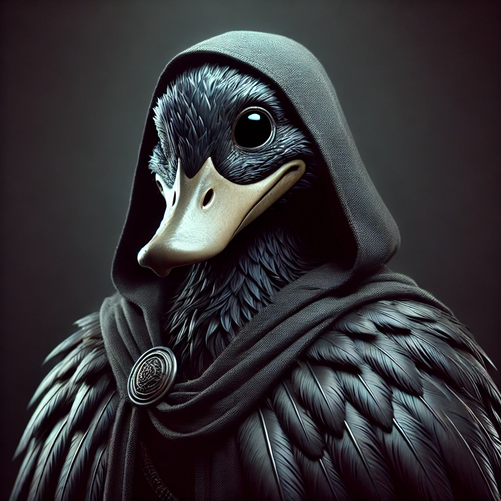

> "Pourrait faire peur si ce n'était pas une canne"

* Canne Durulz, « vieille », âge indéterminé
* **Niveau de vie**: pauvre
* **Équipement**: fétiches de plumes

# Runes

* Lunatique
* Perchée
* Vit la nuit

* Entendre, sentir le monde des esprits
* Négocier et combattre les esprits
* Voyager en esprit

* Se glisser dans la nuit
* Sinistre
* « Voir » dans le noir
* Invoquer une ombre

# Durulz de la Passe du Dragon

* **Vertus**: survivre, méfiance envers les humains, fierté malgré la malédiction

# Nageuse de l'Ombre

* Glisser entre les doigts
* Très bonne ouïe
* Marchander avec les esprits
* Paraître inoffensive
* **Vertus**: explorer les ombres pour lever la malédiction des Durulz, patience, discrétion

### Prodiges de la Nageuse de l'Ombre

* Emprisonner un esprit dans une plume
* Invoquer une ombre
* Voyager en esprit

* **Faiblesse**: sensible à la lumière — elle vit la nuit
* **Relations**:
    - Haine des Yelmites

*Canne encapuchonnée au plumage sombre, Duckita fuit la persécution anti-Durulz de la Passe du Dragon : son clan a été décimé. Elle a appris les bases de la Nageuse de l'Ombre du clan, tuée lors de la bataille, qui l'a sauvée pour que la tradition continue. Sinistre, elle vit la nuit, entourée de ses fétiches de plumes.*
