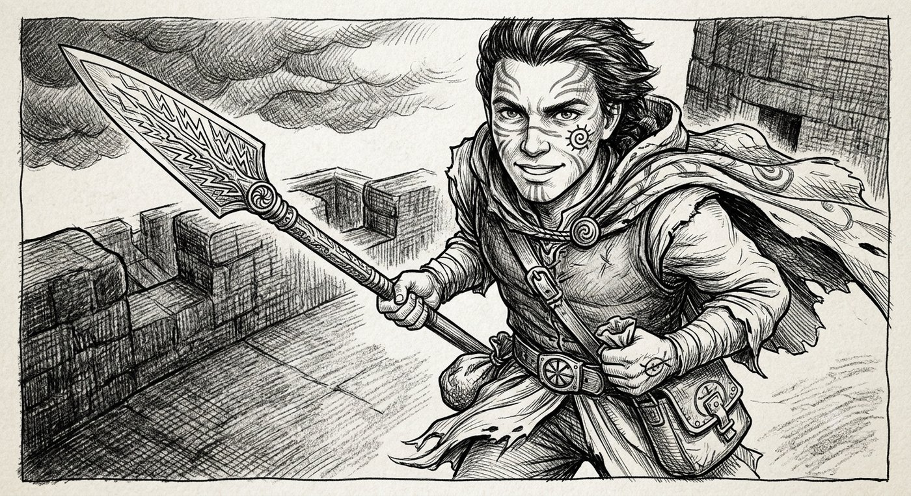

> "Je crois en mon Destin"

* Homme, 20 ans
* **Niveau de vie**: pauvre
* **Équipement**: outils de chantier et armes d'entraînement

# Runes

* Rebelle
* Agir avec énergie
* Liberté

* Rapide
* Surprendre l'adversaire
* Envol
* Coureur d'orage

* Chanceux
* Attirer les coïncidences
* Attirer la sympathie
* Croire en son Destin

# Exilé Sartarite

* Jeune rebelle
* Touche-à-tout (chantiers, manœuvres, maraudes)
* Entraînement aux armes
* Enseignements du Vent Secret
* **Vertus**: courage, liberté, solidarité, résistance aux Lunaires
* **Relations**:
    - Le Vent Secret
    - Sa famille
    - Haine des Lunaires

# Initié d'Orlanth

(Panthéon des Tempêtes)

* **Vertus**: agir avec énergie, surprendre l'adversaire, combattre les Lunaires

### Sorts de l'Initié d'Orlanth

* Retrouver son souffle, insuffler du courage
* Préparer des pierres tonnerre (bruit et confusion)
* Préparer de la guède (combat nu)
* Yavor, la lance de foudre
* Envol
* Écharpe de brume
* Coureur d'orage
* Chevaucheur de lance

*Fils d'immigrés Orlanthi étant venu à Pavis après la défaite contre l'Empire Lunar, Korlanth est un touche-à-tout (chantiers, manœuvres, maraudes...). Il s'entraîne aux armes avec ses copains et suit les enseignements du Vent Secret, qu'il n'a jamais balancé. Il croit en son Destin.*
