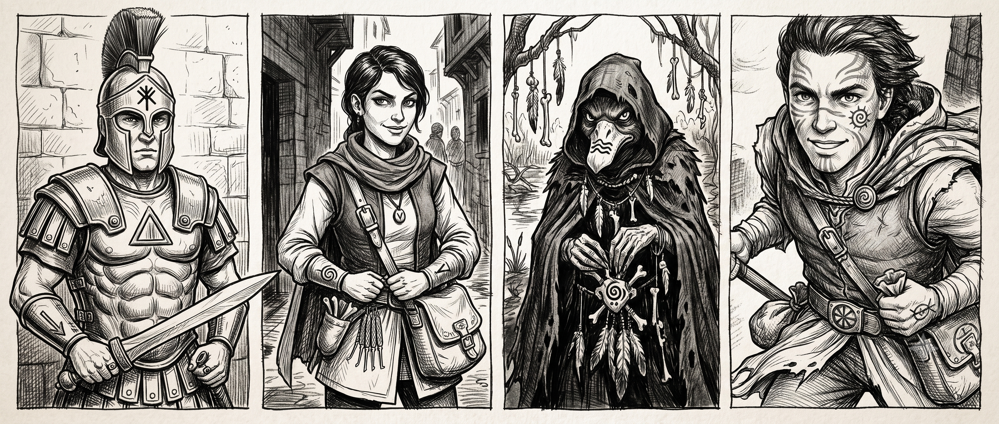

Exploration de la campagne de Multisim sortie en 2001 pour HeroWars, librement adaptée. 

**Télécharger le PDF consolidé : [les-heritiers-de-zola-fel.pdf](les-heritiers-de-zola-fel.pdf)**

# Prémisse

C’est l’histoire de Fazia, qui a volé à des aventuriers revenant de la Grande Ruine, une carte du mythique Canal-Puzzle. Mais voler des voleurs, c’est pas vraiment voler hein? 

C’est l’histoire de Irinus, un décurion de l’armée Lunar qui l’a prise la main dans le sac. Venu pour briller dans les terres désolées de Prax, quoi de mieux que d’aller dénicher des secrets magiques des Érudits de l’Ambigu? Et vu qu’il n’a pas de sorciers de confiance sous la main, il embarque Fazia qui lui a démontré ses compétences en érudition. Merci Papa l’antiquaire. 

Mais il a aussi besoin de bras pour ramer et se défendre des dangers de la Grande Ruine.  Ce ne sont pas les esclaves et les hoplites qui manquent mais pour mener les embarcations, il a arrêté et menacé  Duckita, une canne butée. Ce qu’il ignore c’est que pour elle l’idée d’aller avec lui dans le Canal-Puzzle n’est pas pour lui déplaire dans sa quête anti Yelm. Les opposés trouvent parfois des terrains d’entente, n’est-ce pas?

Ha j’oubliais, c’est aussi l’histoire de Korlanth dit La Chance qui pourrit actuellement dans la prison Lunar  suite à une rixe dans une auberge de Pavis où il aurait tenu des propos carrément révolutionnaires, ce qu’il prend avec optimisme puisque c’est son destin. 

# Les héros

- [Irinus Solantis, décurion Dara Happien](heroes/irinus)
- [Fazia Hanout, jeune érudite roublarde](heroes/fazia)
- [Duckita, Durulz, Nageuse de l'Ombre](heroes/duckita)
- [Korlanth La Chance, jeune Orlanthi](heroes/korlanth)

# Les autres

Ils sont regroupés dans un [glossaire](others) par ordre alphabétique.