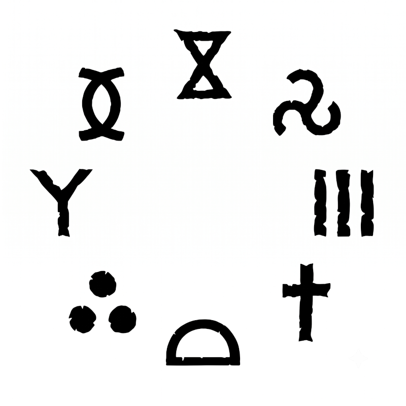

> Les érudits (Sages Gris de Lankhor Mhy, Sages Bruns d'Irippi Ontor, Logiciens du Dieu Invisible, Astrologues Buseriens...) aiment passer des heures à réflechir sur l'ordre des runes de pouvoir.

 
 Certains ont une idée bien arrêtée de l'ordre de ces runes dans le Cosmos.

 D'autres sont plus ouverts, et aiment tirer par hasard l'ordre et trouver le lien menant à l'autre. Ils affinent leur sagesse pour prodiguer les meilleurs conseils aux gouvernants.

 Certains l'utilisent comme examen dans les Universités des grandes Cités.

*Un exemple de cercle:*

Deux exemples de méditations: 

> La **vie** mène à l’**harmonie** et crée une ère de paix **véritable**. Il 
n’y a rien à ajouter : les choses sont **figées**. Mais cela conduit
à la non-vie (la **mort**). Cette cassure amène le **désordre**. De ce
désordre, on découvre le **mensonge**. Et ce mensonge est source de
**mouvement** qui peut reconduire à une période de nouveau **fertile**.

> La **vie** est **mouvement**. Mais au bout d’un moment, on ne s’y retrouve
plus. Cela amène le **désordre**. De ce désordre, apparait la **mort** et
la destruction. Cela provoque stupeur et marque un temps d’**arrêt**.
Cela permet de revoir la **vérité** des choses et de reconduire à
l’**harmonie** qui fécondera la **vie** et relancera le cycle.