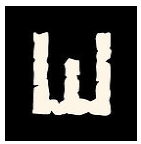
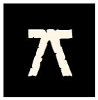
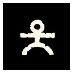

> Quand le destin hésite, on rassemble tout ce qui fait notre force, dans la chair comme dans l'invisible, et l'on regarde de quel côté le sort va pencher face à ce qui s'oppose à nous.

Principe: face à l'adversité, on mise sur tout ce qui pourrait, dans cette situation, nous servir. L'adversaire ou l'obstacle fait de même. Et ensuite on procède à un tirage pour résoudre.

Une  résolution intervient pour déterminer  une bifurcation narrative. Elle n’est là que pour servir le récit. On ne fait donc pas de résolution à tout bout de champ. On peut même choisir de résoudre une opposition une première fois et ne pas le faire une seconde fois si ça n’amène rien à a dynamique du récit. 

L'idée sous jacente de la mécanique du jeu est d'offrir le cadre nécessaire et suffisant pour expérimenter une immersion gloranthienne. 

Le système a été inventé pour que les joueurs gardent en permanence en tête que le monde doit être vu par des prismes très différents et pour qu’il y ait cohérence entre les mécaniques de jeu et le cadre de pensée des personnages.

Lorsque le destin est incertain et qu’on sent l’apparition d’une potentielle bifurcation narrative, on procède en trois étapes: 

- Chaque partie détermine ce qui est important à ce moment là.  En s’immergeant dans le monde, la situation, le focus qu'on souhaite, on détermine donc les éléments à mettre dans la balance: les **mises**
- La **résolution** des mises se fait ensuite avec des règles différentes suivant la vision du monde de chaque camp, selon qu’on est [animiste](../animism), [théiste](../theism), [mystique](../mysticism) ou [logicien](../mysticism/index.md). Chaque camp obtient donc un certain nombre de réussites.
- L’**interprétation du résultat** se fait en se basant sur la situation, le focus mis en place,  les objectifs et les stratégies des uns ou des autres.

## Détermination des mises

Le moteur est d’abord basé sur le bon sens et la connaissance du monde de Glorantha. Chaque obstacle contient son lot de difficultés à surmonter. Vous utilisez vos atouts pour espérer dépasser l’obstacle. 

Les mises potentiellement déterminantes se listent donc.

Quand il y a opposition, il peut être intéressant de définir les objectifs de chaque camp et de déterminer les mises de chaque camp en fonction des objectifs de l’un et l’autre.

A veut ça: A+ les mises qui peuvent y mener, A- les mises qui peuvent contrecarrer l'objectif de A.

B veut ça: B+ les mises qui peuvent y mener, B- les mises qui peuvent contrecarrer l'objectif de B

Opposition → A+, B- vs A-, B+

**Mises pro A contre mises pro B**

ou encore

**Atouts, tactiques pour contrer les difficultés, dangers de l'adversaire**

On a le nombre de **mises** pour chaque **camp**. On va pouvoir procéder à la **résolution**.

Quelque soit le cadre de pensée de votre personnage, c’est toujours la même méthode pour créer les mises de manière narrative. La spécificité se retrouvera dans les mises acceptables des uns et des autres. 

### Et la difficulté dans tout ça?

Déjà signalons que certains facteurs sont des facteurs cadre. Ils sont tellement impactants qu’ils forcent les mises à s’aligner et permettent d'exprimer ce qu’il ne sera pas possible de tenter. 

Pour autant si on veut s'entêter quand même a jouer hors cadre, on pourrait voir apparaître un delta de puissance entre les deux parties. 

Plutôt que d'exprimer cela par des multiplication de dés, on va voir plus loin que chaque cadre de pensée possède un mode affaibli et un mode héroïque. 

Note: on bascule vers un mode affaibli ou héroïque que si un facteur cadre nous pousse à le faire. Sinon c’est bel et bien la dynamique des mises qui est en jeu. Une partie aura juste beaucoup plus de dés de son côté que l’autre.

### Les dés et les mises

Une fois les mises connues pour chaque camp, on perd le lien entre la mise qui a créé le dé et le dé. Cela serait trop complexe mentalement de regarder chaque réussite de chaque facteur et encore plus pour les Logiciens. Ce qui importe c’est le nombre de réussites au final pour chaque camp.

Le cadre de pensée peut servir à exprimer le résultat suivant le point de vue de ce cadre. 

Les mises sont aussi là pour déterminer les éléments narratifs. Elles deviennent les ingrédients de la narration pour raconter le résultat de l’opposition.

[Exemple de détermination de mises](sample)

### Obstacle abstrait

Certains obstacles ne sont pas liés à un cadre de pensée particulier. Ils correspondent simplement à la résistance du monde.

Deux possibilités:

-  **Miroir**: on résout les mises avec le même cadre de pensée que l'opposant non abstrait: cela reflète une vision du monde holistique. C'est le cadre à utiliser quand l'enjeu est un dépassement de soi. 

-  **Agnostique**, **Matérialiste**, **Le monde médian**: les pairs (2,4,6) seront des réussites, les impairs (1,3,5) seront des échecs. Il n'y a pas d'autres règles d'ajustement des mises une fois le tirage effectué. C'est le cadre à utiliser quand l'enjeu est mineur et n'implique pas vraiment émotionnellement le personnage.

Note: ici c'est la rune du monde médian qui est utilisée. Mais si le personnage est dans le monde des esprits, ou celui des Dieux, ce sont les règles de ce monde qui servent alors comme règle de base.  

> Exemple: Un mystique escaladant une montagne va générer des mises pour lui et des mises représentant les difficultés à surmonter. On sait que le tirage du mystique sera fait avec les règles du mysticisme. Donc par défaut, le tirage de l'obstacle se fera avec les règles du mysticisme. Mais ça pourrait aussi être avec les règles du théisme dans le cas d’une ascension de Kerofin par exemple, qui est un lieu sacré du panthéon Orlanthi. 

## Les tirages

Selon la vision du monde des protagonistes, leurs méthodes de résolution diffèrent. La façon de jouer le tirage d’un camp est différent pour un [animiste](../animism), un [théiste](../theism), un [logicien](../logic) ou un [mystique](../mysticism/). 

Chaque tirage permet de déterminer un nombre de réussites qu’on compare au nombre de réussites de l’autre camp. 

## Interprétation du résultat

Celui qui a plus de réussites l’emporte. C’est aussi simple que ça. 

On peut amener de la nuance selon la différence de réussites.

En cas d’égalité, on peut jouer le status quo ou faire gagner in extremis le protagoniste s’il y a un protagoniste dans le récit. 

Dans tous les cas, les mises et les cadres de pensée servent la narration de l’interprétation. 

Et ce qui est essentiel de garder en tête, c'est le contexte de la situation qui sert a interpréter le résultat. 

Un enfant voulant tuer un Dieu et qui par miracle arriverait a une réussite serait interprété comme une simple égratignure au Dieu mais cela serait déjà bel et bien un exploit! 

Et la mort du héros? C’est vous qui voyez. C’est un sujet trop important pour que ça soit le hasard qui décide. La mort est la fin d’une histoire, le début d’une autre. Dans le pire des cas, si vous êtes partagé, tirez à pile ou face. 

### Graduation du résultat

Si l’on veut, on peut s’aider de la grille de lecture suivante:

- Fiasco / Exploit quand la différence entre les camps est supérieure ou égale a 2
- Victoire, Succès / Défaite, Échec quand la différence entre les camps est égale à 1.
- Status-quo, Revers en cas d'égalité

### Les rétributions

Les joueurs aiment voir les personnages évoluer.  Les évolutions sont toujours racontées dans le système gloranthien. Il n’y a pas de meta-game, ou en tout cas le moins possible. Pas de bonus, malus. 

C’est donc à la Destinée d’imaginer des rétributions: liens, attaches, cadeaux, nouveau pouvoir, prise de conscience...