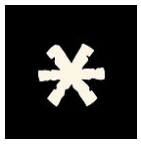
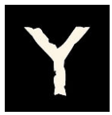

Les runes sont les briques du monde. Elles tissent la réalité. Elles s'immiscent partout. Elles dessinent la trame du Destin.

Identifions les.

Nommons les.

Observons leur impact. 

Parfois deux cultures ou personnages sont liés à la même rune mais sa manifestation diffère, toujours. 

Les runes réunissent mais distinguent aussi. Elles ne sont jamais seules. 

> Arachne Solara a 8 pattes et vous n'avez que deux mains.

L'idée est de tirer deux runes pour établir une connexion avec Glorantha. 

Cela permet ensuite de tirer les fils jusqu'à ce qu'une idée émerge. 

_Table des runes de pouvoir:_

| **Chiffre** | **Rune** | **Thèmes** | **Exemples** |
| --- | --- | --- | --- |
| **[1]** |  | **Découverte** | ce qui est autour, le monde, lieux, informations… |
| **[2]** |  | **Menace** | ce qui est différent, l’autre, l’ennemi… |
| **[3️]** |  | **Relations** | ce qui relie, émotions, sentiments, liens, dilemme… |
| **[4️]** |  | **Loi** | ce qui est figé, moralité, société, groupe, autorité… |
| **[5️]** |  | **Ressources** | ce qui est nécessaire, matériel, réalité… |
| **[6️]** |  | **Révélation** | ce qui surprend, bouscule, rebondissement, surprise, ce qui est hors-norme, improbable… |
| **[7️]** |  | **Savoir, Connaissance** | ce qui doit être cherché, recherché, étudié… |
| **[8️]** |  | **Mystère** | ce qui est caché, tromperie, illusion, vain, illusoire… |

Main gauche et main droite (2d8 ou 8 cartes)

Cela parait abstrait mais c’est beaucoup plus facile à manier que ça en a l’air. Cela permet de contraindre votre imagination gloranthesque mais vous êtes totalement libre d’inventer ce que vous voulez. 

La relation entre les deux runes est également libre: ça peut être un rapport de cause à effet, un rapport temporel, un rapport hiérarchique, etc… voire même n’avoir aucun rapport et être deux choses indépendantes dans la suite du récit. Ce sont des entités symboliques servant l’inspiration du récit en cours. 

### Quand tirer les runes?

En début de saison, en début de situation, ou quand vous vous sentez en manque d’inspiration ou lorsque les objectifs des personnages doivent se confronter au réel. 

En effet, le récit est centré sur les objectifs des personnages avant tout. Cela permet de bien creuser leurs motivations et leurs façons de réfléchir et d’agir. Mais ce n’est pas suffisant pour écrire une histoire. Les personnages sont plongés dans un monde complexe (Glorantha) qui bouge et ce mouvement du monde est exprimé par les Runes. C’est aussi simple que ça dans une logique Gloranthesque. 

*Bonne [méditation sur les runes](../../../notes/runes-meditation) de pouvoir*