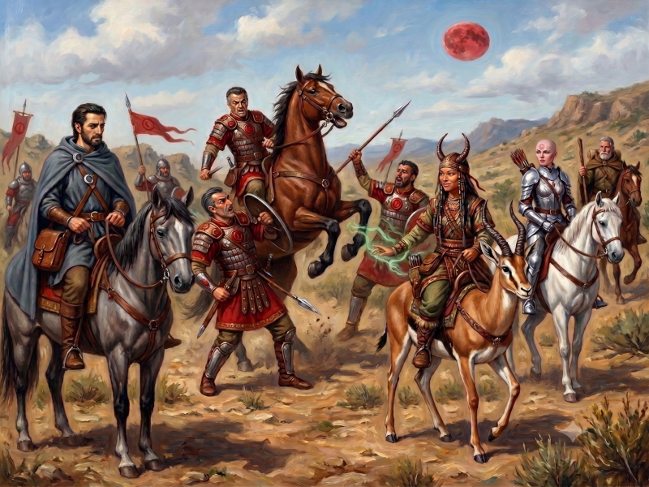
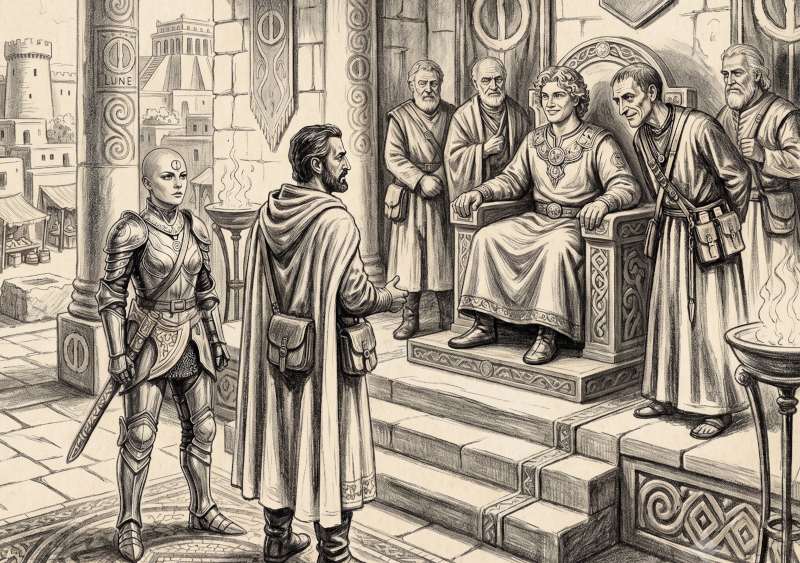

# De Dunstop vers Bagnot

**Date :** 1611 – Saison de la Mer – Semaine de l'Harmonie – Jour de l'Argile

Nous quittâmes Dunstop avec une escouade lunaire qui devait rejoindre Bagnot pour relever la garde au *Temple de la Terre qui Tremble*. Dès le départ, l'ambiance fut lourde : les commentaires des soldats critiquaient ouvertement Peek-ee-Peek. Un petit noyau de soldats, entraîné par l'un des leurs particulièrement xénophobe, alimentait les préjugés les plus rances : zoophilie des nomades, prétendue soumission des hommes-sables à leurs "femelles", etc. 

Le voyage commençait mal et ces tensions risquaient de compromettre notre sécurité. Bien qu'elle ne s'abaissât pas au niveau des soldats, Hanya ne prit pas pour autant la défense de la nomade. Elle la jugeait rustre, ne jurant elle-même que par la beauté de la civilisation dont Jillaro était l'un des multiples bijoux. Jaridan, quant à lui, essaya de parler à la nomade, mais celle-ci, sur la défensive, ne le laissait pas approcher avec son cheval. 

La tension était au plus vif quand nous montâmes le camp pour la nuit. Nous hésitâmes à faire camp à part ; mais d'un côté, le danger aurait été plus grand, et de l'autre, je voulais m'entretenir avec les soldats pour en savoir plus sur Sartar et Prax.

## Pendant le voyage

**Objectif d'Ikarnos :** Obtenir d'éventuels renseignements sur les menaces au sein de l'Empire.

> 🎲 Défaite marginale 

Récit d'Ikarnos: "Je tentais de m'entretenir avec le décurion qui commandait l'escouade pour voir ce qu'il savait des menaces et de nos ennemis, mais je n'obtins aucun renseignement digne de ce nom."
  
**Objectif de Peek-ee-Peek :** Envoyer *Esprit de la Bête* sur la monture du soldat raciste pour provoquer un accident.

> 🎲 Victoire marginale 

Récit de Peek-ee-Peek: "Je tentais de provoquer un accident sur le soldat qui m'avait manqué de respect toute la journée. Les esprits m'accompagnent et guident ma route. Je murmurais donc à *Esprit de la Bête* d'aller faire ruer soudainement le cheval du décurion pour envoyer un coup de sabot au soldat. Le cheval rua, mais le soldat ne fut pas touché, et le décurion ne chuta pas non plus. L'événement parut étrange à tous et jeta un grand silence dans les rangs. Au moins, ils arrêtèrent de me chercher des noises et se mirent sur leurs gardes, croyant à un ennemi invisible tout proche. Des éclaireurs partirent. Nous perdîmes du temps, mais je souriais intérieurement : j'avais obtenu le calme."

**Objectifs de Jaridan et Hanya :** Rien de spécial.

# Halte à Bagnot

**Date :** 1611 – Saison de la Mer – Semaine de l'Harmonie – Jour du Vent

Après l'incident de la veille avec le cheval du décurion, nous décidâmes de forcer la cadence à cheval et de poursuivre notre voyage sans l'escouade. Ce choix s'avéra payant : nous pûmes atteindre Bagnot dans la journée. 

Pendant le trajet, nous discutâmes du groupe et de la manière dont nous devrions nous soutenir pour éviter que les problèmes de la veille ne se reproduisent. Peek-ee-Peek nous avoua alors que c'était elle qui avait fait ruer le cheval, même si elle regrettait de ne pas avoir réussi à éborgner le soldat. Face à nos remarques, elle accepta de faire des efforts pour nous permettre d'approcher nos montures de son antilope, malgré le mépris profond qu'elle vouait aux chevaux.

Puis, nous aperçûmes enfin les fortifications en pierre de Bagnot, l'ancienne capitale du royaume de Tarsh, avant que les rois ne s'installent à Bout-du-Monde. Nous apprîmes également que le nouveau roi, Pharandros, était actuellement en visite dans la cité. Muni du sceau de Fazzur et de notre liste de contacts, nous étions en bonne posture pour le rencontrer : Pharandros n'est autre que le neveu de Fazzur, et il vient à peine d'accéder au trône.

## Immersions dans la cité

La cité apparaissait d'inspiration clairement Orlanthi et beaucoup moins militaire que Dunstop. Jaridan, le marchand Tarshite, y possédait déjà quelques contacts commerciaux. Hanya restait dubitative, ne retrouvant pas la splendeur de sa chère Jillaro, même si on lui vanta le *Temple d'Arim le Pauvre*, sans doute la seule construction notable de la ville. 

Nous décidâmes de nous rendre chez Caius Brontex, un magistrat ami de Fazzur figurant sur notre liste. Celui-ci accueillit notre petite équipée dans sa demeure, dont l'architecture extérieure était Orlanthi mais l'ameublement intérieur purement Dara-Happien. Autour d'une table, nous discutâmes avec Caius de la situation régionale. Nous y glanâmes plusieurs informations :
* La *Lunar Pax* est fragile (mais nous le savions déjà).
* Le jeune roi Pharandros est particulièrement ambitieux.
* Il voue une immense admiration à Fazzur pour son génie militaire.
* Il est partisan d'une application stricte et impitoyable des lois lunaires, même dans les provinces barbares, afin de "mieux éduquer" ces dernières (recours aux piloris, envois massifs d'esclaves au *Mur des Esclaves*, crucifixions...).

Nous l'interrogeâmes sur l'intérêt de choisir un itinéraire par l'est plutôt que de contourner par le nord. Caius, sortant très peu de sa cité, n'avait pas d'avis tranché sur la question, bien que lui-même aurait préféré la route principale pour des raisons évidentes de confort et de sécurité.

### Activités des compagnons

* **Hanya** alla visiter le *Temple d'Arim le Pauvre*. Elle se retrouva isolée au milieu des barbares. Le temple n'avait rien d'exceptionnel en soi, mais ses sculptures en bois détaillaient le périple de cet homme devenu Dieu, qui eut le courage de pénétrer le premier dans la *Passe du Dragon* après les tueries draconiques. Les bas-reliefs montraient ses diverses et mystérieuses rencontres : un homme-cheval, une femme avec des plumes sur la tête, ou encore une prêtresse et une montagne.
* **Jaridan** en profita pour vendre quelques biens et renouveler ses stocks commerciaux.
* **Peek-ee-Peek** préféra se faire discrète et resta la majeure partie du temps à l'abri chez Caius.

## L'audience royale

Nous décidâmes d'envoyer en ambassade chez Pharandros uniquement moi-même (Ikarnos) et Hanya. Nous ignorions les dispositions exactes du nouveau roi à l'égard des non-lunaires, et l'altercation avec l'escouade nous incitait à la prudence.

Je me fis donc annoncer aux côtés d'Hanya auprès de Pharandros. Le roi était jeune, beau, charismatique, arborant des cheveux bouclés blonds et un sourire communicatif. Nous fûmes parfaitement reçus, car à ses yeux, *"les amis de son oncle le sont forcément"*. Le jeune souverain était entouré de conseillers souvent bien plus âgés que lui, mais je remarquai rapidement que ces derniers ne semblaient pas le dominer pour autant. 

Je présentai notre mission qui m'amenait à voyager vers les terres de Prax, récemment conquises. La vision du jeune roi était claire : en apportant les bienfaits lunaires aux populations locales, celles-ci cesseraient presque naturellement d'être une menace, tout en usant bien sûr de la force si nécessaire. 

Soudain, l'un des conseillers me demanda ce que le *Masque Ondoyant* de l'Empereur penserait du culte d'Arim le Pauvre. Je reconnus immédiatement un mot secret : mon interlocuteur faisait sans doute partie de la *Société des Phrases Secrètes*. Je le fixai intensément. C'était un homme mince, presque ascétique, vêtu d'une robe et portant plusieurs étuis à parchemins. 

C'est Hanya qui prit la parole pour lui répondre : 
> "La Déesse ne combat que ses ennemis et sait reconnaître les qualités de tout en toute chose, car nous ne sommes qu'Un à ses yeux !"

L'homme sourit malicieusement : 
> "Certes, vous avez raison, noble gardienne de Jillaro. J'osais juste une plaisanterie en comparant l'austérité du pauvre Arim au train de vie actuel du nouveau masque."

L'entrevue se termina sur ces mots. Il était évident que je devais reprendre contact avec cet homme de manière plus discrète. Nous quittâmes le roi en l'informant que nous résidions chez Caius et que nous resterions quelques jours ici afin de préparer notre expédition vers Prax par l'est. Il n'y avait plus qu'à attendre. 

De retour à la demeure, nous racontâmes tout à Jaridan et Peek-ee-Peek. J'avais pris le parti de les inclure dans la confidence pour souder notre groupe pour le moins hétérogène. Hanya était plutôt d'avis de se méfier : à ses yeux, Jaridan et Peek-ee-Peek n'étant pas "des nôtres", ils pouvaient avoir des raisons de nous trahir, et il valait mieux qu'ils en sachent le moins possible. Elle convint cependant que les informations glanées étaient loin d'être confidentielles.

> **Peek-ee-Peek :** "Vous êtes étranges à vouloir rester enfermés entre des murs. Mais j'attendrais si c'est la volonté de la Déesse."

Nous allâmes nous coucher dans la vaste maison de Caius, qui se révélait un hôte des plus prévenants.

## Rencontre occulte au Lunarium

Le lendemain, je retrouvai le conseiller aux thermes de la cité. Ces derniers, nouvellement érigés, avaient été inaugurés par le roi quelques jours plus tôt (ce qui expliquait sa venue à Bagnot, dans l'optique d'asseoir son règne par une vision civilisatrice). J'étais accompagné de Jaridan. 

C'est au cœur de la fumée rouge du *Lunarium* que l'homme réapparut. Je remarquai qu'il n'y avait que très peu de locaux dans les bains. Il se présenta enfin : 

> **Imex Rapiis :** "Imex Rapiis, conseiller stratégique et tactique auprès du Roi. Pharandros est jeune et découvre encore le monde barbare. Ce n'est pas l'Empire ici, mais seulement une province. Par chance, c'est la plus riche des Provinces. Je suis là pour que la Prospérité règne, pour que les chefs barbares n'aient aucun intérêt à se rebeller et pour que la *Lunar Pax* persiste. C'est pour cela que nous avons construit ces Thermes."

Se tournant vers Jaridan, il ajouta : 

> **Imex Rapiis :** "C'est le choix entre la victoire avec nous, ou la défaite contre nous, en quelque sorte."

Je décidai d'avancer mes pions : 

> **Ikarnos :** "Seulement, il faut envoyer taxes, impôts et esclaves dans l'Empire. L'équilibre n'est pas simple à trouver."
>
> **Imex Rapiis :** "Comme je vous l'ai dit, la Province est riche, la situation pourrait donc être bien pire. Vous êtes courageux de partir ainsi à l'aventure. De l'autre côté des montagnes se trouve la célèbre *Passe du Dragon* : un territoire de collines et de sommets, une mosaïque de peuples essentiellement barbares, mais aussi inhumains. Ici à Tarsh, nous avons quelques exilés dans les montagnes qui se révoltent de temps à autre. Mais là-bas, de l'autre côté, cela doit être l'enfer, même si nous les avons vaincus il y a presque dix ans. Soyez prudents, mes amis, en tout cas."

## Départ

Nous partîmes quelques jours plus tard en direction de la montagne, marchant vers ce qui était indiqué sur nos cartes comme les **Ruines Tombantes** — le seul passage permettant de rejoindre la *Passe du Dragon* sans avoir à contourner par le Nord.

| [Précédent](../02) | [Suivant](../04/) |