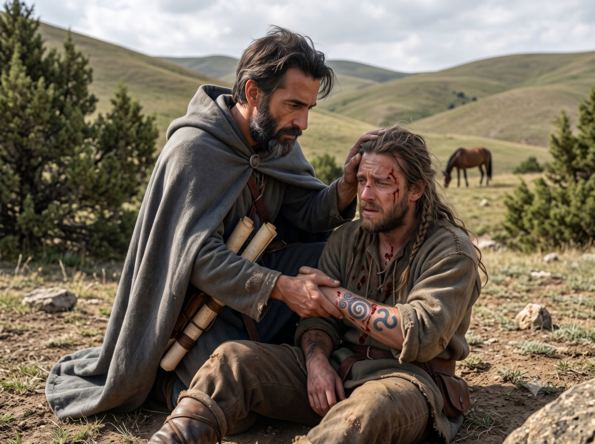

**Destination :** Les Ruines Tombantes

**Membres de la troupe :** Hanya, Peek-ee-Peek, Ikarnos & Jiridan

## L'embuscade des exilés

Nous avancions sur nos montures le long d'une route de plus en plus sauvage, nous rapprochant des montagnes, quand soudain des flèches fusèrent. Nous étions attaqués !

Hanya s'écria : **"Les Exilés !!!"** Nous regardâmes autour de nous et vîmes une douzaine d'hommes en armes approcher. Quatre restaient en retrait avec leur arc, tandis que huit autres avançaient, armés de haches et protégés par de petits boucliers ronds sur lesquels on distinguait les runes de l'**Air** et du **Mouvement**. Ils portaient des tuniques et des peaux de bêtes — des ours ou des loups, peut-être. **"Mort à Shipelkirt !"** hurlaient-ils.

> 🎲  **Résolution - Impact de la 1ère volée de flèches :**
> * **Conflit :** 
>   - Attaquants: `1` (Flèches) 
>   - Héros: `1` (Sens de l'antilope & Peek-ee-Peek) + `1` (Hanya : Route sûre)
> * **Résultat 1 vs 2:** Égalité donc revers

L'antilope de Peek-ee-Peek s'arrêta pile avant l'attaque et Hanya traça un signe de protection dans l'air. Le combat est inéluctable.

Nous fûmes donc surpris par une volée de flèches qui, fort heureusement, n'atteignirent pas leur cible grâce à notre vigilance. Mais il était trop tard pour élaborer un plan de bataille : nous devions réagir immédiatement.

## La mêlée et la ruse de l'otage

> 🎲 **Résolution - 1er contact :**
> * **Conflit :** 
>   - Assaillants: `1` (Flèches) + `1` (Supériorité numérique) + `1` (Haine de l'Empire) + `1` (Farouches) + `1` (Haches) = `5` 
>   - Héros: `1` (Hanya) + `1` (Peek-ee-Peek) + `1` (Montés) = `3`
> * **Résultat 5 vs 3:** Défaite des héros à `-1`.

L'étau se resserrait dangereusement autour de nous. Heureusement, la proximité de la mêlée empêchait désormais les archers ennemis de tirer vers nous sans risquer de toucher les leurs.

Ikarnos et Jiridan tentèrent de s'éloigner du coeur de l'affrontement. Ikarnos se rapprocha de Jiridan, lui saisit les poignets et lui passa une cordelette autour.

**Ikarnos** : "Ils croiront que tu es notre prisonnier si ça tourne mal. Tu en profiteras pour intervenir."
Ikarnos attacha ensuite une corde entre son cheval et celui de Jiridan. La manoeuvre qui se fit discrètement attira malheureusement la suspection des exilés et le feu des archers sur eux.

> 🎲 **Résolution - Les archers contre Ikarnos & Jiridan :**
> * **Conflit :** 
>   - Archers : `1` (Arcs) + `1` (Avantage de la position) 
>   - Héros : `1` (Montés) + `1` (Ruse de Jiridan : *"Ne tirez pas !"*)
> * **Résultat 2 vs 2 :** Victoire des héros à `+2`.

**Jiridan** comprit immédiatement l'avantage tactique qu'Ikarnos venait de lui offrir. Il s'écria en langue Orlanthi : "Ne tirez pas ! Libérez-moi, je suis leur prisonnier !" Cela fit hésiter les archers, qui interrompirent aussitôt leurs tirs.

## La danse de mort de la Lune Rouge

Pendant ce temps, Hanya et Peek-ee-Peek faisaient face au groupe de mêlée.

> 🎲 **Résolution - Hanya & Peek au contact :**
> * **Conflit :** 
>   - Assaillants : `1` (Haches) + `1` (Nombre) + `1` (Haineux) + `1` (Farouches)
>   - Héros : `1` (Hanya) + `1` (Grâce de la Déesse) + `1` (Peek) + `1` (Montés) + `1` (Antilope)
> * **Résultat 4 vs 5:** Victoire éclatante des héros à `+4`.

Hanya et Peek-ee-Peek firent une démonstration magistrale de leur talent. L'antilope bondit par-dessus deux gardes. En plein vol, Peek transperça l'un des assaillants de sa lance. Hanya, quant à elle, combattait avec une grâce hypnotique, faisant tournoyer sa monture et son épée, tranchant gorge après gorge.

Le sang rouge giclait, offrant un écho esthétique saisissant, en parfait accord avec la **Lune Rouge** qui brillait fièrement dans le ciel. Peek revint à la charge à trois reprises pour éliminer les rebelles restants. Pris de panique, les archers s'enfuirent.

**Hanya** rangea son arme : "Devons-nous les poursuivre ?"

**Ikarnos** secoua la tête : "Non. Leur couardise sera une nouvelle fois la preuve de la supériorité de la Déesse."

## L'interrogatoire et le sort d'oubli

Nous descendîmes de nos montures. **Ikarnos** adressa un clin d'oeil à Jiridan : "Maintenons l'illusion tant que nous ne sommes pas certains d'être hors de danger."

**Jiridan** resta donc en selle, faisant mine d'être entravé, tout en examinant les corps des assaillants.

Il y avait 4 morts, 3 mourants et 1 gravement blessé. Hanya acheva froidement les mourants. 

**Jiridan** murmura alors à l'oreille d'Ikarnos : "J'ai reconnu certains visages. Je les ai vus au marché de Bagnot. Les rebelles sont donc aussi présents en ville, et pas seulement dans les montagnes..."

**Ikarnos** s'approcha du seul survivant : "Tu veux vivre ou mourir ?" 

L'homme balbutia : "Gloire à Orlanth !", avant de cracher d'autres mots en Orlanthi. Ses yeux s'agrandirent de stupeur lorsqu'il vit Jiridan traduire ses paroles.

> 🎲 **Inspiration** :  Révélation

Le prisonnier avait dit : "La Guerre des Héros a commencé, et Argrath fera plier la Déesse."

**Ikarnos :** "Intéressant. Et où pouvons-nous trouver cet Argrath ?"

**L'homme :** "C'est lui qui te trouvera. Il t'arrachera les tripes, fils de chien !"

**Ikarnos :** "C'est courageux de ta part de ne pas implorer ton salut. Ton bras est salement amoché... Tu aurais pu faire un esclave utile dans les jardins d'un patricien. Seulement, nous ne sommes pas là pour ça. Mon choix est délicat, comprends-tu ? Que faire d'un ennemi vaincu : le tuer, ou le laisser vivre pour qu'il continue le combat ?"

Jiridan comprit qu'Ikarnos jouait avec sa proie. D'un côté, cela lui semblait cruel ; de l'autre, il était fasciné par cette faculté typiquement Lunaire à ne jamais rendre les choses simples ou binaires.

Une lueur de terreur passa enfin dans le regard du rebelle, comme s'il prenait soudainement conscience de la noirceur de son sort. 

**Ikarnos** murmura alors quelques phrases en **Vieux Dara-happien**, puis demanda doucement à l'homme : "Rappelle-moi, l'ami... Quel est donc le Dieu que tu sers ? Et comment s'appelle ce "héros" qui doit vaincre la Grande Déesse ?"

> 🎲 **Résolution - Sort "Oublier les noms" contre le survivant :**
> * **Conflit :** 
>   - Ikarnos `1` (Sort) + `1` (Position de force) 
>   - `1` (Volonté du Rebelle)
> * **Résultat 2 vs 1 :** Victoire d'Ikarnos à `+1`.

Le prisonnier balbutia : "Gloire à... Il... vaincra..." Soudain, des larmes coulèrent sur ses joues. Il venait de se rendre compte, avec horreur, qu'il était incapable de prononcer le nom de ses Dieux et de ses Héros. L'oubli magique était total.

**Ikarnos** sourit : "Si tu survis, va à Bagnot, au temple de Danfive Xaron. Tu y trouveras une nouvelle vie. Ou alors, retourne parmi les tiens, et demande-leur grâce pour ne plus être capable d'adorer tes propres Dieux..."

Nous abandonnâmes le prisonnier sur place, lui laissant un peu d'eau et quelques vivres, avant de reprendre notre route vers la montagne, redoublant de vigilance.

## Débriefing et passage de la Ligne Brillante

Durant la marche, nous avons fait le point sur cette rencontre. Devions-nous faire remonter l'information à **Fazzur** ou aux autorités Tarshites ? Les Exilés sont une réalité ancienne dans le royaume. Le fait d'avoir été attaqués par un groupe qui nous avait probablement repérés à Bagnot ne représentait pas une information cruciale pour la lutte globale contre la Rébellion.

Jiridan remercia Ikarnos d'avoir épargné l'homme, même s'il restait passablement choqué par la nature de la magie employée. Hanya restait digne et silencieuse. Peek-ee-Peek, quant à elle, estimait que le groupe ennemi était pathétique, affirmant que la force de notre troupe reposait uniquement sur elle et Hanya.

Nous convinmes qu'il fallait désormais voyager plus discrètement. Notre but n'était pas de mater la rébellion locale, mais de convoyer des ressources pour l'Empire, plus particulièrement en **Prax**. Même si cela exigeait de traverser la redoutable **Passe du Dragon**, nous n'étions qu'au début de notre voyage et nous savions que de nombreux obstacles chercheraient à nous distraire de notre objectif.

C'est alors que nous traversâmes la **Ligne Brillante**.

Une certaine appréhension s'empara du groupe : une fois cette frontière magique franchie, nous serions pleinement soumis aux phases de la Lune Rouge. Le passage s'apparentait au franchissement d'un mur invisible. D'un côté, le ciel arborait des teintes légèrement rougeâtres ; de l'autre, il était d'un bleu éclatant et le vent soufflait bien plus fort. Ikarnos et Hanya furent les plus impressionnés par ce phénomène, n'ayant jamais connu d'autre ciel que celui du cœur de l'Empire. À l'inverse, Jiridan et Peek-ee-Peek retrouvaient le ciel ouvert qu'ils avaient toujours connu.

Les Astrolabes Busériens ont longtemps glosé sur les phases de la Lune. En effet, selon leur logique astrale, la Pleine Lune est intrinsèquement instable : elle est pleine, mais se vide de moitié en un seul jour. Elle diminue ensuite plus lentement lors du Jour de l'Eau, qui semble agir comme un ralentissement, la plongeant dans sa phase mourante. D'après Ikarnos, ce phénomène est sans doute à mettre en lien avec sa théorie personnelle sur les **Durulz** (les Canards).

## Tensions au bivouac - Les Esprits vs La Lune

Nous voyagions désormais en marge de la route, sur nos gardes. Peek-ee-Peek partait en éclaireuse et nous signalait si la voie était libre. À mesure que nous approchions des montagnes, nous évitions soigneusement les habitations isolées. Cependant, la région n'était pas déserte, et la rencontre était inévitable.

> 🎲  Ennemi et relations. Ce qui est différent menace notre cohésion.

Lors d'un bivouac au pied des montagnes, alors que Peek psalmodiait des incantations chamaniques en jouant avec un caillou rond et peint, Hanya s'en prit brusquement à elle. Elle affirma que pour le bien de la mission, il serait préférable que tous les membres de la troupe soient voués à la Déesse Rouge et abandonnent leurs vieux cultes superstitieux.

Elle regarda ensuite Jiridan, lui précisant posément qu'elle ne parlait pas pour lui — le vieux Dieu du commerce (Issaries) étant respectable —, mais qu'elle ne comprenait pas comment Peek-ee-Peek, qui prétendait avoir eu une révélation pour la Déesse, pouvait continuer à pratiquer ses "trucs d'esprits". Selon elle, Peek gagnerait à embrasser pleinement la Lune.

La situation devint immédiatement très tendue. Pour toute réponse, Peek-ee-Peek sortit une flèche liée à un esprit capable de tuer Hanya sur-le-champ si elle le lui ordonnait, puis elle cracha par terre. Hanya tenta alors d'obtenir l'appui d'Ikarnos en avançant divers arguments théologiques.

> 🎲 **Résolution - Convaincre Peek-ee-Peek :**
> * *Note : L'obstacle ici est clairement Hanya. Ses points vont donc alimenter l'antagonisme (Agresseur vs Agressé). Nous sommes au 1er Quartier, la magie lunaire est donc normale.*
> * **Conflit :** 
>   - Tentative de conversion : `1` (De gré ou de force) + `1` (Ouverture d'esprit) 
>   - Résistance : `1` (Complexe de supériorité) + `1` (Hanya hautaine) + `1` (Traditionnaliste)
> * **Résultat 2 vs 3 :** défaite de Peek à `-1`.

Peek-ee-Peek écoutait et s'emportait. Le débat s'envenimait, et la mercenaire (Hanya), transformée en véritable missionnaire, semblait habitée par une ferveur sacrée. Face à elle, Peek-ee-Peek peinait à formuler ses arguments.

Alors que le ton montait dangereusement, Ikarnos intervint. Il leur rappela fermement que **Jakaleel la Sorcière** avait été l'une des **Sept Mères** qui ramenèrent la Déesse à la vie il y a 500 ans. La Déesse Rouge a intégré les esprits dans sa vision du monde, tout comme elle l'a fait avec tout le reste : ses amis comme ses ennemis, les mages comme les prêtres, et même le Chaos. Nous sommes bien trop petits pour appréhender une telle immensité.

Contrainte à la réflexion, Peek-ee-Peek dut reconnaître qu'elle ne connaissait encore rien du vaste monde. Ikarnos réussit à apaiser les deux femmes en faisant promettre à Peek de rencontrer un chaman ou une chaman de Jakaleel dès que l'occasion se présenterait. Ainsi, elle ne renierait pas sa nature, continuerait d'honorer la voie des esprits, tout en se rapprochant de la Déesse pour guider, un jour, le **Peuple Sable** vers sa réalisation.

Peek-ee-Peek se détendit et partagea avec nous une vieille histoire : comment, il y a plusieurs siècles, le Peuple Sable (qui possédait initialement la rune de la Terre) abandonna cette dernière pour adopter celle de la **Lune Naissante**, car elle leur rappelait les cornes des antilopes qu'ils montaient.

"C'est ainsi que, tout naturellement, l'Empire devint leur allié lors de la grande bataille de Prax", conclut **Ikarnos**, qui avait étudié en détail les chroniques de la campagne de Fazzur. Grâce à cette alliance, ils étaient aujourd'hui la tribu la plus puissante des cinq tribus praxiennes.

Ikarnos flatta un peu l'orgueil de Peek-ee-Peek en lui laissant entendre qu'elle pourrait bien être l'une de ces héroïnes promises à changer le destin de tout un peuple. La soirée se termina ainsi dans une atmosphère nettement plus sereine qu'elle n'avait commencé.

| [Précédent](../03) | [Suivant](../05/) |