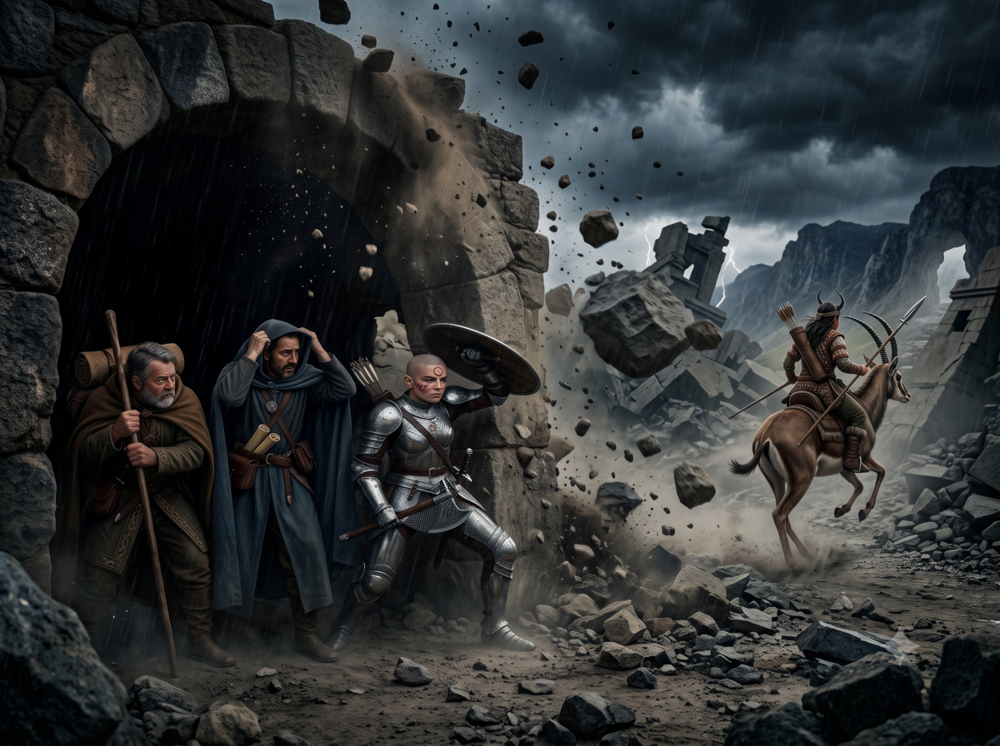
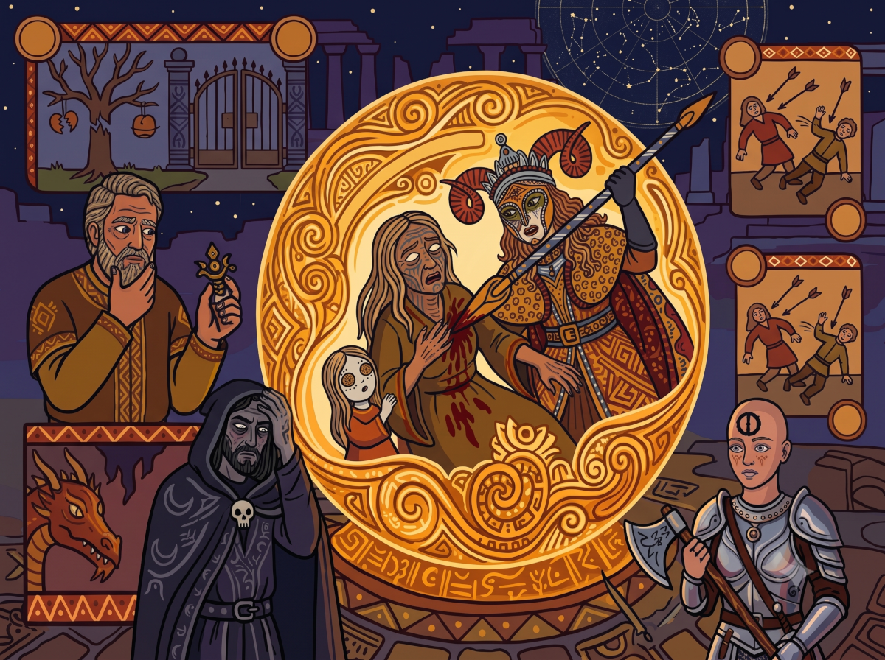

> 🎲 **Thèmes attendus :** Des ruines mystérieuses, une histoire étrange d'un érudit de l'EAW (Empire des Amis des Wyrms), des blocs de pierre tombant du ciel, la rencontre avec Elemenoria.

## En route vers les mondes barbares

Nos héros continuent d'avancer vers les montagnes et ont quitté les bois de la plaine de Tarsh. Toujours aux aguets et prenant toutes leurs précautions, ils commencent à monter sur les contreforts à travers une forêt de sapins. Le temps se rafraîchit drastiquement et les vents gagnent en violence. Ils ont quitté l'espace confortable de l'Empire, qui avait réussi à asservir le climat. Les voilà bel et bien en route vers les mondes barbares.

Les sapins se font de plus en plus rares, laissant place à une piste de pierre rocailleuse menant vers un col. Soudain, d'étranges constructions en ruines se dessinent à l'horizon.

**Ikarnos** (s'étant renseigné au préalable) : "Mes compagnons, voilà les Ruines Tombantes !"

**Hanya :** "Ça a dû être gigantesque et magnifique..."

**Ikarnos :** "L'Empire des Amis des Wyrms y avait bâti l'une de ses cités... avant l'arrivée des Dragons."

**Peek :** "Des Dragons ? Il y a des Dragons ici ???"

**Jaridan** (riant nerveusement) : "Espérons que non ! Plus sérieusement, personne ne m'en a parlé au marché de Bagnot. La passe est utilisée par les voyageurs. S'il y avait un tel danger, tout le monde en parlerait, non ? Enfin, je l'espère..."

Personne n'est vraiment rassuré. C'est au pas qu'ils pénètrent dans la cité. Les constructeurs de l'EAW voyaient grand. Nos héros s'enfoncent dans ce lieu immense et hanté, fait de constructions illogiques : des rues larges aboutissant à des culs-de-sac, des chemins tournant en rond. Toute logique urbanistique semble avoir déserté les lieux, ce qui perturbe profondément Ikarnos. Peek, de son côté, peste contre ces amas de pierres.

Soudain, un bloc de plusieurs tonnes se fracasse juste devant eux, suivi par une pluie de roches !

> 🎲 Obstacle : Chute de pierres de l'échelle
> - Conflit :
>   - Lune mourante : pouvoir lunaire affaibli 
>   - Surprise (1), Immense (1) 
>   - Antilope (1), Route sûre (1)
> - Résultat 2 vs 2 : Défaite à -1.

**Peek :** "Attention, les pierres !!!" hurle-t-elle en stoppant net sa monture.
Nos quatre héros scrutent le ciel. Les pierres tombent de nulle part.

**Hanya :** "Ça doit être des aigles... Cherchez des monstres volants, abritez-vous et abattez-les !"
Mais le ciel est désespérément vide d'ennemis.

> 🎲 Seconde salve :
> - Conflit: 
>   - Lune mourante : pouvoir lunaire affaibli
>   - Pierres qui tombent (1), rivets de métal (1) 
>   - Essaient de se mettre à l'abri (1)
> Résultat 2 vs 1: Défaite à -1.

Le groupe réalise alors que le tracé chaotique de la ville n'est pas seulement dû à l'excentricité de ses bâtisseurs, mais aussi à ces précipitations meurtrières.

**Peek :** "Je ne vois rien en l'air. Qui nous attaque ??"

**Jaridan :** "Et si on tentait d'avancer pour fuir la zone d'impact ?"

**Ikarnos :** "On fonce !!!"

> 🎲 La percée :
> - Conflit:
>   - Lune mourante : pouvoir lunaire affaibli
>   - Pierres (1), de plus en plus intenses (1) 
>   - Chaque héros utilise un atout (Maîtrise, Mouvement ou Antilope) et profite d'une accalmie (1).
>- Résultats des 2 vs 2 : Succès +2 

Profitant d'une brève accalmie, Ikarnos garde son sang-froid, Hanya et Jaridan se faufilent avec agilité, et Peek lance son antilope à travers les décombres. Après une course effrénée de 200 mètres, ils atteignent un quartier en surplomb. Ébahis, ils observent les pierres continuer de s'écraser exactement à l'endroit qu'ils viennent de quitter. Sans chercher à comprendre ce prodige, Ikarnos ordonne de s'éloigner au plus vite pour trouver le col.

## La sorcière des Ruines

La nuit tombe. Au loin, Peek-ee-Peek repère un filet de fumée. Désespérés de tourner en rond dans ce dédale ascendant, ils s'en approchent avec prudence. Au détour d'une ruelle en flanc de montagne, ils découvrent une vieille femme et une petite fille assises près d'un feu.

Alors qu'ils tentent de se dissimuler, la vieille femme prend la parole :
"Approchez, Mortels, n'ayez pas peur. Vous êtes venus pour ça. Venez partager mon maigre repas, même si je sens que les nourritures terrestres ne sont pas ce que vous cherchez."

**Jaridan** (murmurant) : "Restons sur nos gardes."

**Ikarnos :** "Qui es-tu, vieille femme ?"

**La vieille femme** (sourire édenté) : "On me connaît sous le nom d'Elemenoria. Mais un nom n'est qu'un nom, seul importe ce qu'on en fait et ce qu'il signifie pour celui qui l'entend."

**Ikarnos :** "Tu parles par énigmes. Es-tu illuminée ?"

**Elemenoria :** "Lumière et ombre sont les deux faces d'une même pièce, mais cette pièce-là est la tienne. La mienne s'appelle plutôt réalité et rêve."

**Peek-ee-Peek :** "Je n'aime pas cette femme, nous devrions partir."

**Hanya :** "Ce n'est pas à toi d'en décider."

Dans un silence pesant, les héros partagent la viande rôtie proposée par la femme. Ils remarquent que la fillette, âgée d'une dizaine d'années, a le regard vide des aveugles.

**Elemenoria** brise le silence : "Savez-vous pourquoi ce lieu est si particulier ? Avez-vous déjà vu un dragon ? Quand un vrai dragon rêve, il devient réalité, et c'est cette réalité que les mortels aperçoivent. Il y a longtemps, les hommes ont cru pouvoir se mêler à eux. Ils créèrent un Empire. L'un des leurs vint ici, et j'étais sa servante. Son rêve était de construire l'échelle la plus haute du monde pour naviguer entre le domaine des Dieux et celui des hommes. Mais qui dit rêve, dit réveil... Les dragons se sont réveillés. L'échelle fut détruite, et ses morceaux tombent encore et toujours. Voilà ce qu'est la réalité !"

**Jaridan :** "Mais quel âge avez-vous ? L'Empire a disparu il y a 500 ans !"

**Elemenoria :** "Les mortels meurent, mais le pouvoir se transmet. As-tu un rêve, marchand ? N'ayez crainte, l'endroit est sûr. Je peux exaucer un voeu pour chacun d'entre vous. Une dernier voeu pour la longue route qui nous attend tous en quelque sorte", dit elle avec une lueur étrange dans le regard. 

Elle étend la main. Un globe de lumière l'enveloppe, elle et la fillette.

### Les voeux du destin

**Hanya l'ambitieuse** entre la première. À l'intérieur, le silence est absolu.

**Hanya :** "Je crois que tu n'es qu'une blague vieille folle. Prouve moi le contraire. Moi je reverais par exemple d'être assez rapide pour qu'aucun projectile ne puisse m'atteindre." Fière de son voeu impossible, elle sourit. 

**La vieille femme** lui répond: "qu'il en soit ainsi mais sache que tout voeu a un prix. Chaque fois qu'un projectile aurait du t'atteindre, certes, tu l'éviteras mais quelque part un autre sera touché!" 

Hanya quitta le globe lumineux un peu dubitative.

**Jaridan** demande à Hanya qui lui répond: "ben va s'y tu verras bien par toi-même". Jaridan est donc le suivant à pénétrer dans le globale silencieux.

**Jaridan :** "Je rêve qu'en ces temps troublés, les ennemis d'hier deviennent amis au mieux ou au moins des alliés. Je pense que c'est impossible mais j'ai toujours rêvé de cela et c'est pour cela que je suis avec ces Lunaires." 

**La vieille :** "voila un noble rêve Jaridan. Il existe un lieu et un temps où ce rêve s'exaucera mais si tu veux l'atteindre il te faudra renoncer à ta famille et ne plus jamais les revoir! Es-tu prêt à cela ? Sont-ils prêts à cela?" 

Et Jaridan ressort, bouleversé par ce qu'il vient d'entendre. C'est ensuite au tour d'**Ikarnos**.

**La femme :** "le temps n'est plus aux paroles mais aux révélations. Toi dis moi ce que tu désires!" 

**Ikarnos :** "je souhaiterais obtenir le pouvoir des Dragons alors" dit-il en espérant ainsi mettre du côté de l'Empire un terrible pouvoir pour lutter contre ses ennemis. 

**La femme sourit :** "Je m'y attendais. Soit. Les Dragons attendent de toute facon pour intervenir. Tapis, patiemment, infiniment, ils vous observent et toi tu pourras leur parler en temps et en heure. Mais .. hahaha .. ce qui est drôle c'est que quand ca arrivera, tu auras alors changer de camp!" 

**Ikarnos :** "Maudite que dis tu??" 

**La femme :** "Je ne dis rien, je révèle ton destin." 

Et c'est ainsi qu'Ikarnos sort aussi troublé que ces trois compagnons.

**Peek-ee-Peek** pénètre enfin dans le globe.

Elle s'assoit et demande : "Es-tu faite de chair et d'os, ou es-tu un esprit ?"

**La vieille** plisse les yeux : "Nous sommes les filles du destin, et as-tu déjà vu un esprit aveugle ?"

Soudain, Peek empoigne sa lance. "Meurs, Sorcière !!!"

> 🎲 Attaque de Peek contre Elemenoria
> - Conflit: 
>   - Lance, surprise, tuer l'ennemi 
>   - Clairvoyante
> - Résultat 3 vs 1: Victoire +2

La lance transperce le coeur d'Elemenoria, qui tente de murmurer une dernière malédiction. 

**Peek** enfonce la lame avec rage : "Que ta mort soit la plus rapide !" 

Le globe se dissipe instantanément. La sorcière a disparu. Il ne reste que la petite fille aveugle qui se lève d'un bond et s'engouffre dans une anfractuosité du mur.

> 🎲 Arrêter la fillette
> - Conflit:
>   - Guerrière, petite fille aveugle 
>   - Agile, les autres crient "Non !"
> - Résultat 2 vs 2: Échec

Les autres se jettent sur Peek pour la maîtriser.

**Jaridan :** "Folle ! Qu'as-tu fait ? L'ouverture est trop petite, elle va avertir d'autres personnes. Il faut fuir !"

**Ikarnos :** "En selle. Mais ce soir, Peek, tu devras t'expliquer !"

## La Passe du Dragon et la colère des Gazzams

Les héros dévalent les pentes dans l'obscurité, fuyant la scène du crime. Au petit matin, ils atteignent les contreforts de la Passe du Dragon. Au sud, une brume épaisse ; au nord, des collines ; devant eux, le royaume de Sartar.

L'assassinat d'une étrangère empêche Peek de tuer pendant une pleine lune (contrainte de l'esprit protecteur).

Les héros avancent en descendant depuis des heures sur un rythme soutenu mais prudent étant donné qu'il fait nuit et que la pente est escarpée. Au petit matin, ils découvrent la nouvelle géographie devant eux. C'est l'occasion de se poser un peu après une fuite anxieuse et surtout c'est l'occasion pour Ikarnos d'interroger la nomade. 

**Ikarnos :** "Qu'as tu fait fou! Tu l'as assassiné froidement". 

**Jaridan :** "Chez vous, on se permet de tuer ceux qui avec qui on partage le pain?" 

**Hanya :** "Je l'ai toujours dit, les barbares peuvent être civilisés mais les nomades sont encore des primitifs qu'il faut soumettre ou éliminer" 

**Peek crache :** "c'est vous les fous.. Je vous ai vu revenir de votre entrevue, vous aviez tous l'air différents. Ha oui, elles exaucent les voeux. Haha .. que vous a t'elle promis? Hein dites le moi et je vous dirais pourquoi je l'ai tuée et après vous me remercierez", dit la nomade sans se démonter.

**Hanya :** "plus aucune flèche ne sera capable de m'atteindre". 

**Jaridan :** "la paix sera possible entre les ennemis d'hier" 

**Ikarnos :** "je pourrais maîtriser les pouvoirs des Dragons" 

**Peek :** "Hahaha.. voilà qui est bien alors! Soit c'est une folle et sa mort ne sera regrettée de personne, soit elle dit vrai et j'ai ainsi empêché qu'un autre ne vienne avec le voeu de détruire la Déesse. Voilà pourquoi je l'ai tuée. Vous savez tout.. vous ne pensez qu'à votre gloire sans voir le danger que cette femme représentait." 

Puis elle s'inscrit dans un mutisme. Ikarnos, Hanya et Jaridan se mettent à délibérer. Soudain une flèche est lancée contre Hanya !! C'est Peek.

> 🎲 La flèche de Peek 
> - Conflit:
>   - Très bon archer (2), surprise (1) 
>   - Armure (1).
> - Résultat 3 vs 1 : Victoire +2 (L'effet du voeu s'active).

Le tir est parfait mais il se passe quelque chose d'étrange, au dernier moment Hanya bouge presque imperceptiblement et la flèche la frôle et continue son chemin. On entend plus loin un râle et les têtes des trois se tournent du côté de Peek puis du côté des arbres qui boisent les contreforts de la montagne. Les arbres se mettent à bouger. Et soudain une tête monstrueuse apparaît : un gazzam !

Mais ce n'est pas tout, d'autres monstruosités apparaissent. Des sortes de dragons antiques : il y en a une dizaine et leurs cris stridents explosent les oreilles des héros.

**Ikarnos :** "Vite aux montures, fuyons, ils sont trop grands et trop nombreux!"

> 🎲 La Fuite 
> - Conflit:
>   - Cheval, utilisation du terrain, route sûre d'Hanya (3) 
>   - Charge des Gazzams, colère, cris (3).
> - Résultat 3 vs 3 : Victoire +1

Les héros décident de fuir en passant par une route qui monte à travers les montagnes en espérant que les monstres trop gros n'arriveront pas à la suivre. En se retournant ils voient un petit dinosaure mort avec la flèche de Peek dans l'oeil. Cela explique leur colère. Heureusement, ils arrivent à s'enfuir mais c'était moins une et maintenant ils doivent continuer sur un promontoire à la queue-leu-leu en faisant attention aux pas de leurs montures.

**Peek:** "la sorcière semble avoir dit vrai. Je voulais juste vérifier. Vous pouvez encore une fois me remercier." 

**Hanya:** "Ikarnos, traitons cette primitive comme elle le mérite et enchainons-la.La mort serait trop noble pour elle".

**Ikarnos:** "Il suffit. Nous devons avancer et nous parlerons tout ça ce soir au bivouac."

Et c'est ainsi que nos héros ne peuvent pas descendre vers les collines de la Passe du Dragon et doivent continuer à longer les montagnes vers le Nord dans un silence de glace.

Un peu avant la tombée de la nuit, les héros s'arrêtent pour monter un camp. La tension est vive. Le repas est maigre également car ils doivent se contenter de leurs réserves.

**Jaridan:** "si Peek dit vrai, la sorcière a bel et bien exaucé nos souhaits."

**Peek:** "on dirait bien. Tu devrais me remercier Hanya, non?" 

**Hanya:** "et donc Ikarnos peut parler aux Dragons? Pourtant des sortes de Dragons nous ont attaqués!" 

**Ikarnos:** "La Sorcière m'a prédit que je pourrais un jour leur parler mais n'a pas dit quand." 

**Jaridan:** "comme moi, la paix à laquelle j'aspire n'arrivera que si je sacrifie ma famille pour cela. Est-ce que cela en vaut vraiment la peine?" 

**Peek:** "Vous voilà liés à cette sorcière. Et apparemment sa mort n'a pas délié les voeux. Donc ne me tenez pas rigueur de tout ce qui se passe. Sur ce, bonne nuit. J'assurerais la dernière garde." 

**Ikarnos:** "Nous devons rester soudés et demain nous parlerons de la mission. Nous ne devons pas intervenir comme tu le fais Peek. Nous sommes des observateurs. Nous devons trouver une couverture plausible pour traverser ses terres et arriver jusqu'en Prax. Nous avons la nuit pour réfléchir."

Or cette nuit là, le sommeil de Peek est agité. En effet, l'esprit Tuer l'Etranger lui impose de ne pas tuer pendant une lune et en tuant le jeune dinosaure, elle a rompu le lien. L'esprit la visite et étreint son âme. Peek est en sueur et à son réveil, l'esprit n'est plus là, il a repris sa liberté.

Au petit matin, Ikarnos étudie les cartes. Ils n'ont pu redescendre vers le sud comme il l'escompait. Il a un petit pincement au coeur car il aurait aimé approcher l'Oeil du Dragon, une cité draconique qui lui aurait peut etre révélé un peu plus son destin mais ils doivent passer au nord vers Mine de Nain. Les Lunaires ne sont pas en froid avec le peuple de Mostal mais ne sont pas pour autant alliés. Pourtant l'Empire en a brulé des forêts Elfes, ils pourraient être reconnaissants mais ces créatures étranges semblent intéressées par autre chose, c'est peut-être l'occasion d'en savoir en peu plus. Il faudra ensuite rejoindre la route d'Aldachur et voyager en territoire Orlanthi. Il faudrait en savoir plus sur les tribus Vantatos et Tovtaros pour savoir s'il faut aborder Aldachur par le sud ou par le nord. Ils seront alors sur la route de Pavis direction Prax. Pour l'heure, nos héros doivent donc poursuivre et négocier un passage par Mine de Nain.

| [Précédent](../04) | [Suivant](../06/) |