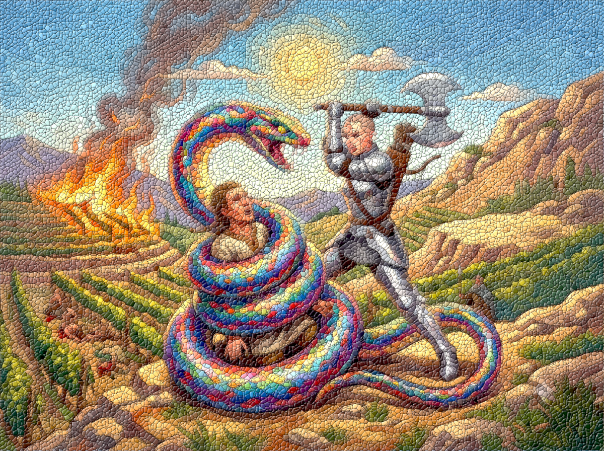

## Le clan des pommiers

Après l'horreur de la nuit, les héros pénétre dans le village Sartarite au petit matin.

Le jour se lève. Des villageois sortent de leurs maisons. Les héros avancent à pied en tenant leurs montures. Les gens les regardent perplexes. Il y a des hommes, des femmes, des enfants. On fait rentrer les enfants. Certains femmes rentrent chez elles. Finalement seuls des hommes et des femmes armés de lances pour la plupart restent. 

Ikarnos parle: "Bonjour braves gens, nous avons une nouvelle pour votre chef ainsi que pour le jeune Irken que nous avons rencontrés. Nous demandons l'hospitalité. Une de nos montures est également blessée." 

Un homme s'avance et déclare: "Salut étrangers, je suis Jirudal, Irmir va conduire vos montures aux écuries. Kalia, va chercher Sheena qu'elle regarde les blessures de la ... bête. Vous autres suivez-moi, je vais demander au Cercle de se réunir."

Peek suit Fta-Ah et veut s'assurer que tout se passera bien. Les autres vont attendre que le cercle se réunisse. Ils se rassemblent donc dans le grand hall de la maison du chef en attendant que les choses s'organisent. On leur amène un peu de quoi manger et du lait. Ils se remettent de leurs émotions. Ils sont également sous la surveillance de quelques hommes en armes. Enfin une présence discrète mais ils ne sont pas dupes. Les décorations sont encore très Orlanthis dans le style. L'influence lunaire n'a pas beaucoup percé dans ce clan.

Peek rassure Fta-Ah et psalmodie une mélodie qui calme un peu l'antilope. Une jeune femme en robe blanche arrive avec 2 servantes. Elle a une bassine d'eau et des petits sacs avec elle. "Bonjour, méchante blessure, la pauvre bête a l'air fatiguée en plus." 

Peek: "bonjour, tu dois être Sheena, je suis Peek-ee-Peek fille de chef, en Prax et voilà Fta-Ah, elle a été blessé par des Ogres. Nous avons du fuir et avons galopé une bonne partie de la nuit. Elle est épuisée mais s'en remettra. Connais-tu les Esprits qui soignent?" 

Sheena sourit: "non, mais la déesse Chalana Arroy y pourvoira, fais-moi confiance." 

La prêtresse se met au travail et applique des onguents sur la plaie de Fta-Ah et murmure des prières en même temps. Ses mains semblent auréolées de lumière.

Sheena se retourne vers Peek et lui annonce: "elle sera totalement guérie après une semaine de repos. Vous allez donc devoir rester ici." 

Peek la remercie chaleureusement et ensuite est conduit dans le Hall où elle rejoint ses compagnons. Elle leur annonce qu'ils vont devoir rester une semaine ici pour que Fta-Ah se remette. Ils n'ont pas le temps de trop réagir que cela bouge autour d'eux, 7 personnes arrivent et se mettent autour de la grande table située plus haut dans le Hall. Des villageois affluent. Enfin, arrive Irken qui a l'air bouleversé. Le silence se fait. 

Un homme costaud au visage carré s'exprime: "Moi, Jarlan, Chef du clan des Pommiers déclare cette session du Cercle ouverte. Avancez étrangers!"

Les héros s'avancent et se présentent, puis présentent les faits. Les gens écoutent horrifiés. 

Jarlan déclare: "vous en avez tué 3 sur 5 et l'infâme Cai est donc sauf ainsi que cette monstruosité. Mmm, il faut qu'on aille finir le travail et reprendre les terres. Serez-vous des nôtres?" 

Ikarnos: "Nous vous remercions Jarlan, et vous pouvez compter sur nous. De toute facon notre antilope doit se reposer une semaine avant que nous puissons repartir. Nous vous aiderons et repartirons juste après." 

Un homme au visage émacié et portant une barbe s'exprime: "si ces ogres sont venus ici c'est qu'il y a peut-être quelque chose dans nos terres qui les ont attirés. Il faut en trouver la cause." 

"Et l'éradiquer!" déclare un vigoureux gaillard portant un casque de Taureau tout en jetant un regard noir aux héros. 

"Calme-toi Brontos, ils ont prouvé qu'ils avaient combattu et nous allons vérifier." 

Brontos: "cette chose dans le Ciel a ravivé le Chaos et vous le savez très bien. Je combattrais et Nous vaincrons " 

D'autres gens dans la foule reprennent "Je combattrais et Nous vaincrons".

 Jarlan: "ne soufflons pas les braises sur l'incendie mes amis. J'ordonne qu'une troupe de 20 thanes accompagnés des étrangers aille voir le domaine de Cai et comme l'a suggéré Pizidan, il faut fouiller les alentours. J'ai dit."

Irken s'avance: "je demande l'autorisation de les accompagner et toi, Jarlan, tu aurais du m'écouter! Vous auriez du tous m'écouter!" 

Une femme du cercle s'exprime: "meme le lunaire n'a rien vu, ces ogres sont passés maitres dans l'art de la dissimulation. Estimons nous heureux que le nombre de victimes n'a pas été plus important pour notre clan." 

Le conseil se termine et l'expédition se prépare. A pieds. Il faudra compter 4h de marche pour retourner la-bas.

## Retour à la villa des Delli

Finalement, le groupe est un peu plus nombreux. Il y a bien les 20 thanes mais se sont greffés des jeunes donc Irken : une dizaine en tout, dont certains étaient déjà là avec leurs torches". Ils arrivent devant la grande demeure. Le silence règne. Malgré le temps ensoleillé, l'angoisse est bien présente dans l'assemblée. La troupe encercle la demeure puis un petit groupe dont les héros pénètre par la grande porte. On voit des traces de sang là où le combat a eu lieu mais il n'y a plus aucun corps. D'après Peek, il manque 3 chevaux dans les écuries. 

"Ils ont du fuir" 

On fait le tour de la maison. Plus de trace de la statue. Le mobilier est toujours là. Jaridan remarque le système de ventilation qui les a endormis. Il y a un coffre mais il est vide. Ils descendent même dans une cave et découvre une grande table en pierre, couverte de traces de sang séchés dans les rigoles. La table semble idéale pour contenir un corps. Tout le monde frémit. Ils voient des affaires de voyage dans un coin. Ils comprennent que les Ogres tuaient des voyageurs pour l'essentiel. Ils voient également des affaires de petite taille. Ils tuaient des Nains également! Jaridan fouille et trouve un médaillon hexagonal. 

"Ne devrions nous pas le ramener au Roi Nain?" 

Ikarnos réfléchit: "gardons-le et nous le rendrons a ses frères ClouSilex une fois à Pavis" 

Mais un des thanes d'armes l'arrête: "Que fais tu étranger? Cet objet appartient maintenant à notre clan."

> 🎲 Réussir à conserver le médaillon 
> - Conflit: 
>   - Jaridan: négociation (1)
>   - Thane: légitime (1) 
> - Résultat 1 vs 1: Défaite à -1

Le thane récupère donc le médaillon. Le groupe retourne dehors et est divisé: que faire de la maison ? Certains veulent la brûler, d'autres trouvent ca dommage. La maison est solide. 

Ikarnos rappelle: "ce n'est peut être pas la priorité du moment. S'ils ont fui à cheval, que pouvons-nous faire ? Ils doivent déjà être loin maintenant et nous sommes à pieds. Peut-être devrions nous fouiller les environs pour chercher ce que votre Sage Gris conseillait?" 

La fouille s'organise. Les Orlanthis adoptent la méthode de l'Air. Ils procèdent en faisant comme une sorte d'escargot représentant la rune de l'Air ce qui est une manière assez efficace pour fouiller les alentours. Les lunaires utilisent plutôt la méthode du quadrillage et les Dara happiens utilisent une méthode solaire en lancant des groupes dans toutes les directions (rayons).

## La fouille des vignes

>  Les ogres ont lâchés des serpents dans leur fuite pour les ralentir. C'est l'occasion de se renseigner ce que Glorantha compte comme serpents.

Les héros avancent donc avec les Orlanthis en parcourant les vignes hautes du domaine quand soudain le premier cri révèle le danger. Des Orlanthis s'exclament: "des serpents!!" Des dizaines de serpents infestent la vigne.

Chaque joueur va être confronté aux serpents. On verra par un jet de combien, quel a été l'impact de l'attaque sur les Orlanthis.

Destin: -1

> 🎲 Attaque des Serpents Piques 
> - Conflit: 
>   - Les serpents-pique: attaque-éclair (1), vif (1), rusé (1) 
>   - Ikarnos: rien (0)
>   - Hanya: mouvement (1), route sûre (1)
>   - Peek: nomade (1), lance de mort (1), rapide (1)
>   - Jaridan: rune de terre (1), en retrait au moment de l'attaque (1)
> - Résultats: 
>   - Ikarnos (4 vs 1): Défaite -2
>   - Hanya (3 vs 2): Victoire +2
>   - Peek (3 vs 3): Victoire +1
>   - Jaridan (3 vs 2): Défaite -1

Ikarnos est mordu et le venin s'immisce dans ses veines. Peek arrive à s'extirper de la zone dangereuse. Hanya pourfend quelques serpents et s'échappe aussi. Jaridan esquive mais n'est pas pour autant tirer d'affaire.

> 🎲 Attaque des Serpents Piques 
> - Conflit: 
>   - Les serpents-pique: attaque-éclair (1), vif (1), rusé (1) 
>   - Jaridan: rune de terre (1), peek en renfort avec son arc (1), serpents se dispersant pour attaquer les Sartarites (1)
> - Résultat 3 vs 3: Défaite -2

Jaridan arrive à s'extirper des vignes mais un serpent l'a mordu également. Il rejoint les autres. Il y a énormément de blessés parmi les Orlanthis. Certains sont même encore allongés dans la vigne. Il faut décider. Un homme s'avance et déclare: je peux brûler la vigne par Yelmalio. 

Brontos le Taureau-Tempête déclare: "tu vas bruler nos hommes, fou! 

L'homme: "Ils sont déjà condamnés". 

Peek propose: "donnons leur une mort digne et sans souffrance" 

Et elle bande son arc attendant le feu vert des Orlanthis. L'heure est lourde. La flèche part ainsi suivies par d'autres lancées par les Orlanthis encore vaillants. Les hommes sont tués. Puis on voit le Yelmalite lever les mains l'une contre l'autre et former un rond, on voit l'air se densifier entre ses deux mains formant une sorte de loupe, le soleil commence à chauffer et un rayon fuse de ses mains puis un autre et encore un autre, mettant le feu à la vigne qui s'enflamme en brûlant les serpents ainsi que les quelques Orlanthis décédés.

>  Rebondissement

Et soudain on se rend compte qu'un jeune Orlanthi est en train de se faire étrangler par un étrange serpent arc-en-ciel qui plante ses crocs en lui. Hanya s'approche, et croise les yeux de ce dernier qui tente de l'hypnotiser.

> 🎲 Hanya contre le Serpent-Arc-En-Ciel
> - Conflit: 
>   - fort (1), hypnotiser (1)
>   - fanatisme lunaire (1), hache(1), rapide (1)
> - Résultat 2 vs 3: Victoire +2
>   - il y a eu plusieurs surenchères non détaillées

Le combat est épique, le serpent n'hypnotise pas Hanya et tente de fuir mais celle le rattrape et doit lui asséner plusieurs coups. Se voyant attaquer le serpent tente de la mordre. Peek sait que Hanya est immunisée contre les flèches mais ne veut pas prendre le risque vu ce qui s'est passé avec les Gazzams et pour l'instant la fière gardienne de Jillaro semble s'en sortir. Les Orlanthis n'osent pas tirer et personne n'est à proximité pour intervenir au contact. Finalement après plusieurs coups, le serpent s'écroule mort!

Il faut agir vite car il y a beaucoup de blessés. Il faut que les indemnes courent au village chercher des guérisseuses. Les blessés marcheront vers le village pour gagner du temps également. Brontos est déjà en train d'amputer quelques blessés grave en cautérisant avec sa grande hache. C'est l'horreur et la tristesse parmi les membres du groupe.

Jaridan et Ikarnos sont blessés. Cela peut empirer si l'on n'intervient pas assez vite. Hanya et Peek partent avec cinq autres Orlanthis pour chercher de l'aide.

> 🎲 Lutte contre le temps
> - Conflit: 
>   - mouvement (1), nomade (1)
>   - poison (1)
> - Résultat 2 vs 1: Victoire +1

Le groupe arrive à temps et repartent avec des guérisseuses à cheval. Peek choisit de suivre en courant: plutôt mourir que monter sur un cheval! De toute façon elle n'est pas guérisseuse. Les soigneuses arrivent. Les herbes sont brûlées, et avec la fumée on fait sortir le venin. Les prières envers Chalana Arroy sont envoyées. Ikarnos envoit ses pensées à Deezola une des sept mères, déesse qui soigne dans le panthéon Lunaire. Le poison est stoppé.

>  Rebondissement (Illusion et Vérité)

L'ambiance est lourde et des Orlanthis commencent à accuser les Lunaires de leur avoir caché des choses, ce qui est ridicule puisque eux-mêmes ont eu à en pâtir mais ils argumentent en disant qu'ils ont peut-être fait semblant. On les accuse d'être de mêche avec les Ogres.

> 🎲 Plaider son innocence
> - Conflit: 
>   - Autorité d'Ikarnos (1), Diplomatie de Jaridan (1)
>   - Préjugés du clan (1)
> - Résultat 2 vs 3: Défaite -1

On leur fait comprendre qu'ils ne sont plus les bienvenus et qu'ils ne pourront pas rester. Ikarnos leur rappelle que leur Antilope doit rester au repos. Ils leur proposent de la laisser et de revenir dans une semaine la rechercher ou sinon de repartir avec au pas et de camper où bon leur semble pour se reposer ce qui serait mieux d'ailleurs pour tout le monde apparemment. C'est donc dans une ambiance lourde que les héros repartent et expliquent la situation à Peek qui ne manque pas d'insulter les Orlanthis en les traitant de lâches, de fous mais personne ne relève: leur choix semble déjà faits et ils pleurent leurs morts. Les héros récupèrent donc leurs montures, on leur donne quand même un peu de nourriture et ils repartent au pas en les tenant par la bride pour ne pas fatiguer Fta-Ah. Peek suggère à Ikarnos de dénoncer le clan au roi Nain vu qu'ils ont gardé le médaillon. Mais Ikarnos répond qu'il faut avancer. Bien que guéris, cela fait du bien à Jaridan et Ikarnos de marcher et de toute façon, ils ne pourront pas trop s'éloigner pour monter le camp.

| [Précédent](../07) | [Suivant](../09/) |