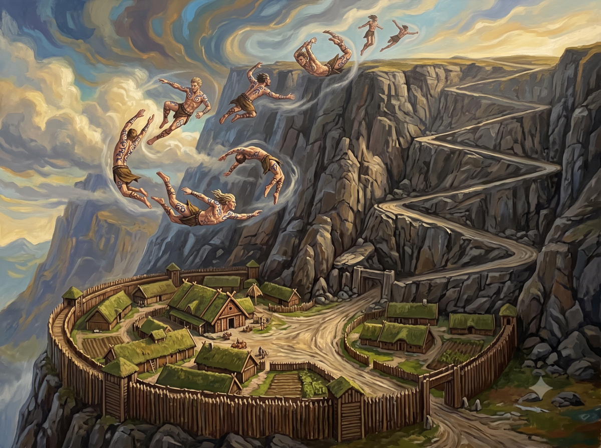

*Suite des aventures de Peek & Jaridan*

## En route vers AldaChur

Jaridan et Peek avancent prudemment pendant la fin de la nuit aux aguets des dangers autour d'eux et Jaridan sent la colère de la fière nomade. 

Au petit matin, ils font une halte pour déjeuner et Peek déclare: "pourquoi tu ne m'as laisser la tuer?" 

Jaridan hausse les épaules: "qui te dit que tu y serais arrivé. Ikarnos l'aurait défendu"

Peek: "et toi?" 

Jaridan: "je n'ai pas eu envie d'être parmi ceux qui s'entretuent. J'aspire trop à la paix pour ca." 

Peek: "contre le chaos, il n'y jamais de paix!" 

Jaridan: "peut etre trouverons nous un moyen de la soigner. En tout cas, c'est ce que je vais rechercher à AldaChur, il y a des temples là bas et des sages, peut être sauront-ils." 

Peek: "et s'ils reviennent et qu'on n'a pas de solution?" 

Jaridan: "je ne voyagerais pas avec un ogre. Je dirais à Ikarnos que la mission s'arrête là pour moi et je suppose que tu devrais en faire autant." 

Il l'observe: "déçue hein? Moi aussi, tu sais, si j'ai accepté c'est pour défendre aussi la cause de la paix et toi?" 

Peek: "la tribu Sable est forte car alliée aux Lunaires mais je me méfie d'eux. J'ai peur qu'ils nous affaiblissent en réalité. Je voulais trouver de quoi renverser les choses mais au lieu de ça, j'ai encore plus de suspicion à leur égard. Enfin, on verra bien. Si ca se trouve, tu retrouveras ta famille bientôt." 

Il s'assombrit: "si c'est le cas, je serais un homme heureux de revoir les miens mais tellement malheureux car d'après la Sorcière, je ne verrais jamais la paix arriver." 

Ils se reposent un peu et après un peu débrief sur la route à prendre à travers la vallée séparant les 2 falaises de la Marche des Nains, ils reprennent la route. "Je suis content que ton antilope soit totalement remise en tout cas."

Le voyage se passe sans encombre. Quelques rencontres avec des Orlanthis. Jaridan enseigne à Peek que les habitants de la Passe du Dragon vénèrent essentiellement Orlanth pour les hommes et Ernalda pour les femmes. Orlanth est en lutte avec la Lune Rouge et les Lunaires ont même interdit qu'on pratique ouvertement son culte.Ils s'en servent pour juguler toute rebellion, en profite ainsi pour se fournir en esclaves sous motif de culte illégal et les chefs de clan sont tellement déboussolés qu'ils se convertissent aux 7 Mères ou à Yelmalio comme le Duc Harald d'AldaChur. C'est malin. Ils sèment la discorde entre les clans et n'ont plus qu'a ramasser les points. Peek se rend compte qu'ils ont fait un peu pareil au final en Prax sans le coté interdiction mais cet aspect de l'Empire ne lui plait pas. Elle remercie Jaridan de lui avoir ouvert les yeux. Finalement, ils arrivent devant les grandes falaises qui mènent au plateau des terres de l'est sur lequel se trouve plus loin la cité d'Aldachur et Jaridan se rend compte que ca va être rude voire impossible de passer. D'habitude il prend par le nord par la route principale mais là on est loin. Les Orlanthis lui ont parlé d'une route pourtant par le sud.

> 🎲 Comment passer? 
> - Conflit: 
>   - Jaridan: information des Orlanthis rencontrés, cartographie + Peek: s'orienter
>   - peu fréquentée, terres arides au pied de la falaise, ils se sont perdus
> - Résultat 3 vs 3: Victoire +2

Ils finissent par retrouver les traces d'un sentier qui a l'air relativement fréquenté puis avec d'autres indices, ils rejoignent au sud une route plus large qui semble mener vers la falaise. Et effectivement ils voient devant eux un village et au dessus une route qui serpente le long de la falaise! Ils l'ont trouvé.

## Le village au pied de la falaise du haut plateau d'Alda-Chur

Jaridan et Peek avancent donc au pas vers l'entrée du village formant un demi-cercle collé à la falaise et entouré de remparts en bois. Deux gardes armés de lance et de bouclier s'avancent vers eux. Jaridan s'adresse à eux: "Salutations ! Je m'appelle Jaridan et suis marchand. La nomade est avec moi également et nous venons en paix. Nous allons à Alda-Chur et souhaitons emprunter la route de la falaise."

Un des gardes répond: "Vous êtes les bienvenus et sous la loi de l'hospitalité d'Orlanth."

 Il semble guetter une réaction de la part des héros. "Nous allons vous accompagner au Hall de notre chef Sigmar où vous pourrez vous restaurer et lui conter votre voyage. Suivez-moi". 
 
 Jaridan fait signe à Peek de démonter et de continuer à pieds dans le village en tenant par la bride leurs montures. Ils avancent donc sous les regard des villageois qui ont tous un air plutôt farouche. Peek soutient leurs regards. Ces gens lui plaisent car elle retrouve un peu du parfum des terres sauvages de la Désolation. Le Hall est la plus grande batisse du village. Les montures sont menées aux écuries et Peek s'assure que Fta-ah soit bien traitée. Beaucoup d'enfants viennent voir l'antilope. Les héros pénètrent dans le hall et mettent un peu de temps à s'habituer à la pénombre. C'est l'heure du repas et on les convie à une table où se trouvent d'autres hommes. L'ambiance est chaleureuse. A leur table, ils font connaissance avec Jakran un des guerriers du clan. Il semble plutôt bourru mais est curieux de connaitre ces étranges voyageurs sans doute pour savoir s'il doit les considérer comme une menace ou pas. Jaridan joue le jeu et se lie un peu avec l'homme. Il lui explique finement qu'il va à Pavis pour y faire du commerce et qu'il a réussi à trouver une guide Nomade qui avait été enrôlée par les Lunaires et qui est bien contente de retourner chez elle. Le repas se termine. Des hommes et des femmes font part de problèmes locaux puis on invite Jaridan et Peek à venir se présenter au chef Sigmar qui est assis un peu plus haut à côté de sa femme, une femme d'age mure, aux formes généreuses portant des tatouages de la rune de Terre, affichant ainsi sa dévotion pour Ernalda la Grande Déesse de la Terre. 
 
 Jaridan réexplique la situation et Sigmar répond: "vous êtes les bienvenus mais ne vous attardez pas à Alda-Chur c'est devenu un nid de vipères depuis qu'Harald a viré sa quetille pour pactiser avec l'Empire. Toi, la Nomade, que penses-tu de l'Empire? N'êtes vous pas alliés avec eux en Prax ?" Un silence se fait dans la salle. 
 
 Jaridan s'apprête à répondre pour Peek mais Sigmar lui fait signe de s'arrêter: "laisse répondre la Nomade".

> 🎲 Personnalité de Sigmar: ressources & relations. Il cherche des alliés dans sa lutte contre l'Empire (moyen) car il sait le clan faible et aimerait renforcer les ressources du clan (objectif)

> 🎲 Peek répond à Sigmar 
> - Conflit: 
>   - Défendre la Tribu, Mépris des sédentaires
>   - Haine des Lunaires
> - Résultat 2 vs 1: Défaite -3!

Peek fidèle à elle-même regarde de manière assez méprisante les hommes et les femmes assemblés. Elle ne cherche pas à s'excuser de l'alliance des Sables avec les Lunaires et explique qu'en tant que chef de clan il devrait comprendre qu'une tribu fait tout pour se défendre et qu'ils ont pu ainsi vaincre tous leurs ennemis Nomades et devenir la tribu la plus puissante de Prax. 

Malheureusement cela est totalement contre-productif car avec de tels arguments, cela justifie le comportement opportuniste d'Harald Poing-d'Acier qui est devenu Duc d'Alda-Chur en s'alliant avec les Lunaires, en divisant les tribus de la Confédération et en allant même jusqu'à abandonner Orlanth et à se convertir à Yelmalio. 

Sigmar répond: "c'est bien ce que je pensais. Dans ce cas vous comprendrez aisément que vous ne pouvez pas emprunter la route d'Orlanth, mais remontez au nord, vous trouverez une belle route, souvent empruntée par vos amis. Je ne vous ferais pas l'offense de vous attaquer puisque vous êtes sous la loi de l'hospitalité d'Orlanth mais maintenant que vous êtes rassasiés, vous pouvez remonter en selle car vous avez de la route à faire." Et sur ce, il se lève. Le verdict est sans appel!

Peek et Jaridan repartent en jetant un oeil à la route sinueuse qui serpente le long de la falaise. Ils voient de jeunes hommes tatoués qui s'exercent au vol Orlanthi. Le prodige est impressionnant, ils s'élancent le long de la falaise et plongent dans le vide portés par les vents. Ils comprennent que ces jeunes sont en train de les narguer par bravade mais ne voient pas comment faire autrement. Le chef a parlé.

| [Précédent](../09) | [Suivant](../11/) |