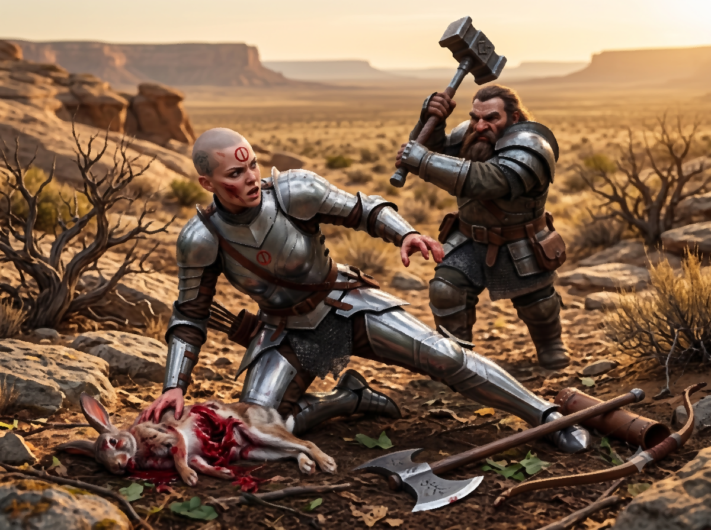

*Suite des aventures d'Ikarnos & Hanya*

## Retour au clan des Pommiers (Ikarnos, Hanya)

Le Tula du clan est assez proche de l'endroit où Hanya et Ikarnos ont rencontré les Nains. En effet, leur enquête laborieuse s'est avérée assez lente jusque là car ils ne voulaient rien laisser passer. C'est plutôt une bonne chose car la présence d'Hanya vu son état peut être un risque pour nos héros. 

Ikarnos propose donc le plan suivant: "je pourrais me faire passer pour votre prisonnier. Nous ne sommes pas en bon terme avec le clan car ils nous ont accusés d'avoir été à l'origine des troubles, ce qui est absurde. Hanya restera en retrait au cas où ça tournerait mal. Et lorsque je verrais l'homme soit je m'adresserais à lui en lui parlant des serpents, soit je m'adresserais à vous en parlant d'Isidilian. Vous saurez alors que c'est lui. Seulement, comment réussir à lui dérober l'objet ? Je n'en sais rien. On avisera. L'important est d'être dans la place. Il faut aussi trouver un moyen de rester un peu sur place pour voir les gens et avoir une opportunité. Vous pourriez dire que votre compagnon qui .. heu.. me semble assez âgé a besoin de repos avant de retourner à Mine de Nain." 

Le Nain esquisse ce qui semble un sourire: "un Nain n'a jamais besoin de repos hormis quand il forge et travaille durement. Ils ne vont jamais gober ca". 

Ikarnos: "je n'ai pas mieux hélas.. ils ignorent tout de votre facon de vivre et Gundaroum je vous assure fait vraiment figure d'ancien fatigué donc ca pourrait marcher... ou alors, on peut dire que je l'ai blessé et que vous avez besoin de pratiquer un rituel Nain de soins pour qu'il puisse repartir." 

Tout le monde réfléchit intensément mais est d'accord pour le plan. Ikarnos, le Nain en robe, le vieux Nain et un des guerriers iront au clan. Hanya restera avec le dernier guerrier ce qui ne rassure pas Ikarnos du tout mais bon il faut bien prendre des risques.

## L'expédition d'Ikarnos

Notre petit groupe approche du Tula. J'ai accepté d'être désarmé et de me faire attacher les mains par des bracelets de fer non sans frissonner car connaissant le talent des Nains avec le métal, je sais que jamais je n'arriverais à défaire ces liens. Mais le jeu en vaut la chandelle, j'ai connu des situations bien pire à Raibanth quand j'écumais les bas-fonds de la ville pour l'Empereur.

> 🎲 Une épreuve d'endurance

Nous rencontrons enfin les gens du clan et sommes amenés dans le village qui me rappelait de funestes souvenirs. Les Nains s'entretiennent avec Jarlan et réussissent à le berner assez facilement je dois dire. Même le vieux Pizidan n'est pas si sage que ca finalement. Les Nains vont même au-delà de mes espérances en leur proposant en échange de leur hospitalité de jeter un coup d'oeil à leurs armes et à d'éventuels objets de facture naine pour qu'ils les aident à s'en servir ou pour les améliorer. Je me rends compte que finalement ils n'avaient sans doute pas besoin de moi pour retrouver leur médaillon. Je scrute tout de même la foule à la recherche de visages familiers. Je vois Sheena la prêtresse qui a soigné l'antilope de Peek. Brontos le Taureau-Tempête me jette des regards sombres et je me réjouis d'avoir mis Hanya à l'abri. Cette brute aurait sans doute vu en elle le Chaos et cela aurait déchainé sa fureur. Je ne vois pas le jeune Irken qui doit sans doute être aux champs. Je vois aussi l'homme qui a brûlé les champs du domaine de Cai. Sans doute le même qui a déclenché la fureur de Yelm sur la domus.

> 🎲 Est-ce que Ikarnos voit le thane qui leur a pris le médaillon? 
> 
> Ca peut se jouer en jet oui/non ou en confrontation. 
> 
> Il peut être utile d'en savoir un peu plus sur ce médaillon et sur ce thane, je pense. 
> 
> Le thane s'appelle Korlan. Voyons un peu ses objectifs ? Korlan en veut à quelqu'un dans le clan et aspire à utiliser l'objet Nain à son avantage contre ce dernier. 
> 
> Mais quelle est donc la propriété du médaillon ? Il confère une grande force à son propriétaire. Utile pour un thane qui voudrait prouver sa valeur au détriment d'un autre. 
> 
> Je pense qu'il est mieux de se baser sur un jet binaire pour savoir s'il est présent ou pas pendant la présentation des Nains. L'homme est absent sans doute dans son domaine ou en patrouille.

Alors que les Nains sont installés dans une masure afin qu'ils puissent "soigner" leur vieux "blessé", on me traine jusqu'à un poteau et l'on m'y attache en me dépouillant de tous mes biens.

Je suis confiant dans le codage utilisé dans mes écrits pour Fazzur, ils ne devraient y voir que du feu, enfin je l'espère. De toute façon, le danger est ailleurs. Assoiffé, affamé, attaché au poteau les heures passent et je m'affaiblis. Le guerrier Nain qui accompagne le groupe reste pas loin soi-disant pour me surveiller ce qui fait rire les Thanes mais je sais qu'il attend à ce que je réagisse si jamais je voyais l'homme que nous recherchons.

> 🎲 Comment Ikarnos va résister à l'épreuve et à l'humiliation ? 
> - Conflit:
>   - Abnégation 
>   - Affamé, Assoiffé, Brimades physiques 
> - Résultat 1 vs 3: revers

Les heures passent. Des enfants me jettent des ordures au visage. Je me concentre sur ma mission et mon esprit se concentre sur les apprentissages de la Déesse qui a vécu nettement pire: démembrée à l'Age des Dieux elle est revenue encore plus forte et a triomphé de tout. J'essaie de rester vigilant pour repérer l'homme et prévenir Nigmar au cas où mais je finis par sombrer dans l'inconscience.

>  **Rebondissement!** 

> Les Nains pourraient se débrouiller seuls et Korlan serait venu de lui-même les voir et ils auraient récupérer le médaillon et se seraient enfuis (ca serait vraiment la tuile pour Ikarnos) ou alors auraient libéré Ikarnos (ca serait sans doute trop facile). Ou bien le rebondissement arrive d'ailleurs (Hanya ? une visite Lunaire ? une attaque du clan ? un message divin ?...)
> 
> Quand il y a trop d'options comme ca, c'est signe qu'un jet de destin doit être réalisé. Résultat: relations. Cela rejoint la piste des Nains ou d'Hanya. Une intervention d'Hanya serait intéressante je pense mais encore faut-il savoir ce qu'il en est de son côté.

## Au niveau du campement avec Hanya

J'ai envie de chair crue. L'ogre qui grandit dans ma chair me le rappelle régulièrement. J'essaie de pas trop regarder le Nain car je pourrais sauter sur lui et le dévorer. Je refuse poliment sa nourriture naine qui ressemble à un brouet de champignons pour prétexter des absences et aller chasser. Je mange les animaux crus, le coeur encore chaud après les avoir abattus d'une flèche. Je n'arrête pas de penser au plan d'Ikarnos et me demande si c'est ça que les Déesses attendent de moi pour sauver l'Empire en danger.

>  Objectif d'Hanya: attendre au point de rendez-vous mais quelque chose doit se passer du fait du rebondissement. Et Hanya a un gros secret à cacher. 

Alors que je dévore un lapin cru que j'ai abattu d'une flèche, je sens un mouvement derrière moi. Le Nain m'a suivie et semble avoir compris quelque chose, tenant son marteau de guerre et poussant un cri en m'attaquant.

> 🎲 Confrontation Hanya et le Mostali
> - Conflit:
>   - Hache de guerre, Coup tranchant
>   - Marteau, retard d'Hanya pour saisir sa grande hache et se redresser, bien protégé
> - Résultat 2 vs 3: revers

Je dois lâcher le lapin, prendre ma hache et me relever, le Nain est déjà sur moi avec son marteau. j'arrive à l'esquiver. Puis-je fuir ? Mais il va avertir les autres. Dois-je continuer le combat ? Je dois me battre donc et j'attends ce que mon adversaire va faire.

> 🎲 Confrontation Hanya et le Mostali
> - Conflit:
>   - Hache de Guerre, Coup Tranchant, Masque de la Terreur
>   - Marteau, Armure
> - Résultat 3 vs 2: victoire +2

Le Nain n'a pas de tactique particulière heureusement et se contente de me réattaquer comme la 1ere fois mais cette fois je suis prête et j'invoque le masque de terreur de la Déesse pour l'impressionner en faisant tournoyer ma hâche qui le blesse méchamment. Il s'écroule à genoux. *

Je lui dis: "Ce n'est pas ce que tu crois. Je ne veux pas te tuer sache-le. Reste-ici, repose-toi." Le Nain tourne de l'oeil et s'évanouit. J'hésite à le tuer.

> 🎲 Résistance d'Hanya face au mal
> - Conflit:
>   - Gardienne de Jillaro, plus ou moins repue avec le lapin
>   - Marque du Chaos
> - Résultat 2 vs 1: victoire +1

Mais je prends le lapin et le termine. Cela apaise ma soif de chair et j'arrive à me contrôler. Il vaut mieux que le Nain survive au cas où ca tournerait mal et ca pourrait jouer en ma faveur. De toute facon il est hors d'état de nuire. Le temps presse, je dois aller au village le plus discrétement possible et récupérer Ikarnos et fuir!

## Retour au clan des Pommiers (Hanya)

Je cours dans les collines en me faufilant dans les sous-bois pour être la plus discrète possible. Après plus d'une semaine dans les terres de la Passe du Dragon j'ai pu observer le mode de vie de ses habitants et j'adapte mes déplacements en fonction pour ne croiser personne et me rapprocher le plus du village en tentant une approche par le nord où j'ai repéré des coteaux à flancs de colline qui me permettront d'avoir un point de vue où je l'espère je pourrais voir Ikarnos et les Nains.

*Objectif d'Hanya: atteindre sans encombre le village pour retrouver Ikarnos*

>  **Contretemps!** 

Maudite géographie, impossible de monter sur le coteau aussi facilement, à l'ouest des bergers et leur troupeau, à l'est des gardes qui semblent surveiller quelque chose et en face de moi, cette roche qui monte presqu'abrupte. Il faut pourtant que j'escalade et passer par là pour arriver au village qui est de l'autre côté. Ou alors attendre la nuit. C'est ce que je décide.

>  Ici la situation a juste consisté à faire un choix: affronter les guerriers, tenter de passer à travers les paturages quitte a se faire repérer, tenter une escalade périlleuse ou attendre ...

## Clan des pommiers (Ikarnos)

Quand je me réveille je vois un petit attroupement sur la place. Gundar m'apprend qu'un défi a été lancé et qu'un combat va avoir lieu. J'ai meme l'impression qu'il a un sourire aux lèvres. Il commence à y avoir du monde. Deux hommes s'avancent au milieu d'un cercle tracé sur le sol. Je reconnais l'homme qui nous a pris le médaillon. 

Je m'exclame: "Toi là bas souviens-toi des serpents ! Tu sais très bien que ce n'est pas moi qui les ai fait venir!". 

Un des gardes me donne un coup avec le bois de sa lance pour que je me taise. J'encaisse en espérant que les Nains ont compris le message. D'ailleurs, je dois vraiment être fatigué car je me rends compte que l'homme torse nu a le médaillon au cou. Son adversaire est aussi torse nu, un grand costaud pleins de cicatrices. Je reconnais là un rude gaillard. Le vieux Sage entonne des chants et rappelle une loi sur l'honneur et la vérité. Apparemment un grief oppose les deux hommes et l'homme au médaillon a décidé de défier l'autre à mains nus. Il va se faire massacrer je me dis dans un premier temps. Puis le combat commence et soudain un doute m'assaille. L'homme au médaillon encaisse les coups de son adversaire sans broncher et quand il se met à répondre ses coups semblent d'une puissance surnaturelle. Finalement le gros costaud s'écroule. L'homme au médaillon lève les bras en triomphe. 

La prêtresse Sheena et ses acolytes l'emportent pour le soigner. Puis le chef du village parle avec Gundar qui fait venir l'homme au médaillon. Je n'entends pas ce qu'ils disent mais parfois ils regardent vers moi. Finalement ils semblent se mettre d'accord. 

Un homme vient avec mes affaires et les donne aux Nains. Je reprends un peu espoir. L'homme au médaillon redonne le médaillon aux Nains qui en échange lui donne mon médaillon Vision des Ténèbres. Le chef du village donne aux Nains mon Diplomatica Scriptoriae ainsi que mon matériel pour écrire, non sans avoir craché sur le livre avant de leur passer. Ca y est ils vont venir me libérer mais stupeur, je les vois quitter le village sans moi! Je hurle ma rage à leur encontre mais ils disparaissent dans la nuit qui commence à tomber.

>  Ici on a joué une petite scène de mise en situation sans confrontation ou choix, juste pour préparer l'intervention d'Hanya. Les règles stipulent qu'on n'est pas obligé de faire des jets de situation si on a une trame déjà en tête. En plus dans notre cas, le jet de contretemps me semble également obsolète étant donné les objectifs limités d'Ikarnos. La situation n'a pas vraiment permis à Ikarnos d'agir avec le destin mais ca a permis d'avancer l'histoire. Par contre, on pourrait faire un jet de rebondissement mais là on va  considérer qu'étant donné que le 1er rebondissement n'a pas été encore joué, on passe à la suite pour y arriver justement.  

## La nuit au village (Hanya, Ikarnos)

Hanya attend la nuit pour contourner la masse rocheuse. Elle tente de se faire discrète pour arriver au village sans encombre. 

La nuit est calme. C'est la nuit du jour sauvage qui succède au jour du feu et la Lune Rouge est pleine. D'un côté, elle pourrait faire repérer Hanya qui se faufile dans les ombres mais celle-ci voit aussi et surtout en elle un signe que la Déesse l'accompagne pleinement. 

Ikarnos somnole tout en restant vigilant. Ses pensées se dirigent également vers la Déesse mais c'est surtout le vent qui le perturbe. Au bout de la place, le hall du chef est animé. Les hommes font la fête. Il entend des rires et des bruits. Que ces barbares sont bruyants! Les bourrasques ont l'air de participer à leur joie. Doit-il être inquiet ? Les Sartarites n'ont rien à lui reprocher vraiment et ils risquent sans doute gros s'ils le tuent. En même temps ils l'ont lâchement dépouillé de ses biens qu'ils ont refilés au Nain et au combattant. Ils ne vont donc sûrement pas le relâcher. 

Il est ainsi dans ses pensées quand soudain une ombre passe à proximité. La peur le saisit: est-on venu l'assassiner ? Mais au moment où il aperçoit Hanya, l'espoir renaît. "Hanya, bénie soit la Déesse!" 

Hanya sourit: "Où sont les Nains?" 

Ikarnos: "Partis, en traitres, ils ont mon grimoire en plus." 

Hanya coupe les liens d'Ikarnos. 

Celui-ci lui raconte succinctement ce qui s'est passé. "Nous devons retrouver les Nains et les obliger à honorer leur dette" dit Ikarnos. 

Hanya le regarde "Et tes autres affaires?" 

Ikarnos réfléchit et répond: "Je vais de ce pas les récupérer." 

Hanya frémit: "Tu es sûre?" 

Ikarnos pointe du doigt le hall qui est maintenant calme, les hommes doivent cuver et dormir de tout leur soûl maintenant. "Si je ne reviens pas, file à la recherche des Nains, récupère le grimoire et force les à te montrer où se trouve Cai avec leur étrange pierre! N'oublie pas ensuite notre plan. Nous nous reverrons dans les limbes peut-être." 

Puis il s'éloigne vers le hall. 

## La récupération du médaillon et du grimaoire (Ikarnos)

Ikarnos utilise toutes ses capacités de discrétion pour se fondre dans la masse le plus discrètement possible.

> 🎲 Se faufiler dans le hall
> - Conflit:
>   - se fondre dans la masse, discrétion, repérage, tous endormis
>   - quasi-nu, lieu inconnu, nombreux
> - Résultat 4 vs 3: victoire +2

Ikarnos se faufile dans le hall. Par chance, tout le monde a l'air endormi. Il a même réussi à récupérer une couverture de berger à l'entrée et dans la pénombre on le prendrait aisément pour un des nombreux hommes venus assister au défi de l'après-midi. Il faut maintenant retrouver l'homme qui lui a volé le médaillon. Si son intuition est bonne, celui-ci doit l'avoir à son cou. 

> 🎲 Retrouver son médaillon
> - Conflit:
>   - ombre impériale, observation
>   - retrouver l'homme parmi la multitude
> - Résultat 2 vs 1: victoire +2

Ikarnos met un peu de temps pour retrouver l'homme. Le hall est grand et il doit adapter ses mouvements pour apparaître le plus naturel possible au cas où l'un des hommes verrait sa silhouette. Et soudain il l'aperçoit et l'entend car ce dernier ronfle ivre de sa victoire. Le médaillon brille à son cou et par chance, l'homme a même la dague d'Ikarnos avec lui. Ikarnos s'en saisit tenté de la plonger dans le cœur de l'homme et laisser le poison le tuer. Il approche sa dague de l'homme et coupe la lanière du médaillon qu'il récupère. En le tenant dans sa main et en pensant au Masque de la Déesse, sa vue s'accroît et il voit à travers les ombres. Les hommes allongés apparaissent clairement maintenant. Il frémit. Quelle folie! Ils sont peut-être une cinquantaine. Il est temps de fuir. Ses jambes flageolent un peu mais le courage revient. Il n'a pas le choix de toute façon. 

Ikarnos respire un grand coup en quittant le hall et en retrouvant de nouveau la lune Rouge éclatante dans le ciel. Il se met alors à courir  en direction du chemin qu'ont empruntés les Nains dans la perspective de retrouver Hanya au plus vite. Le vent de la Passe du Dragon lui fouette les chairs et il prie que ces souffles Orlanthis ne soient pas des esprits capables d'alerter les Orlanthis. 

## La traque des Nains (Hanya)

Hanya sait exactement où aller. Les Nains vont vouloir récupérer leur guerrier. Normalement ils ne devraient pas le trouver car ce dernier n'est plus au lieu de rendez-vous mais blessé à plusieurs centaines de pas de là, sauf s'il a pu récupérer et a rejoint le point de rendez-vous. Vont-ils le chercher? Vont-ils l'abandonner ? Vont-ils user de leur étrange magie ? Impossible à dire mais en tout cas, ils ont du passer là-bas forcément et il est probable qu'ils y passent la nuit. 

> 🎲 Les nains ont-ils retrouvé leur compagnon blessé ? non. 

Hanya n'a aucun mal à retrouver le point de rendez-vous initial et elle se rend compte qu'il n'y a que le Nain en robe Gundar et le vieux Nain Gundaroum. L'autre guerrier doit être à leur recherche. 

Elle s'avance en tenant sa hache en main: "Salutations mes amis bâtisseurs!" 

Les Nains se retournent étonnés et répondent: "où est notre compagnon?" 

Hanya sourit: "Il est en vie ne vous inquiétez pas mais ce n'est pas bien de trahir vos serments. Je ne savais que le peuple de Mostal était capable de tricherie." 

Gundar répond en s'emportant: "Nous n'avons trahi personne! Nous avons notre médaillon et c'est tout ce qui compte. Nous l'avons récupéré sans l'aide de ton compagnon, on ne vous doit donc rien." 

Hanya s'approche en caressant avec grâce le fil de sa hache à double tranchant: "Et pourtant vous lui avez dérobé son précieux grimoire. Sont-ce des pratiques de gens qui se veulent honnêtes?" 

Gundar regarde Gundaroum et répond avec la voix du vieux Nain: "Vous pouvez regarder dans la pierre si vous nous rendez le Mostali de fer." 

Hanya: "Voila qui est mieux. Et bien sûr vous nous rendez le grimoire?" Elle sent l'avarice naine s'inscrire sur leurs traits. 

"C'est entre lui et nous, nous te le renderons pas. Or il n'est pas là, alors que décides-tu?" 

Hanya réfléchit. Ils sont malins. Elle ne pourra voir dans la pierre que si elle les mène au Nain blessé et donc après il y aura l'autre guerrier et il faudra se battre âprement si elle veut obtenir le grimoire par la force. Ne voyant pas d'autre alternative, elle décide donc de les mener au Nain blessé en laissant son manteau au campement pour avertir Ikarnos au cas où celui-ci arriverait et ne trouverait personne en espérant qu'il comprendra le signe. 

Sur la route elle décide d'expliquer aux Nains ce qui s'est passé avec les Ogres pour justifier pourquoi ils sont à leur recherche. Elle porte un bébé ogre après tout. Gundaroum semble écouter gravement ce que cela implique et lui confie: "le Chaos est une partie extérieure à la machine et il ne peut être réparé. Mais vous humains ne cherchez pas à réparer la machine, c'est là l'erreur de votre Déesse." 

Ils finissent à retrouver le Nain blessé, affaibli mais encore en vie. Gundaroum s'approche de lui et appose ses mains sur divers endroits du corps du Nain. Celui-ci semble aller mieux. Il parle dans sa langue en montrant Hanya. Il n'a pas l'air de voir sa présence d'un bon oeil. Les Nains parlent entre eux. 

La Lune Rouge éclaire la scène alors que l'aube pointe son nez. Gundaroum fait venir Hanya à côté de lui et lui demande par l'entremise de Gundar toujours de se focaliser sur l'Ogre qu'elle recherche. La pierre se met à luire puis il lui demande si elle est prête. Elle opine de la tête et le Nain l'invite à poser ses mains sur la pierre. Et là Hanya voit. 

> 🎲 Il va donc falloir déterminer où sont partis Cai et sa fille. Jet de liste entre: AldaChur, Pavis, Le Creux du Serpent Pipe, Bout-du-Monde. C'est donc à Pavis que les Ogres se rendent !

Hanya voit un paysage de désolation qui ressemble à un désert de pierre. Il n'y a quasiment aucune végétation et là elle voit Cai et sa fille qui chevauchent. Elle essaie de noter tous les détails qu'elle peut obtenir de la scène, l'emplacement de la lune, la couleur du ciel. Mais le paysage est tellement désolé qu'elle ne distingue aucune âme qui vive. Ce n'est pas la Pélorie c'est sûr. Un autre endroit dans la Passe du Dragon? Elle ne pense pas. Ikarnos saurait lui, car il a étudié les cartes. En tout cas, les deux fugitifs sont sains et saufs et ils ont maintenant un moyen de les retrouver. La pierre ternit et la vision disparait. Garun lui dit que c'est maintenant ici que leurs chemins se séparent. Elle hésite. Est-elle capable de les affronter? Le guerrier valide est absent et pourtant le vieux Nain lui a offert la vision. Il doit être confiant en cas d'attaque de sa part ou alors, mais oui, il a confiance en l'autre nain qui a récupéré son arbalète et est prêt à tirer. Haha, bénite soit le don de la sorcière! 

Elle respire un grand coup et lève sa hache: "vous allez maintenant me rendre les affaires de mon ami ou quelqu'un ici va mourir!" 

> 🎲 Confrontation Hanya et les Nains
> - Conflit:
>   - masque rouge de la terreur 
>   - arbalete
> - Résultat: défaite -1

Garun fait un signe au guerrier, la carreau part de l'arbalète. Un tir parfait pour tuer et là, stupeur des Nains en découvrant que le tir va directement dans le coeur du vieux Nain qui s'écroule. Merci Elemenoria! 

Hanya dit: "rendez-moi les affaires de mon compagnon et nous serons quitte."

Les Nains sont atterrés et lui laisse reprendre le matériel d'écriture d'Ikarnos contenant ses lettres codées mais surtout son précieux grimoire. Elle quitte les Nains encore sous le choc et retourne en courant au point de rendez-vous, récupère son manteau et part dans la direction du village en espérant retrouver Ikarnos s'il a réussi. S'il a échoué, elle le saura car il ne viendra pas. Elle devra respecter son voeu alors, retrouver Cai puis créer ce nouvel ordre d'Ogres pour la grandeur de la Déesse. 

## Retrouvailles (Ikarnos & Hanya)

Son coeur bat à cent à l'heure et soudain elle apercoit la silhouette d'Ikarnos qui trottine tout affaibli mais enfin libre. 

Les deux héros se rejoignent et se serrent dans les bras. Hanya lui explique tout ce qui s'est passé et Ikarnos déclare: "décidément notre destin nous pousse résolument vers Prax!". 

En effet, il a reconnu dans la vision d'Hanya les paysages de Prax. C'est logique, les ogres vont probablement tenter une nouvelle vie là-bas. Reste à déterminer s'ils vont ou non rejoindre Jaridan et Peek surtout avec leur projet en tête. Mais ça, ça sera la suite de l'histoire qui le dira...

| [Précédent](../11) | [Suivant](../13/) |