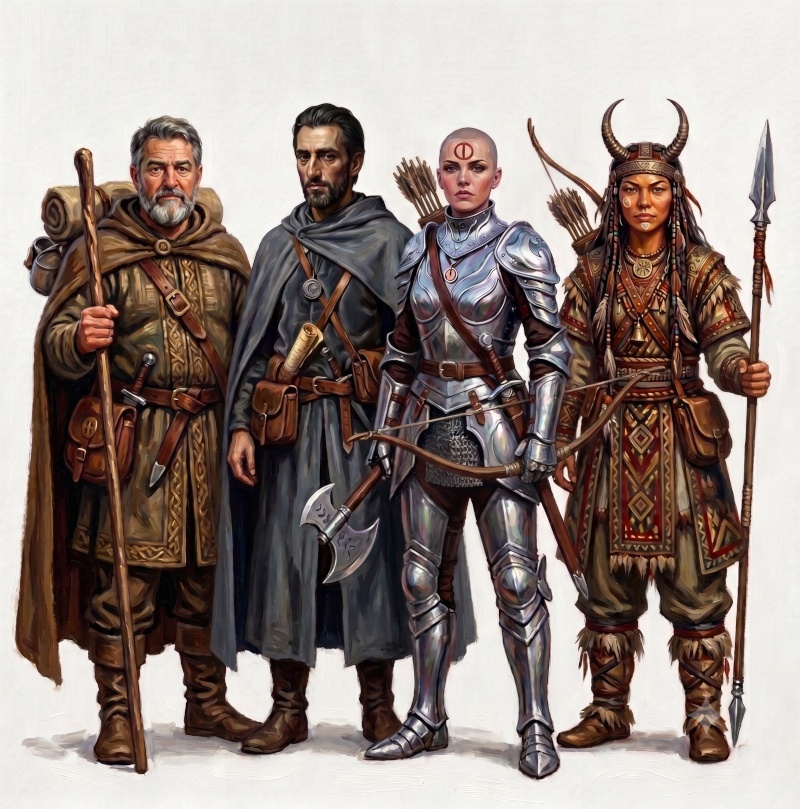

# E PLVRIBVS VNVM. Nous ne faisons qu'Un [(1)](#note1)

Un récit Gloranthien d'une exploration en solo avec d'abord les règles HQ/G puis petit à petit avec des tests d'autres règles qui ont fini par aboutir à **Glorantha Perspectives**.

# Les héros [(2)](#note2) 

*De gauche à droite:*
- [Jaridan, marchand Tarshite pacifiste](heroes/jaridan)
- [Ikarnos de Raibanth, Ombre impérial](heroes/ikarnos)
- [Hanya, gardienne de Jillaro, mercenaire investie](heroes/hanya)
- [Peek-ee-peek, fille de chef, fière nomade Sable](heroes/peek-ee-peek)

# L'histoire

- [Les préludes](01)
- [Dunstop](02)
- [Bagnot](03)
- [Vers les Ruines Tombantes](04)
- [Les Ruines Tombantes](05)
- [Mine de Nain](06)
- [Cai et Visa Delli](07)
- [Le clan des pommiers](08)
- [Camping forcé dans la Passe du Dragon](09)
- [Le chemin de la falaise (Peek & Jaridan)](10)
- [Les Marches Naines (Ikarnos & Hanya)](11)
- [Une alliance décevante (Ikarnos & Hanya)](12)
- [Glasswall (Jaridan & Peek)](13)
- [Esclavagistes (Ikarnos & Hanya)](14)
- [En route vers AldaChur (Jaridan & Peek)](15)
- [Accusés à tort (Ikarnos & Hanya)](16)
- [Rencontre avec des Aldryami (Jaridan & Peek)](17)

# Notes:

(1) Mon projet initial était d'explorer un peu plus la vision lunaire du monde mais l'incursion des héros en Sartar finit par les faire évoluer. Et au fil du récit, j'ai l'impression qu'ils finiront peut-être à s'éloigner totalement de la Voie Lunaire, en tout cas, certains. Comme quoi, les personnages finissent à échapper à leur créateur.

(2) Les héros ont été construits à la façon HeroQuest/Glorantha et remaniés à la sauce [Coeur de Runes](https://uzzgame.wordpress.com/coeur-de-runes/): runes, culture, occupation, croyances, relations, ... Que des mots-clés qui pourront servir de mises (en plus des mises obtenues selon la situation)